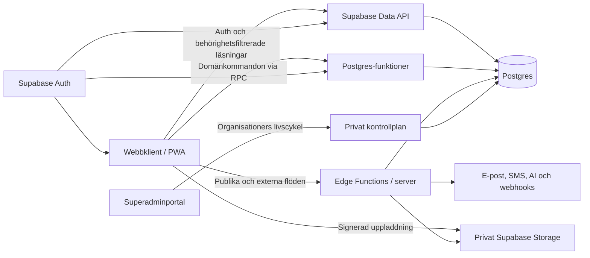

# Migreringsplan: IndexedDB till Supabase

Status: Stagingpilot UI-verifierad 2.2
Produkt: FöräldraMentorer – Kommunportal
Senast uppdaterad: 2026-08-26

Relaterade dokument:

- [Teknisk specifikation för progressiv ärendehantering](teknisk-specifikation-progressiv-arendehantering.md)
- [Verksamhetsflöden och handläggningsrutiner](verksamhetsfloden-och-handlaggningsrutiner.md)
- [AI-support](AI-SUPPORT.md)

## Genomförandestatus

Följande grund är implementerad och verifierad lokalt samt, där det anges, i den externa stagingmiljön:

- versionslåst Supabase CLI och reproducerbara lokala kommandon,
- första SQL-migreringen för organisationer, medlemskap och privat superadmin-kontrollplan,
- serverstyrd klassificering av organisationer som `live` eller `demo`,
- första verksamhetsdelen med ärenden, tilldelningar, aktiviteter, händelser och idempotens,
- privata, versionsstyrda plattformsmallar för kurser samt organisationsägda kurs-, versions- och modulrader,
- ett idempotent `install_course_template`-kommando som kopierar en vald mall till den aktiva organisationen,
- deterministisk seed med två demokurser utan personuppgifter,
- organisationsägda mentor- och föräldraprofiler med valfria, organisationskontrollerade Auth-kopplingar,
- sammansatta foreign keys för mentor- och föräldrakopplingar på ärenden,
- idempotenta `create_mentor`, `create_parent` och `link_case_people` med händelselogg och optimistisk versionskontroll,
- ett deterministiskt prototypscenario i en separat demoorganisation med syntetisk mentor, förälder, ärenden, aktiviteter och en egen kurskopia,
- en privat `organization-documents`-bucket med 20 MiB-gräns och explicit MIME-allowlist,
- organisationsägda dokument, immutable dokumentversioner och händelser med serverutfärdade Storage-sökvägar,
- idempotenta `create_document_upload` och `complete_document_upload` som reserverar och verifierar storlek och MIME-typ,
- Storage-RLS som stoppar cross-org-listning, läsning och upload samt begränsar mentorers dokumentåtkomst till egna tillåtna kategorier,
- ett syntetiskt PDF-dokument med matchande metadata och Storage-objekt i demoorganisationen,
- obligatoriskt `organization_id` och sammansatta foreign keys som stoppar korsorganisatoriska relationer,
- RLS för aktiva organisationsmedlemmar och stängda direkta klientskrivningar,
- omedelbar avstängning av läsningar och kommandon när en organisation spärras,
- idempotenta och loggade RPC-kommandon för organisationsprovisionering och första ärendeflödet,
- optimistisk versionskontroll när en aktivitet slutförs,
- organisationsägda aktivitetsdefinitioner med frysta versionsreferenser på aktiviteter och immutable publicerade versioner,
- organisationsägda resultatkataloger där `complete_case_activity` validerar resultatkod och härleder klassificering server-side,
- administratörsstyrd `publish_activity_definition` som atomiskt publicerar en granskad full katalog med idempotens och optimistisk versionskontroll,
- append-only `activity_definition_events` med obligatoriskt publiceringsskäl samt pilot-UI med separat granskningssteg före publicering,
- explicit val av aktiv publicerad aktivitetsdefinition vid manuell aktivitetsskapning, där klienten bekräftar aktuell version och databasen fryser exakt definition/version samt avvisar stale, retired, draft och cross-org-val,
- serverstyrda aktivitetsövergångar för start, vänteläge, planeringsuppdatering och återupptagning med kontrollerad väntande part, motivering, bevakningsdatum, idempotens och versionskonflikt,
- behörighetsstyrd återöppning för organisationsadministratör/samordnare, där tidigare resultat bevaras i audit och en öppen avvikelse atomiskt markeras `superseded`,
- databasregel som stoppar aktivitetsslutförande när ärendet är pausat eller stängt, även om RPC:n anropas utanför pilotgränssnittet,
- komplett serverstyrd ärendelivscykel för paus, återupptagning, avslut och behörighetsstyrd återöppning med strukturerad orsak, motivering, idempotens, versionskontroll och append-only audit,
- atomiskt ärendeavslut som markerar varje oavslutad aktivitet som inställd med en korrelerad aktivitetshändelse, samtidigt som slutförda aktiviteter och historik lämnas oförändrade,
- spärr mot att pausa eller avsluta ett ärende med oavgjord aktivitetsavvikelse samt uttrycklig regel att återöppning inte återaktiverar gamla aktiviteter,
- append-only `case_description_versions` och `case_notes`, där rättelser skapar nya versioner och originalet behålls,
- organisationsägda `activity_deviations` och immutable `deviation_decisions` med en öppen avvikelse per aktivitet,
- databasstyrd automatisk avvikelse när ett fryst aktivitetsresultat klassas som `deviation`, samt idempotent och versionskontrollerat ställningstagande,
- utfallen fortsätt, begär komplettering, pausa och avsluta, inklusive serverstyrd uppföljningsaktivitet vid komplettering,
- `current_session_context` och `is_platform_superadmin` som endast lämnar caller-scopad metadata,
- en separat Supabase-pilot med Auth-session och en komplett första ärendearbetsyta: beskrivningshistorik, aktiviteter, anteckningar/rättelser, avvikelser/beslut, privata dokument och händelselogg,
- dokumentuppladdning i piloten genom reserverad organisationssökväg → privat Storage-upload → serververifierad slutföring,
- stabil felmappning från SQLSTATE `40001` till `VERSION_CONFLICT`, samma idempotensnyckel vid osäkert återförsök och automatisk omläsning av den vinnande versionen,
- ett serverstyrt inbjudningsflöde som håller secret key utanför browsern, verifierar superadmin med användarens JWT och provisionerar organisationen idempotent,
- en serverstyrd och fail-safe feature flag för ärendearbetsytan som fångar ärendelista, direkta länkar, inkommande kontakt och nyregistrering utan dual-write,
- självregistrering avstängd samtidigt som e-postinloggning för inbjudna användare är aktiverad,
- lokalt end-to-end-test av superadmininloggning → Auth-inbjudan → organisationsprovisionering → ny administratörsinloggning → 0 synliga ärenden från andra organisationer,
- lokalt samtidighetstest där två autentiserade klienter läser aktivitetsversion 1, den första skriver version 2 och den andra avvisas samt läser om den vinnande ändringen,
- en `security definer`-säkrad deferred constraint-kontroll som kan validera publicerade aktivitetsversioner under organisationsprovisionering utan att ge klientroller åtkomst,
- borttagen körbehörighet för `anon` och `authenticated` på Supabases automatiska RLS-event trigger-funktion,
- deterministisk demoarbetsyta med syntetisk ärendeanteckning, case-kopplat privat dokument och en öppen avvikelse som kan beslutas i piloten,
- separat GitHub Actions-kontroll som bygger databasen från tom miljö och kör reset, pgTAP, databaslint, Advisors samt applikationstester,
- en separat manuellt godkänd staging-preflight som verifierar runtime-flagga, två oberoende kortlivade Auth-sessioner, anonyma avslag och explicita cross-org-läsningar utan service-role eller verksamhetsskrivningar,
- 368 pgTAP-kontroller för två organisationer, roller, Auth-kontext, spärrad medlem, organisationsspärr, superadmin utan implicit verksamhetsåtkomst, oberoende kurskopior, personer, komplett ärende- och aktivitetslivscykel, dokumentmetadata och Storage-objekt samt isolerad, auditerad publicering och användning av versionsstyrda aktiviteter,
- 217 applikations- och kontraktstester för befintlig prototyp, Supabase-repository, servergräns, Vercel-runtime, cutover-routning, staging-preflight, komplett pilot-UI, definitionsval, aktivitets- och ärendeövergångar, återöppning, granskningssteg, idempotens och versionskonflikter,
- extern staging byggd från migrationsfiler med seed, privat dokumentbucket och syntetiskt PDF-objekt,
- en aktiv plattformssuperadministratör och två separata syntetiska demoorganisationer provisionerade genom det granskade kontrollplansflödet,
- extern direktkontroll med två riktiga Auth-sessioner: 27 organisationsägda tabeller, 8 explicita främmande rad-ID:n, privat Storage, 5 anonyma domäner och klientåtkomst till privilegierade funktioner verifierades utan cross-org-läsning,
- Supabase Security Advisor verifierad med 0 fel och 0 varningar samt skydd mot läckta lösenord aktiverat i Auth,
- separat Vercelprojekt `foraldramentorer-staging` med statiska appresurser, tre isolerade Node-funktioner i Stockholm (`arn1`) och server-side Supabase secret,
- stagingappen driftsatt på `https://foraldramentorer-staging.vercel.app` och verifierad `Ready` utan funktionsfel,
- den officiella HTTPS-preflighten godkänd både med ärendearbetsytan avstängd och aktiverad; två organisationer läste vardera endast sitt eget syntetiska ärende,
- manuellt UI-stickprov godkänt för båda demoorganisationerna: rätt administratörskontext, exakt ett eget ärende, full ärendearbetsyta, inget främmande ärendenummer och 0 klientfel; båda sessionerna avslutades efter kontrollen,
- ett manuellt godkännandestyrt GitHub Actions-workflow för test → prebuilt Vercel-deploy → tvåorganisations-preflight; GitHub Environment `staging` är skapat med obligatoriskt godkännande och har projektvariabler samt de fyra syntetiska testkontona, medan ett separat begränsat och långlivat `VERCEL_TOKEN` återstår.

Den första kompletta ärendevertikalen, dess serverstyrda ingång, hela ärende- och aktivitetslivscykeln och databasens staginggrund är klara. Den direkta externa isolationskontrollen, den officiella HTTPS-preflighten och UI-stickprovet för båda demoorganisationerna är godkända. Ärendearbetsytans feature flag är aktiverad endast i staging. GitHub Environment och dess manuella godkännande är konfigurerade; kvar för repeterbar stagingdrift är ett separat begränsat och långlivat Vercel-token samt att workflowet finns i den pushade repositoryversionen. Därutöver återstår gallring och skadlig-kod-kontroll för uppladdningar, förfinade roller för känsliga personfält och det uttryckliga beslutet om logisk eller fysisk isolation. Om verksamhetens riskklass kräver tvåpersonersgodkännande ska publiceringskommandot dessutom kompletteras med separat granskare före aktivering.

## 1. Rekommendation i korthet

Migrera stegvis från webbläsarens IndexedDB till en organisationsisolerad Supabase-lösning med:

- Supabase Postgres som auktoritativ datakälla,
- Supabase Auth för stabil användaridentitet och session,
- Row Level Security (RLS) på all verksamhetsdata,
- Supabase Storage för handlingars filinnehåll,
- transaktionella Postgres-funktioner (RPC) för domänkommandon som berör flera tabeller,
- `supabase-js` för autentisering och behörighetsfiltrerade läsningar,
- server-/Edge Function-lager för publika flöden, externa leverantörer, hemligheter och bakgrundsjobb.

Organisationen är den absoluta datagränsen. Varje verksamhetsrad ska bära `organization_id`, även användarprofiler, mentorer, föräldrar, dokumentmetadata, kurser, utbildningsprogression, mallar, kataloger, inställningar, supportärenden, kommunikation och revisionshändelser. Det ska inte finnas gemensamma läsbara verksamhetsrader som flera organisationer delar.

Ett litet antal plattformssuperadministratörer får skapa, aktivera, konfigurera och stänga organisationer samt utse organisationens första administratör. Rollen ger inte automatiskt åtkomst till organisationens personer, ärenden, dokument, kurser eller annan verksamhetsdata. Eventuell felsökningsåtkomst till sådan data måste vara ett separat, tidsbegränsat och fullständigt loggat break-glass-flöde.

IndexedDB ska inte fortsätta som en parallell auktoritativ datakälla. Appskalet kan fortfarande fungera offline, men verksamhetsskrivningar ska i första produktionsversionen kräva nätverk. En riktig offlinekö införs bara som ett separat projekt med definierad konfliktlösning.

Migreringen bör börja med en komplett vertikal pilot: inloggning → ärendelista → ärendedetalj → uppdatera aktivitet → händelselogg. När den fungerar med RLS, idempotens och versionskonflikter flyttas övriga delområden i prioriterad ordning.

## 2. Nuläge och migreringskonsekvenser

Applikationen är i dag en statisk JavaScript-klient med en liten Node-server. All befintlig data i IndexedDB-databasen `foraldramentorer-prototype-v2`, version 14, är prototypdata och behöver inte bevaras eller importeras till Supabase. Det finns ingen produktionsautentisering; rollväxling och aktuell användare är prototypfunktioner.

Migreringen är därför en schema- och applikationsmigrering, inte en datamigrering. Supabase-miljöerna byggs från tom databas och får ny, deterministisk test-/demodata med uttryckliga organisationstillhörigheter. Demokurser och utvalda prototypscenarier är fortsatt produktinnehåll, men återskapas i den nya modellen i stället för att importeras från IndexedDB. Den gamla IndexedDB-datan kan tas bort när Supabase-flödet är accepterat.

Nuläget har flera bra kontrakt som ska bevaras:

- varje verksamhetspost har eller normaliseras till `tenantId`,
- ärenden och aktiviteter har versionsfält för optimistisk låsning,
- sammansatta ärendekommandon använder atomiska IndexedDB-transaktioner,
- `processedCommands` ger idempotens,
- betydelsefulla ändringar skapar händelser,
- mallar, beskrivningar, anteckningar och matchningsprofiler versionshanteras,
- exempeldata finns i storlekarna 1, 10 och 250 mentorer.

Följande behöver ändras före produktion:

- klienten laddar i dag hela register till minnet; Supabase-versionen behöver filtrering och cursorbaserad paginering,
- organisation och aktör kommer från klientkonstanter; de måste härledas från den autentiserade sessionen,
- många enkla skrivningar går direkt till en store; de måste gå via ett behörighetskontrollerat repository eller domänkommando,
- `candidates` ska byta begrepp till `mentors`,
- äldre `meetings` och `caseMeetings` ska konsolideras till den kanoniska modellen `interactions`,
- dokumentblobbar ska flyttas till privat objektlagring,
- automatiska påminnelser får inte vara beroende av en öppen webbläsare,
- prototypdata ska kunna återskapas deterministiskt och alltid vara tydligt organisationsmärkt.

## 3. Målarkitektur

### 3.1 Scheman och exponering

Rekommenderad indelning:

- `public`: organisationsägda verksamhetstabeller som behöver nås genom Data API, samtliga med `organization_id`, RLS och explicita grants,
- `private`: internt kontrollplan, säkerhetsfunktioner och plattformstabeller som inte ska exponeras genom Data API,
- `api`: valfritt schema för stabila vyer och RPC-kontrakt om projektets Data API konfigureras att exponera detta schema.

Nya tabeller ska inte antas bli automatiskt tillgängliga via Data API. Grants och exponerade scheman ska anges uttryckligen i migreringarna. En publishable key får finnas i klienten; secret/service-role-nyckel får aldrig finnas där.

Planens normalalternativ är logisk men databasverkställd isolation i ett gemensamt Supabase-projekt: RLS, sammansatta foreign keys, organisationsspecifika Storage-sökvägar och automatiska negativa tester. Om kravet med ”helt isolerad” även innebär fysisk isolation av databas, Auth, backup, loggar och Storage måste organisationerna i stället få separata Supabase-projekt. Det är ett annat driftupplägg med ett centralt kontrollplan, dynamisk projektstyrning, högre kostnad och betydligt större förvaltningsbörda. Denna nivå ska beslutas uttryckligen i etapp 0; RLS i ett gemensamt projekt är stark logisk isolation men inte fysisk separation av infrastrukturen.

### 3.2 Läsningar och skrivningar

Använd två tydliga vägar:

1. Enkla, behörighetsfiltrerade läsningar använder `supabase-js`, RLS-skyddade tabeller eller `security_invoker`-vyer.
2. Skrivningar som påverkar verksamhetstillstånd använder namngivna RPC-kommandon, exempelvis `complete_activity`, `pause_case` och `create_assignment`.

Ett RPC-kommando ska:

- hämta `auth.uid()` från sessionen,
- slå upp användarens aktiva organisationsmedlemskap och roll,
- kontrollera organisatorisk åtkomst och kommandobehörighet,
- kontrollera `expected_version`,
- reservera eller kontrollera idempotensnyckeln,
- utföra all domändata, revisionsdata och eventuella följdposter i samma databastransaktion,
- returnera en liten stabil respons med ID, version och status.

Postgres-funktioner körs i en transaktion per anrop. Använd `security invoker` som standard. Om en `security definer`-hjälpfunktion verkligen behövs ska den ligga i `private`, ha tomt/säkert `search_path`, själv kontrollera `auth.uid()` och sakna generell `EXECUTE`-rättighet.

### 3.3 Kontrollplan och organisationsprovisionering

Superadministration ska vara skild från verksamhetsapplikationen:

- `private.platform_superadmins` anger vilka `auth.users` som får använda kontrollplanet,
- `organizations` innehåller endast livscykel- och driftmetadata för organisationen,
- ett serverkommando `provision_organization` skapar organisation, grundinställningar, organisationsägda kopior av kurser/mallar/kataloger och det första administratörsmedlemskapet atomärt eller idempotent stegvis,
- `suspend_organization` stoppar nya sessioner och verksamhetsskrivningar utan att radera data,
- `delete_organization` får inte vara ett normalt UI-kommando utan ska följa beslutad export-, bevarande- och gallringsprocess,
- alla superadminåtgärder skrivs i en separat append-only-logg med aktör, tid, målorganisation, orsak och korrelations-ID.

Superadmin ska som standard endast se organisationsnamn, status, region/driftmiljö, abonnemangs-/konfigurationsstatus, skapad tid och utsedd organisationsadministratör. Antal personer, ärenderubriker, dokumentnamn, kursresultat och annan verksamhetsdata ska inte visas i kontrollplanet.

## 4. Föreslagen datamodell

### 4.1 Identitet, organisation och behörighet

| Ny tabell | Källa | Syfte |
| --- | --- | --- |
| `organizations` | `DEFAULT_TENANT_ID` och framtida kunder | Absolut organisations- och säkerhetsgräns |
| `organization_units` | `organizationUnitId` | Enheter inom organisationen |
| `user_profiles` | delar av `handlers` | Organisationsägt visningsnamn och appidentitet kopplad till `auth.users.id` |
| `organization_memberships` | `handlers`, framtida mentorkonton | Organisation, roll, status och eventuellt standardenhet |
| `membership_units` | nytt | Vilka organisatoriska enheter en användare får arbeta i |
| `private.platform_superadmins` | nytt | Behörighet till kontrollplanet, inte verksamhetsdata |
| `private.platform_admin_events` | nytt | Append-only-logg över organisationsadministration |

`auth.users` ska endast vara teknisk identitetskälla. All profil- och verksamhetsinformation ligger i organisationsägda tabeller. Verksamhetsroller ska inte ligga i användarredigerbar `user_metadata`. Auktorisationsdata lagras i medlemskapstabeller och, om JWT-claims används som optimering, i administrativt styrd `app_metadata`. Databasen är fortfarande auktoritativ eftersom JWT-claims kan vara inaktuella tills token uppdateras.

Som standard får en vanlig användare ett aktivt medlemskap i exakt en organisation. Om en framtida användare behöver tillhöra flera organisationer krävs en uttrycklig organisationsväxlare, ny aktiv organisationskontext per session/anrop och nya säkerhetstester; det ska inte aktiveras implicit. Plattformssuperadministratörer är det enda initiala undantaget och de får inte samtidigt använda superadminrollen som genväg till verksamhetsdata.

Fältet `tenantId` i nuvarande prototyp används som modellreferens för `organization_id`, men inga befintliga rader exporteras. Begreppet tenant kan finnas kvar internt i äldre kod under övergången, men Supabase-schemat, nya testfixtures och API-kontrakt ska använda organisation konsekvent.

### 4.2 Kärnregister och ärendehantering

| IndexedDB-store | Måltabell(er) | Migreringsregel |
| --- | --- | --- |
| `candidates` | `mentors` | Byt domännamn; flytta historik och matchningsdata till respektive tabell |
| `parents` | `parents` | Behåll stabilt ID och organisation; känsliga fält får separat åtkomstmodell |
| `incomingContacts` | `incoming_contacts` | Koppla med organisationssäkra FK till förälder och ärende |
| `cases` | `cases` | Behåll ID, nummer, typversion, status, version och revisionsfält |
| `caseAssignments` | `case_assignments` | Partiellt unikt index för en aktiv ansvarig per ärende |
| `caseActivities` | `case_activities` | Normalisera vanliga fält; behåll `guided_state` som validerad JSONB-snapshot initialt |
| `caseDescriptionVersions` | `case_description_versions` | Append-only |
| `caseNotes` | `case_note_versions` | Append-only per stabilt `note_id` |
| `activityDeviations` | `activity_deviations` | En öppen avvikelse per aktivitet |
| `deviationDecisions` | `deviation_decisions` | Append-only och länk till ersatt beslut |
| `caseEvents` | `case_events` | Append-only; strukturerad payload utan känslig fritext |
| `processedCommands` | `processed_commands` | Unikt på `(organization_id, idempotency_key)` |

Använd `uuid` för befintliga och nya verksamhets-ID:n, `timestamptz` för tidpunkter, `date` för rena verksamhetsdatum, `boolean` för flaggor och `numeric` för ersättningsbelopp. Använd `text` med check-villkor för stabila statusvärden om inte ett Postgres-enum bedöms ha tydlig förvaltningsnytta.

Alla barnrelationer ska vara organisationssäkra. Rekommenderat mönster är `unique (organization_id, id)` på föräldratabellen och en sammansatt FK `(organization_id, case_id)` från barnet. På så sätt kan inte en giltig post från organisation A länkas till en giltig post i organisation B.

### 4.3 Möten, kommunikation och uppföljning

| IndexedDB-store | Måltabell(er) | Migreringsregel |
| --- | --- | --- |
| `meetings` | ingen egen slutlig tabell | Äldre mentorhändelser transformeras eller arkiveras; skapa inte en tredje mötesmodell |
| `caseMeetings` | `interactions` | Migrera via kompatibilitetsregeln och deduplicera mot befintliga interactions |
| `interactions` | `interactions`, `interaction_participants`, `interaction_history` | Kanonisk modell för möten och kontakter |
| `communications` | `communications`, `communication_links`, `communication_delivery_events` | Normalisera länkar och leveranshistorik; unikt leverantörsmeddelande där det är tillämpligt |
| `mentorReports` | `mentor_reports`, `mentor_report_supplements` | Ursprunglig rapport låses; kompletteringar är append-only |
| `parentCheckIns` | `parent_check_ins` | Organisations- och ärendekopplad |
| `compensationPeriods` | `compensation_periods` | Exakta belopp som `numeric`, beslutshistorik enligt verksamhetskrav |

Ingen historisk mötesdata ska dedupliceras. När prototypkoden flyttas ska `interactions` bli den enda kanoniska modellen och nya fixtures ska inte samtidigt skapa äldre `meetings`/`caseMeetings`-varianter.

### 4.4 Matchning och versionerade definitioner

| IndexedDB-store | Måltabell(er) |
| --- | --- |
| `mentorMatchingProfiles` | `mentor_matching_profiles` |
| `mentorMatchingSupportAreas` | `mentor_matching_support_areas` |
| `mentorMatchingLanguages` | `mentor_matching_languages` |
| `supportMatchingProfiles` | `support_matching_profiles` |
| `supportMatchingSupportAreas` | `support_matching_support_areas` |
| `supportMatchingLanguages` | `support_matching_languages` |
| `matchingSnapshots` | `matching_assessment_snapshots` |
| `caseTypeDefinitions` | `case_type_versions` med relaterade resultat-/malltabeller eller validerad JSONB |
| `activityTemplateDefinitions` | `activity_template_versions` med relaterade steg och resultat |
| `tenantSupportAreaSelection` | `organization_support_areas` |
| `tenantGeographicAreas` | `organization_geographic_areas` |
| `tenantSettings` | specialiserade organisationsinställningar; undvik en obegränsad generell key/value-modell |

Aktiva profilversioner ska skyddas med partiella unika index. Matchningssnapshoten ska bevaras som oföränderlig JSONB eftersom den avsiktligt representerar ett historiskt ögonblick, men de aktiva profilerna ska vara normaliserade och sökbara.

### 4.5 Ansökningar, utbildning och support

| IndexedDB-store | Måltabell(er) | Kommentar |
| --- | --- | --- |
| `mentorApplications` | `mentor_applications`, `mentor_application_events` | Flytta inbäddad historik till append-only-händelser |
| `mentorProfileEvents` | `mentor_profile_events` | Append-only |
| `learningContent` | `learning_content_versions` | Organisationsägt versionsinnehåll |
| `tenantLearningSelection` | `organization_learning_selections` | Sammansatt unik nyckel |
| `learningProgress` | `learning_progress`, eventuellt `learning_attempts` | Separera växande försökshistorik om volymen ökar |
| `publicSupportRequests` | `public_support_requests` | Fastställ gallring och åtkomst innan produktion |
| `supportTickets` | `support_tickets` | Centralt register, inte lokal kö |
| `presentationComments` | ingen egen produktionstabell | Migrera endast uttryckligen relevanta poster till supportärenden |

Kurser, moduler, frågor, tester, versioner, publiceringsstatus och urval ska vara organisationsägda. Det ska alltså inte finnas en global `learning_content_versions`-rad som läses av flera organisationer. Plattformen kan ha interna grundmallar i ett oexponerat kontrollplansschema eller i versionsstyrda seedfiler, men provisionering ska kopiera dem till nya rader med den nya organisationens `organization_id`. Senare plattformsuppdateringar erbjuds som en explicit import/uppgradering per organisation och får inte ändra organisationens publicerade kursversioner i bakgrunden.

Demokurser ska följa samma regel. En versionsstyrd plattformsmall får vara källa vid provisionering, men varje organisation får egna kurs-, modul- och versionsrader. Organisationen kan därefter ändra eller publicera sin kopia utan att påverka andra organisationer. En särskild demoorganisation kan dessutom innehålla hela prototypscenarier med syntetiska personer, ärenden och kursprogression.

Organisationer bör klassificeras som `live` eller `demo` i kontrollplanet. Klassificeringen ska vara serverstyrd, synlig i gränssnittet och användas i rapportering så att demodata aldrig räknas som verklig verksamhet. Demoorganisationen har exakt samma RLS-gräns som andra organisationer och får egna demokonton; den är inte en genväg runt behörighetsmodellen.

Samma princip gäller ärende-/aktivitetsmallar, dokumentationsinnehåll, stödområden, geografiska kataloger, rutiner och supportkunskap: varje organisation har egna rader, egna versioner och egna publiceringsbeslut. Om något innehåll ska delas i framtiden blir det en separat distributionsfunktion som kopierar en specificerad version; runtime-läsningar korsar aldrig organisationsgränsen.

### 4.6 Filer

`caseDocumentBlobs` flyttas inte till Postgres. Varje Storage-objekt måste kunna härledas till exakt en organisation. Flödet blir:

1. klienten begär en kortlivad uppladdningsreservation,
2. filen laddas till en privat Storage-bucket under en organisations- och reservationsstyrd sökväg,
3. ett slutkommando verifierar att Storage-objektet finns samt att storlek och MIME-typ motsvarar reservationen,
4. dokumentversionen görs tillgänglig och en immutable dokumenthändelse registreras,
5. kontrollsumma, skadlig-kod-kontroll och gallring av övergivna reservationer införs innan verkliga handlingar tillåts.

Storage-policyer ska kontrollera `organization_id`, medlemskap och dokumentåtkomst. En gemensam privat bucket får endast användas om varje objekt ligger under en servergenererad sökväg som börjar med organisationens UUID och policyerna verifierar samma UUID mot objektmetadata och sessionen. Separata buckets per organisation är ett möjligt extra lager men ersätter inte databasbehörighet. Upsert ska normalt undvikas för handlingar; en rättelse skapar en ny dokumentversion i stället för att ersätta originalet.

## 5. Centrala databasregler

Minst följande ska uttryckas i Postgres, inte bara i klientkod:

- `organization_id not null` på varje organisationsägd tabell,
- unikt ärendenummer per organisation,
- endast en aktiv ansvarig assignment per ärende,
- endast en aktiv mentor- respektive stödmatchningsprofil,
- endast en öppen avvikelse per aktivitet,
- unik aktivitetsavvikelse per avslutningstillfälle,
- unik idempotensnyckel per organisation,
- en publicerad mall-, kurs- och dokumentationsversion per definitions-ID och organisation,
- organisationssäkra foreign keys,
- check-villkor för status, versioner, tidsintervall och obligatoriska fält,
- append-only-skydd för händelser och publicerade/historiska versioner,
- inga normala `DELETE`-rättigheter för verksamhetsroller.

Exempel på viktiga indexmönster:

- `cases (organization_id, status, updated_at desc, id)` för register och köer,
- `case_activities (organization_id, status, due_date, id)` för arbetskö,
- partiellt index på öppna/försenade aktiviteter,
- `case_events (organization_id, case_id, occurred_at desc, id)` för historik,
- `interactions (organization_id, starts_at, id)` för kalender,
- index på varje FK-kolumn eller sammansatt organisations-FK,
- index på de medlemskapskolumner som används i RLS.

Listor ska använda cursor/keyset-paginering, exempelvis `(updated_at, id)`, inte djupa `OFFSET`-frågor. Index ska verifieras mot verkliga frågor med `EXPLAIN (ANALYZE, BUFFERS)` i staging.

## 6. Autentisering, RLS och rollmodell

### 6.1 RLS-basregel

RLS aktiveras på varje tabell i exponerade scheman. En policy får aldrig nöja sig med `TO authenticated`; den måste också kontrollera organisation, organisatorisk åtkomst, ärendetilldelning eller ägarskap beroende på resurstyp.

Gemensamt mönster:

1. `auth.uid()` identifierar användaren.
2. Aktivt medlemskap avgör organisation och roll.
3. Enhetsmedlemskap eller ärendetilldelning avgör resursåtkomst.
4. kommandot kontrollerar dessutom den specifika verksamhetsbehörigheten.

En inloggad klients `organization_id` får aldrig hämtas från ett redigerbart formulärfält, URL-parameter eller request body. Servern/databasen härleder organisationen från användarens aktiva medlemskap. För publika organisationssidor löses organisationen server-side från en registrerad domän eller slug. `anon` får inte generell SELECT på alla rader som råkar ha `public = true`; publikt kurs-, dokumentations- och ansökningsinnehåll lämnas genom ett smalt organisationsbundet Edge Function-/RPC-kontrakt.

`auth.uid()` ska användas som `(select auth.uid())` i RLS-policyer så att värdet kan initieras en gång per fråga. Alla kolumner som används i policyerna ska indexeras.

### 6.2 Föreslagen åtkomstmatris

| Roll | Läsa | Skriva |
| --- | --- | --- |
| `anon` | endast organisationsbundet publikt innehåll via server/Edge Function | endast hårt avgränsade organisationsbundna kommandon via server/Edge Function |
| `mentor` | egen profil, egna uppdrag, tillåtna föräldrakontaktuppgifter, egna möten/rapporter/meddelanden | egna profiländringar, rapporter, mötesutfall och intern kommunikation enligt kommando |
| `handler` | tillåtna ärenden i organisation/enhet, normalt egna eller tilldelade | tillåtna handläggningskommandon |
| `coordinator` | organisations-/enhetsköer och tillåtna ärenden | tilldelning, definierade beslut och återöppning |
| `administrator` | konfiguration och användaradministration | publicera definitioner och hantera medlemskap; ingen automatisk rätt att handlägga känsliga ärenden |
| `reader` | uttryckligen tillåtna läsmodeller | inga verksamhetsskrivningar |
| `platform_superadmin` | organisationsmetadata i kontrollplanet | skapa, konfigurera, suspendera organisationer och utse organisationsadmin; ingen normal läsning av verksamhetsdata |

Publik intresseanmälan bör gå genom en server-/Edge Function med schema-validering, CAPTCHA/rate limiting och idempotens. Den publika klienten ska inte få generell direkt INSERT/UPDATE på ansökningstabellen. Fortsättning av ett utkast behöver ett separat beslutat mönster: autentiserat sökandekonto eller kortlivad, roterbar återupptagningstoken vars hash lagras server-side.

## 7. Genomförandeplan

### Etapp 0 – beslut och säkerhetsförutsättningar

Leveranser:

- dokumentera att all befintlig IndexedDB-data är prototypdata och inte ska migreras,
- besluta om kravet avser stark logisk isolation i ett gemensamt projekt eller fysisk projekt-per-organisation-isolation,
- fastställ EU-region, avtal/DPA, personuppgiftsbiträden och dataflöden,
- genomför informationsklassning, gallringsplan och bedöm behov av konsekvensbedömning (DPIA),
- besluta autentiseringsmetod för kommunpersonal och mentorer,
- besluta organisatorisk åtkomst och delegerade verksamhetsroller,
- fastställ superadministratörernas kontrollplansbehörigheter och eventuellt break-glass-förfarande,
- definiera RPO, RTO, backup/PITR och återläsningstest,
- välj projekt för lokal utveckling, staging och produktion.

Klart när säkerhets- och verksamhetsägare har godkänt isolationsnivå, åtkomstmatris, superadminmodell och dataklasser. Ingen befintlig verksamhetsdata ska importeras.

### Etapp 1 – Supabase-grund och migreringsdisciplin

Leveranser:

- initiera Supabase CLI-konfiguration och versionsstyrd `supabase/migrations`,
- pinna klientpaket och committa lockfil,
- använda Node.js 22 eller senare för bygg-/serververktyg,
- skapa separata lokala/staging/produktionsmiljöer,
- definiera secrets utan att lägga service role eller databaslösenord i klienten,
- lägga till generering av databastyper,
- skapa CI-steg som startar lokal Supabase, kör migreringar och testar schema från tom databas,
- dokumentera backup och återställning.

Klart när en tom miljö kan byggas reproducerbart från Git och inga manuella dashboardändringar krävs för schema eller policies.

### Etapp 2 – schema, constraints och seeddata

Leveranser:

- skapa organisations-, kontrollplans-, medlemskaps- och kärnregistertabeller,
- skapa ärende-, aktivitet-, historik- och kommandotabeller,
- skapa organisationssäkra FK, check-villkor och unika/partiella index,
- skapa migrationssäker seed för systemkataloger och mallversioner,
- skapa en explicit demoorganisation med markerad exempeldata i lokal miljö/staging och, om produkten behöver demonstration i produktionsmiljön, en separat `demo`-klassificerad organisation,
- köra Security och Performance Advisors efter DDL.

Klart när databasen själv avvisar relationer över organisationsgräns, dubbla aktiva ansvariga, dubblettkommandon och ogiltiga statusvärden.

### Etapp 3 – Auth, medlemskap och RLS

Leveranser:

- koppla `auth.users` till `user_profiles` och medlemskap,
- implementera RLS tabell för tabell,
- skapa privata hjälpfunktioner endast där policyn annars blir komplex eller långsam,
- skapa tester för varje roll och resurstyp,
- verifiera att ett okänt ID och ett ID i annan organisation ger samma externa beteende,
- verifiera att superadmin kan administrera organisationens livscykel men inte läsa organisationens verksamhetsrader,
- verifiera att service role aldrig byggs in i webbläsarpaketet.

Klart när automatiska negativa tester visar att ingen roll kan läsa, ändra eller länka data över organisations-/enhetsgräns.

### Etapp 4 – repositorylager och första vertikala flöde

Leveranser:

- inför repositorygränssnitt i klientens applikationslager,
- behåll ett IndexedDB-repository för test/prototyp under övergången,
- implementera Supabase-repository för paginerade läsningar,
- implementera RPC för första kompletta ärendeflödet,
- flytta aktör, tidpunkt, organisation och ärendenummerallokering till servern,
- hantera `VERSION_CONFLICT` och idempotent återförsök i UI,
- lägg till kontrakttester som körs mot båda repositoryimplementationerna där beteendet ska vara identiskt.

Pilotflödet är klart när två samtidiga användare inte kan skriva över varandra och samma kommando aldrig skapar dubbel verksamhetseffekt.

### Etapp 5 – återstående domäner

Rekommenderad ordning:

1. mentorer, föräldrar och inkommande kontakter,
2. hela ärendehanteringen, avvikelser, anteckningar och dokumentmetadata,
3. matchningsprofiler och snapshots,
4. interaktioner, mentorrapporter och föräldrauppföljning,
5. kommunikation och leveranshändelser,
6. utbildningsinnehåll och progression,
7. ansökningar och supportärenden,
8. ersättningsperioder efter att ekonomiska och beslutsmässiga regler är fastställda.

Varje delområde ska få schema, constraints, RLS, läsmodeller, RPC-kommandon, deterministiska testfixtures och tester innan nästa delområde blir produktionsberoende.

### Etapp 6 – Storage, publika funktioner och bakgrundsjobb

Leveranser:

- privat bucket och dokumentuppladdningsflöde,
- organisationssäker sökväg, metadata och Storage-policy för varje objekt,
- publik mentoransökan via server/Edge Function,
- webhookverifiering och idempotens för framtida kommunikationsleverantörer,
- serverbaserad påminnelsekö/cron med återförsök och deduplicering,
- central supportkö,
- loggning utan att känsligt innehåll kopieras till tekniska loggar.

Klart när inga leverantörshemligheter eller privilegierade databasnycklar krävs i webbläsaren och bakgrundsjobb fungerar utan en öppen klient.

### Etapp 7 – deterministisk prototypdata

Ingen IndexedDB-data importeras. Skapa i stället versionsstyrda testfixtures och lokala seed-skript som:

1. skapar minst två organisationer med separata användare och roller,
2. skapar organisationsägda mentorer, föräldrar, ärenden, aktiviteter, kurser och dokumentmetadata,
3. använder stabila test-id:n men inga verkliga personuppgifter,
4. märker all demodata uttryckligt och håller den borta från `live`-organisationer och verklig verksamhetsrapportering,
5. kan köras om efter `supabase db reset` med samma verifierbara resultat,
6. innehåller negativa scenarier för korsorganisatorisk åtkomst, spärrade medlemskap och versionskonflikter.

En ny `live`-organisation ska starta utan syntetiska personer, ärenden eller progression. Valda demokurser kan provisioneras som organisationsägda kopior genom ett separat, idempotent kommando. Fullständiga prototypscenarier hör hemma i en explicit `demo`-klassificerad organisation, även om den organisationen finns i produktionsmiljön.

Klart när lokal utveckling och CI kan återskapa samtliga prototypscenarier från tom databas utan export från en webbläsare.

### Etapp 8 – pilot, produktionssättning och avveckling

Rekommenderad övergång:

1. provisionera två separata demoorganisationer i staging och kör preflighten utan verksamhetsskrivningar med flaggan av,
2. sätt `SUPABASE_CASE_WORKSPACE_ENABLED=true` server-side så att huvudappens ärendeingång går till Supabase-piloten,
3. genomför verksamhetsmässigt stickprov i en ny tom pilotorganisation,
4. övervaka fel, RLS-avslag, konflikter och svarstider,
5. stäng av IndexedDB-repositoryt för verksamhetsskrivningar,
6. radera lokal prototypdata och ta bort den gamla normala skrivvägen,
7. aktivera nya organisationer genom det granskade provisioneringsflödet.

Den exakta ordningen, GitHub Environment-värdena och rollbacken finns i [Supabase staging: aktiveringschecklista](supabase-staging-checklista.md).

Ingen dual-write, export, provimport eller datacutover behövs. Rollback gäller applikationsversion och schemaändringar; det finns ingen äldre verksamhetsdata som måste återföras.

Feature-flaggan är av som standard. Klienten accepterar bara det explicita booleska värdet från `/api/runtime-config` och behåller senaste verifierade läge om konfigurationsanropet tillfälligt misslyckas. Det förhindrar att den lokala ärendevägen oavsiktligt återöppnas under en aktiverad pilot. Vid planerad rollback sätts flaggan till `false` medan Supabase-konfigurationen ligger kvar, varefter klienterna läser in det nya läget.

## 8. Verifiering och acceptanskriterier

### 8.1 Datakvalitet

- inga föräldralösa FK eller relationer över organisationsgräns finns,
- exakt en aktiv ansvarig finns där verksamhetsregeln kräver det,
- testfixtures ger samma antal och relationer efter varje ren databasåterställning,
- historiska versioner och händelser som skapas i prototypscenarier är i rätt ordning,
- demodata förekommer endast i explicit `demo`-klassificerade organisationer och exkluderas från live-rapportering,
- demokurser i live-organisationer är egna organisationsägda kopior, inte delade runtime-rader.

### 8.2 Säkerhet

- RLS är aktiv på alla exponerade tabeller,
- `anon` och `authenticated` har endast nödvändiga grants,
- mentor kan inte läsa andra mentorers profil eller uppdrag,
- handläggare kan inte läsa annan organisation eller otillåten enhet,
- administratör får inte automatiskt åtkomst till känsliga ärenden,
- plattformssuperadmin kan skapa och administrera organisationer men kan inte läsa deras personer, ärenden, filer, kursinnehåll eller kursresultat,
- kurs-, dokumentations-, mall-, support- och Storage-tester bevisar samma isolation som person- och ärendetabellerna,
- uppdateringspolicyer har både läsvillkor och `WITH CHECK`,
- views använder `security_invoker` eller är helt oexponerade,
- inga klientbundle-, logg- eller eventpayloadar innehåller hemliga nycklar eller oavsiktlig känslig data,
- Security Advisor saknar oåtgärdade kritiska fynd.

### 8.3 Funktion och samtidighet

- befintliga kritiska arbetsflödestester fungerar mot Supabase-repository,
- datamängderna 1, 10 och 250 fungerar utan att hela tabeller laddas till klienten,
- samma idempotensnyckel ger samma svar och inga dubletter,
- samma idempotensnyckel med annan request hash avvisas,
- två kommandon med samma `expected_version` kan inte båda lyckas,
- ett domänkommando lämnar inga halvskrivna poster efter fel,
- ett avslutat eller pausat ärende följer alla befintliga invarianter.

### 8.4 Drift och prestanda

- register, arbetskö, kalender och historik har definierade p95-mål och klarar dem i staging,
- listor använder cursorpaginering,
- vanliga frågor använder avsedda index,
- migrationsjobb kan återstartas eller köras om säkert,
- backup kan återläsas i en separat miljö,
- larm finns för authfel, RPC-fel, misslyckade jobb, databasbelastning och Storage-fel,
- Performance Advisor saknar oåtgärdade kritiska fynd.

## 9. Risker och motåtgärder

| Risk | Konsekvens | Motåtgärd |
| --- | --- | --- |
| Klientfiltrering används som säkerhet | Data mellan organisationer kan exponeras | RLS, organisationssäkra FK och negativa integrationstester |
| Kurser eller dokumentation modelleras som globala rader | En organisation kan påverka eller se en annans innehåll | Organisationsägda kopior, egna versioner och ingen cross-org-runtime-läsning |
| Superadmin får generell databasåtkomst i appen | Rollen blir en dold universalåtkomst | Separat kontrollplan, minsta metadata, ingen verksamhetspolicy och loggat break-glass |
| Storage-sökväg styrs av klienten | Filer kan hamna i eller nås från fel organisation | Servergenererad UUID-prefix, objektmetadata och Storage-RLS |
| Uppladdade filer skannas inte | Skadligt eller felklassificerat innehåll kan sparas | Karantänstatus, serverbaserad MIME-/signaturkontroll, skadlig-kod-skanning och först därefter tillgänglig status |
| Direkt CRUD kringgår domänregler | Halva transaktioner eller felaktiga statusar | RPC-kommandon och begränsade grants |
| En felaktig aktivitetsdefinition publiceras | Nya aktiviteter kan få fel val eller klassificering trots korrekt servervalidering | Separat UI-granskning, adminroll, full servervalidering, obligatoriskt skäl, versionskonflikt och append-only audit är implementerade; rätta genom ny version och besluta om tvåpersonersgodkännande utifrån informationsklassning |
| Auth-inbjudan och databasprovisionering är inte en gemensam transaktion | Ett mejl kan skickas innan organisationen är skapad eller en Auth-användare kan bli föräldralös | Idempotens, kompensationsborttagning i piloten och före produktion en uthållig invitation/outbox-status med säkra återförsök och manuell avstämningskö |
| Prototypdata räknas som verklig verksamhetsdata | Fel statistik, notifieringar eller beslut | `live`/`demo` i kontrollplanet, tydlig UI-märkning, separata demokonton och obligatoriskt rapportfilter |
| En global demokurs delas av flera organisationer | En organisations ändring påverkar en annan | Intern plattformsmall kopieras till organisationsägda kursversioner vid provisionering |
| Alla objekt läses in till minnet | Dålig prestanda och onödig dataexponering | Serverfilter, projektioner och cursorpaginering |
| För bred JSONB-användning | Svaga constraints och svåra frågor | Normalisera aktiva data; JSONB endast för snapshots/payloadar |
| RLS blir korrekt men långsam | Långsamma listor och köer | Index på policykolumner, `(select auth.uid())`, EXPLAIN och advisors |
| Publikt ansökningsflöde missbrukas | Spam och personuppgiftsrisk | Edge Function, validering, rate limit/CAPTCHA och gallring |
| PWA uppfattas som offline-skrivbar | Användaren tror att en ändring sparats | Tydligt onlinekrav och ingen dold lokal skrivkö |
| Oklara kommunala regler | Felaktig bevaring eller åtkomst | Beslutsgate innan verklig verksamhetsdata börjar skapas |

## 10. Grov uppskattning och beslutspunkter

För en utvecklare är en rimlig teknisk storleksordning 3–6 effektiva utvecklarveckor för en första säker pilot och full grundmigrering av kärnflödena. Att ingen befintlig data ska importeras tar bort export-, transform-, avstämnings- och datacutoverarbetet. Externa integrationer, formell informationssäkerhetsgranskning, verksamhetsacceptans och juridiska beslut tillkommer.

| Del | Grov arbetsinsats |
| --- | --- |
| Grundprojekt, CI och miljöer | 1–2 dagar |
| Kärnschema, constraints och index | 4–6 dagar |
| Auth, medlemskap och RLS | 3–5 dagar |
| Repositorylager och ärendekommandon | 7–12 dagar |
| Övriga domäner, Storage och jobb | 6–10 dagar |
| Deterministisk prototyp-seed och övergång | 1–2 dagar |

Följande beslut påverkar lösningen mest och bör tas först:

1. Krävs stark logisk isolation i ett gemensamt Supabase-projekt eller fysisk isolation med ett projekt per organisation?
2. Vilken autentisering ska kommunpersonal respektive mentorer använda?
3. Vilka organisatoriska enheter och ärenden får varje roll läsa?
4. Vilken metadata får plattformssuperadmin se, och ska break-glass alls finnas?
5. Vilka uppgifter och handlingar är känsliga eller sekretesskyddade?
6. Vilken EU-region, avtalsnivå, backupnivå och återställningsförmåga krävs?
7. Ska publika ansökningsutkast kunna återupptas utan konto?

## 11. Aktuella Supabase-förutsättningar att beakta

Planen är kontrollerad mot Supabase changelog och dokumentation 2026-08-24. Särskilt relevant:

- nya tabeller exponeras inte längre automatiskt i Data/GraphQL API; konfigurera exponering och grants uttryckligen,
- `@supabase/supabase-js` och relaterade bibliotek kräver Node.js 22 eller senare sedan 2026-06-30,
- explicit versionspinning i `CREATE/ALTER EXTENSION` ignoreras; förlita inte migrationsfiler på en hårdkodad extensionsversion,
- `realtime`-schemat är låst för egna schemaändringar; skapa inga verksamhetsobjekt där,
- välj en specifik EU-region om datan uttryckligen måste ligga inom EU; den generella regiongruppen Europa omfattar även länder utanför EU,
- Supabase är en delad ansvarslösning: regionval, RLS och plattformskontroller ersätter inte organisationens ansvar för rättslig grund, åtkomst, gallring, loggning och incidenthantering.

Kontrollera changelog, aktuella paketkrav och relevanta dokument igen direkt före implementation och produktionssättning.
