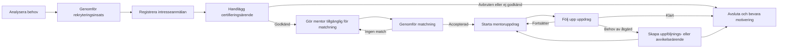
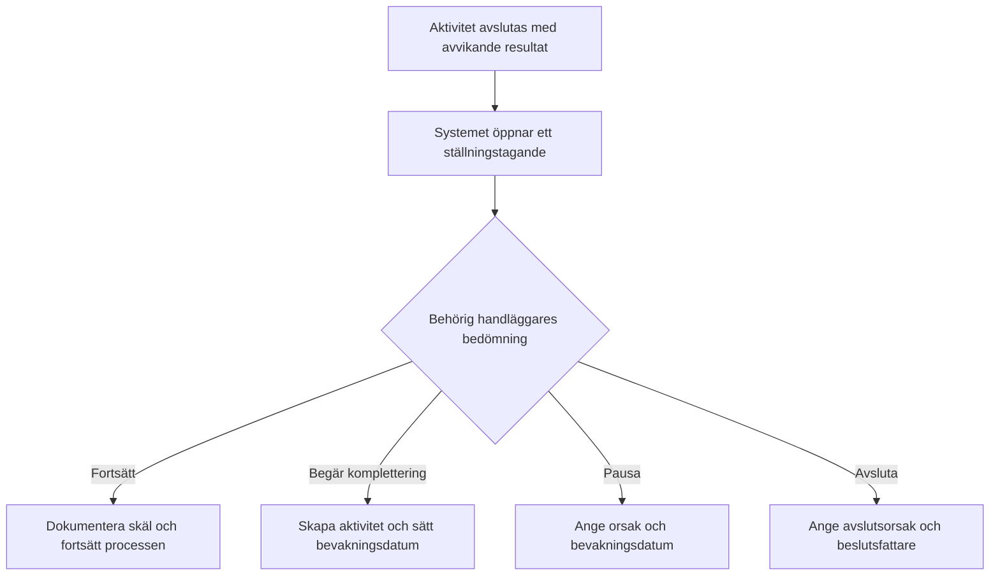

# Verksamhetsflöden och handläggningsrutiner

Status: Verksamhetsförslag 1.0  
Produkt: FöräldraMentorer - Kommunportal  
Senast uppdaterad: 2026-08-05

Relaterade dokument:

- [Koncept och systemskiss](foraldramentorer-koncept.md)
- [Teknisk specifikation för progressiv ärendehantering](teknisk-specifikation-progressiv-arendehantering.md)

## 1. Syfte och avgränsning

Detta dokument beskriver hur samordnare och handläggare bör kunna arbeta i systemet från ett identifierat rekryteringsbehov till certifierad mentor, matchning, aktivt uppdrag, uppföljning och avslut.

Beskrivningen är en föreslagen normalrutin för prototypen. Den ska prövas med verksamhetsrepresentanter innan den betraktas som en fastställd kommunal process. Kommunen måste särskilt fastställa:

- vilket lagstöd och vilken registertyp som gäller för registerkontroll,
- vilka beslut som är myndighetsutövning och vem som har delegation,
- vad som ska diarieföras, bevaras eller gallras,
- vilka uppgifter som omfattas av sekretess eller särskild informationsklassning,
- hur personuppgifter får sökas, visas och exporteras,
- vilka roller som får godkänna, pausa, avsluta och återöppna ärenden.

Systemet ska stödja rutinen utan att göra varje enkel registrering tung. En användare ska kunna börja med en kort registrering och komplettera samma ärende när mer struktur behövs.

### 1.1 Så används dokumentet som lathund

Vid normal handläggning följer användaren flödena i avsnitt 6-13. När något avviker används situationskatalogen i bilaga A.

Varje situationskort innehåller fyra delar:

1. **Gör nu** - den omedelbara handläggningen.
2. **Registrera** - vilken information som ska in i systemet.
3. **Nästa läge** - hur ärendet eller aktiviteten ska lämnas.
4. **Gör inte** - vanliga fel som skapar otydlighet, integritetsrisk eller bristande spårbarhet.

Snabbingång:

| Det som har hänt | Gå till |
| --- | --- |
| Ny intresseanmälan, möjlig dubblett eller otilldelat ärende | A.1 Registrering och fördelning |
| Identiteten kan inte verifieras | A.2 Certifieringskontroller |
| Registerutdrag saknas, är gammalt eller kan inte bekräftas | A.2 Certifieringskontroller |
| Referensen svarar inte eller lämnar uppgifter som måste bedömas | A.2 Certifieringskontroller |
| Mentorn uteblir, vill vänta eller återkallar sin ansökan | A.3 Kontakt och medverkan |
| Ett kontrollresultat är inte godtagbart | A.4 Avvikelse och beslut |
| En aktivitet är försenad eller saknar ansvarig | A.5 Bevakning och överlämning |
| Någon har registrerat fel uppgift eller fel handling | A.6 Rättelse och datakvalitet |
| En matchning fungerar inte eller ett uppdrag behöver pausas | A.7 Matchning och uppdrag |
| Det finns oro för säkerhet, barn eller olämpligt beteende | A.8 Brådskande och känsliga situationer |

## 2. Grundläggande arbetsmodell

### 2.1 Fyra skilda objekt

| Objekt | Fråga som objektet besvarar | Exempel |
| --- | --- | --- |
| Ärende | Vad handlägger kommunen och varför? | Certifiering av Amina Ekström |
| Aktivitet | Vad behöver någon i kommunen göra eller bevaka? | Kontrollera referenser |
| Handling | Vilket underlag har kommit in eller skapats? | Tjänsteanteckning från referenssamtal |
| Händelse | Vad har redan hänt i systemet? | Aktiviteten avslutades av Sara Lind 14:32 |

Minnesregel:

> Ärendet håller ihop processen. Aktiviteten styr arbetet. Handlingen är underlaget. Händelsen ger spårbarhet.

En aktivitet omvandlas inte till en handling eller händelse. När aktiviteten utförs kan handläggaren registrera en handling, och systemet skapar automatiskt en händelse.

### 2.2 Ansvar

- Varje öppet ärende bör normalt ha en ansvarig handläggare.
- Ett ärende kan ha flera medhandläggare.
- En aktivitet ärver ärendets ansvariga om den inte har tilldelats särskilt.
- Den ansvariga handläggaren ansvarar för att ärendet drivs framåt, men behöver inte utföra varje aktivitet.
- En samordnare ansvarar för otilldelade ärenden, belastning mellan handläggare och ställningstaganden som kräver högre behörighet.
- Systemet ska alltid lagra användar-ID, men visa personens fullständiga namn i gränssnittet.

### 2.3 Status och resultat

Status och resultat får inte blandas ihop.

**Status beskriver arbetsläget:**

- Ej påbörjad
- Pågår
- Väntar
- Avslutad
- Ej aktuell

**Resultat beskriver utfallet:**

- Godtagbart utfall, exempelvis `Identitet verifierad` eller `Referenser godtagbara`.
- Avvikande utfall, exempelvis `Äkthet inte bekräftad` eller `Referens kunde inte nås`.

Ett avvikande resultat betyder inte automatiskt avslag. Det öppnar ett ställningstagande där behörig handläggare väljer att fortsätta, begära komplettering, pausa eller avsluta ärendet.

## 3. Ärendetyper

Följande ärendetyper behövs för det sammanhängande verksamhetsflödet:

| Ärendetyp | Mentorkoppling | Registrera minst | Normal avslutning |
| --- | --- | --- | --- |
| Behovsanalys | Ingen | Rubrik, beskrivning och ansvarig enhet | Analys dokumenterad och beslutad |
| Rekryteringsinsats | Ingen | Rubrik, ansvarig enhet och önskat utfall | Insats genomförd och utvärderad |
| Certifiering av mentor | Exakt en mentor | Mentor, ansvarig enhet och bakgrund | Godkänd, avbruten eller ej godkänd |
| Matchning | Exakt en mentor | Mentor, ansvarig enhet, stödbehov och grundkriterier | Matchning accepterad eller avslutad utan match |
| Mentoruppdrag | Exakt en mentor | Mentor, ansvarig enhet och uppdragets ramar | Uppdrag avslutat |
| Uppföljning | Högst en mentor | Ansvarig enhet, syfte och förväntat resultat | Uppföljning dokumenterad |
| Övrigt ärende | Högst en mentor | Ansvarig enhet, avgränsad fråga och önskat resultat | Frågan hanterad |

En mentor kan ha flera ärenden över tid, men varje ärende får vara kopplat till högst en mentor. Ett certifieringsärende ska inte återanvändas för ett senare uppdrag eller en fristående uppföljning.

### 3.1 Så väljs ärendetyp

- **Behovsanalys:** välj när verksamheten först behöver beskriva omfattning, målgrupp, område, språk och tidshorisont för ett nytt eller förändrat behov.
- **Rekryteringsinsats:** välj när ett bedömt behov ska omsättas i annons, informationsinsats eller annan konkret rekrytering.
- **Certifiering av mentor:** välj när en registrerad mentor ska genomgå kontroller, intervju och beslut om godkännande.
- **Matchning:** välj när en certifierad mentor ska prövas mot ett konkret stödbehov.
- **Mentoruppdrag:** välj när en accepterad matchning övergår till ett uppdrag med ramar och planerad uppföljning.
- **Uppföljning:** välj för en avgränsad planerad eller behovsstyrd uppföljning. Koppla mentor när uppföljningen gäller en viss person.
- **Övrigt ärende:** välj bara när frågan inte hör hemma i någon av typerna ovan. Ange vad som behöver vara gjort för att ärendet ska kunna avslutas.

Samma hjälp visas kortfattat direkt när handläggaren väljer ärendetyp i registreringsvyn. Det minskar behovet av att lämna arbetsläget för att slå upp grundläggande vägledning.

## 4. Övergripande livscykel

Övergången mellan stegen ska ske med ett uttryckligt kommando. Systemet får föreslå nästa ärende eller aktivitet, men får inte fatta verksamhetsbeslut dolt.

## 5. Dagligt arbete för handläggare

### 5.1 Börja arbetsdagen

Handläggaren öppnar dashboarden och ser arbetsköer i denna ordning:

1. Ställningstaganden som krävs.
2. Försenade aktiviteter.
3. Aktiviteter som förfaller snart.
4. Mina pågående aktiviteter.
5. Ärenden eller aktiviteter som saknar ansvarig.
6. Poster som väntar på mentor eller extern part och vars bevakningsdatum har passerat.

Varje köpost ska visa ärende, mentor om sådan finns, nästa arbetssteg, ansvarig, förfallodatum och varför posten visas i kön. Formuleringen `Kräver åtgärd` ska undvikas. Systemet ska i stället ange exempelvis `Ställningstagande krävs av handläggare` eller `Inväntar komplettering från mentor`.

**I systemet:** [Öppna dashboard och arbetskö](feature:dashboard.work-queue)

### 5.2 Öppna och bedöma ett ärende

När handläggaren öppnar ett ärende ska översikten direkt besvara:

- Vad gäller ärendet?
- Vem är ansvarig?
- Vilket är nästa rekommenderade steg?
- Finns en tidsfrist eller avvikelse?
- Vad inväntar kommunen?
- Vilket underlag finns redan?

Handläggaren går därefter till den aktuella aktiviteten, utför arbetet, registrerar relevant resultat och kompletterar med underlag endast när det behövs.

**I systemet:** [Öppna ärenderegistret](feature:cases.list)

### 5.3 Avsluta arbetsmomentet

När en aktivitet avslutas ska användaren:

1. välja ett strukturerat resultat,
2. ange notering om resultattypen kräver det,
3. registrera eller länka relevant handling,
4. bekräfta avslutningen,
5. få en tydlig bekräftelse och se nästa föreslagna steg.

Systemet registrerar automatiskt vem som gjorde ändringen och när den gjordes.

## 6. Flöde A: behovsanalys och rekrytering

### 6.1 Registrera behov

**Utlösare:** verksamheten identifierar brist på mentorer inom ett område, språk eller en viss tillgänglighet.

**Enkel registrering:**

- ärendetyp `Behovsanalys`,
- rubrik,
- kort beskrivning av det uppmärksammade behovet,
- ansvarig enhet, exempelvis `Familjestöd`.

Fältet `Mentor` visas inte eftersom en behovsanalys gäller verksamhetens samlade behov och inte en viss mentor.

**Strukturerade kompletteringar i samma registrering:** målgrupp, geografiskt område, språkbehov, önskat antal mentorer och datum då behovet senast bör vara mött. Fyll i det som är känt och komplettera samma ärende senare. Analysunderlag läggs till som handling och medhandläggare läggs till när fler behöver arbeta i ärendet.

**Avslut:** ansvarig registrerar slutsats och beslut om fortsatt åtgärd. Om rekrytering ska genomföras föreslår systemet `Skapa rekryteringsärende` och kopplar det nya ärendet till behovsanalysen som relaterat ärende.

**I systemet:** [Skapa ett nytt ärende](feature:case.create)

### 6.2 Genomför rekryteringsinsats

Vanliga aktiviteter:

1. Formulera målgrupp och budskap.
2. Skapa och godkänn platsannons eller informationsmaterial.
3. Välj publiceringskanaler.
4. Publicera.
5. Bevaka svarstid.
6. Sammanställ utfall.

Annons, beslut och sammanställning registreras som handlingar. En publicering registreras som en händelse eller tjänsteanteckning, inte som en uppladdad fil om inget dokument behöver bevaras.

## 7. Flöde B: intresseanmälan och första bedömning

### 7.1 Registrera ny mentor

**Utlösare:** en person skickar en intresseanmälan eller kontaktar kommunen.

**Minsta registrering:**

- namn,
- kontaktväg,
- samtyckes- eller informationsstatus enligt fastställd rutin,
- kort notering om intresset.

Systemet skapar mentorpost och certifieringsärende i samma sammanhängande operation. Dublettkontroll görs mot befintliga personer, men sammanslagning får aldrig ske automatiskt.

**I systemet:** [Registrera ny mentor](feature:mentor.create)

### 7.2 Fördela ärendet

Nya certifieringsärenden kan vara otilldelade. Samordnaren:

1. kontrollerar arbetsbelastning och eventuell jävssituation,
2. väljer ansvarig handläggare,
3. lägger vid behov till medhandläggare,
4. anger första bevakningsdatum.

### 7.3 Första kontakt

Handläggaren bekräftar intresseanmälan, beskriver processen och säkerställer att personen vill gå vidare. Kontakten registreras som möte eller tjänsteanteckning beroende på omfattning.

Möjliga utfall:

- `Vill gå vidare`: certifieringsaktiviteterna fortsätter.
- `Återkommer senare`: ärendet sätts i vänteläge med bevakningsdatum.
- `Avstår`: ärendet avslutas med neutral avslutsorsak.
- `Felregistrerad/dubblett`: särskild rättelserutin används; posten tas inte bara bort.

## 8. Flöde C: certifiering av mentor

Certifieringsärendet skapas från en versionsstyrd mall. Aktiviteterna visas i rekommenderad ordning, men kommunen kan tillåta parallellt arbete där det är lämpligt.

### 8.1 Verifiera identitet

**Syfte:** säkerställa att personuppgifterna hör till rätt person.

**Arbetssätt:**

- Digital verifiering med godkänd e-legitimation, exempelvis BankID, eller
- fysisk kontroll av giltig identitetshandling enligt kommunens rutin.

**Registreras strukturerat:** personnummer eller annan tillåten identitetsbeteckning, verifieringssätt, datum och verifierande handläggare.

**Registreras normalt inte:** kopia av fysisk identitetshandling. Behov, rättslig grund och lagring måste beslutas separat innan en sådan funktion införs.

**Resultat:**

- Identitet verifierad.
- Identitet kunde inte verifieras.
- Komplettering behövs.

Vid avvikande resultat krävs notering och ställningstagande. Inmatad identitetsinformation visas därefter skrivskyddad och ändras endast genom ett uttryckligt redigeringsläge med bekräftelse och loggning.

### 8.2 Kontrollera registerutdrag

Kommunen måste först fastställa att uppdragets innehåll och lagstöd ger rätt att begära det aktuella utdraget. För arbete som innebär direkt och regelbunden kontakt med barn kan utdraget för annan verksamhet med barn vara relevant, men den bedömningen får inte göras av prototypen.

Normal rutin när den registertypen är tillämplig:

1. Mentorn begär själv utdraget.
2. Utdraget visas först när personen erbjudits arbete eller uppdrag enligt den tillämpliga rutinen.
3. Handläggaren kontrollerar att utdraget är rätt typ och inte för gammalt.
4. Ett digitalt utdrags äkthet kontrolleras i Polismyndighetens kontrolltjänst. Pappersutdrag kontrolleras enligt dess säkerhetsdetaljer.
5. Systemet registrerar endast att utdraget har visats och kontrollerats, datum, handläggare och neutralt resultat.

För den registertyp som gäller annan verksamhet med barn får verksamheten enligt Polismyndighetens information anteckna att utdraget visats, men inte behålla en kopia eller anteckna dess innehåll. Systemet ska därför inte erbjuda vanlig filuppladdning på denna aktivitet innan kommunens lagstöd och dokumenthanteringsrutin har fastställts.

**Resultat:**

- Visat och kontrollerat.
- Inte visat.
- Fel typ eller för gammalt.
- Äkthet inte bekräftad.

Ett annat resultat än `Visat och kontrollerat` öppnar ett ställningstagande. Handläggaren kan exempelvis begära ett nytt utdrag och sätta aktiviteten i vänteläge, pausa processen eller föreslå att ärendet avslutas.

### 8.3 Kontrollera referenser

1. Handläggaren registrerar referensperson och kontaktuppgifter med minsta nödvändiga uppgifter.
2. Mentorn informeras om hur uppgifterna används enligt kommunens rutin.
3. Handläggaren kontaktar referensen.
4. Samtalet dokumenteras som en strukturerad tjänsteanteckning kopplad till aktiviteten.
5. Aktiviteten avslutas med resultat.

**Resultat:**

- Referenser godtagbara.
- Kompletterande referens behövs.
- Referens kunde inte nås.
- Uppgifter behöver bedömas.

Om ett kontaktförsök inte lyckas står referensaktiviteten i `Väntar` med väntande part, bevakningsdatum och en kort notering. Ett vänteläge har inget slutresultat. När beslutade kontaktförsök är uttömda avslutas aktiviteten med exempelvis `Referens kunde inte nås`, vilket öppnar ett ställningstagande. En separat aktivitet, exempelvis `Kontakta mentorn om ny referens`, skapas bara om detta är ett eget arbetsmoment med eget ansvar eller datum.

### 8.4 Följ upp e-learning

E-learningplattformen eller handläggaren registrerar genomförande, datum och version av utbildningen. Systemet bör inte lagra fler svar än vad verksamheten behöver.

**Resultat:** genomförd, delvis genomförd eller ej genomförd. Vid delvis genomförd utbildning står aktiviteten i vänteläge med tydligt återstående moment.

### 8.5 Genomför kunskapsavstämning

Avstämningen ska visa om de obligatoriska kunskapsområdena har förståtts. Resultatet registreras strukturerat. Vid behov skapas en kompletterande utbildningsaktivitet i stället för att den ursprungliga bedömningen skrivs över.

### 8.6 Kalla till intervju

Aktiviteten omfattar att föreslå tid, bekräfta deltagare och registrera bokningen. Förfallodatum är den tid då kallelsen senast ska vara hanterad, medan själva mötestiden lagras på mötet.

**Resultat:** bokad, ombokning behövs, tackat nej eller ej nådd.

### 8.7 Genomför certifieringsintervju

Certifieringsintervjun registreras som ett möte kopplat till aktiviteten. Det ska gå att registrera flera intervjutillfällen utan att tidigare protokoll skrivs över.

Minsta mötesuppgifter:

- mötestyp `Certifieringsintervju`,
- datum och tid,
- deltagande handläggare,
- sammanfattning,
- bedömningsresultat.

Ett mer omfattande protokoll registreras som handling kopplad till mötet och aktiviteten. Andra kontakter och senare uppföljningar registreras som egna möten med annan mötestyp, så att de inte blandas ihop med certifieringsintervjun.

### 8.8 Fatta beslut om godkännande

Beslut kan påbörjas när obligatoriska aktiviteter är avslutade och öppna avvikelser är hanterade. Systemet visar ett beslutsunderlag men fattar inte beslutet.

Beslutsfattaren ska se:

- vilka kontroller som genomförts,
- resultat och datum,
- kvarstående avvikelser,
- relevanta handlingar,
- vem som berett ärendet.

**Möjliga utfall:**

- Godkänd och certifierad.
- Komplettering krävs.
- Inte godkänd.
- Ansökan återkallad.

Beslutet kräver beslutsfattare, datum, strukturerad orsak och motivering enligt fastställd rutin. Vid godkännande uppdateras mentorns tillgänglighet för matchning. Vid övriga slutliga utfall avslutas certifieringsärendet och återstående aktiviteter markeras `Ej aktuella`.

## 9. Flöde D: avvikelse och ställningstagande

Ställningstagandet ska ligga kvar i arbetskön tills det har hanterats. Det får inte försvinna genom att någon ändrar aktivitetens status. En ändring av ett redan fattat ställningstagande kräver nytt beslut, motivering och behörighet; historiken bevaras.

## 10. Flöde E: matchning

Matchning är ett eget ärende och ska inte döljas som en status på mentorn.

1. Handläggaren startar matchningsärendet från en certifierad mentor eller ett dokumenterat familjebehov.
2. Systemet visar endast mentorer som är godkända, tillgängliga och uppfyller hårda kriterier.
3. Handläggaren bedömer mjuka kriterier och dokumenterar kort varför en match föreslås.
4. Mentor och berörd part kontaktas enligt kommunens rutin.
5. Första mötet bokas och registreras.
6. Båda parters återkoppling dokumenteras utan onödiga samtalsdetaljer.
7. Matchningen accepteras eller avslutas utan match.

En misslyckad matchning ändrar inte automatiskt mentorns certifieringsstatus. Om något framkommer som påverkar lämpligheten skapas ett separat uppföljningsärende och mentorns tillgänglighet kan pausas genom ett uttryckligt beslut.

**I systemet:** [Öppna matchningsärenden](feature:matching.list)

## 11. Flöde F: mentoruppdrag och uppföljning

När en matchning accepterats skapas ett uppdragsärende med startdatum, ansvarig samordnare, planerade uppföljningar och förväntat slutdatum.

Normala aktiviteter:

1. Bekräfta uppdragets ramar.
2. Genomför första avstämning.
3. Genomför uppföljning efter cirka fyra veckor eller enligt lokal rutin.
4. Följ upp återkommande enligt uppdragets behov.
5. Sammanställ mötes- och ersättningsunderlag.
6. Utvärdera och avsluta uppdraget.

Varje uppföljning registreras som ett eget möte. En kort kontakt kan snabbregistreras med typ, datum och sammanfattning. Om kontakten leder till fortsatt arbete kompletteras ärendet med aktivitet, ansvarig och förfallodatum.

Vid oro, konflikt, gränsöverskridande eller annan betydande avvikelse ska användaren kunna:

- registrera kontakten,
- pausa matchningen eller uppdraget om rollen medger det,
- skapa en särskild utrednings- eller uppföljningsaktivitet,
- eskalera till samordnare,
- registrera beslut och åtgärd utan onödiga känsliga detaljer.

Akuta skydds- eller orosfrågor ska följa kommunens särskilda rutin och får inte reduceras till ett vanligt arbetsflöde i systemet.

**I systemet:** [Öppna uppdragsärenden](feature:assignment.list)

## 12. Flöde G: enkel registrering som kan växa

En handläggare ska kunna registrera en kontakt eller observation med högst fyra manuella uppgifter:

1. typ av registrering,
2. mentor om registreringen gäller en person,
3. rubrik,
4. kort beskrivning.

Systemet söker efter kompatibla öppna ärenden och visar alternativen innan något sparas.

- Om registreringen hör till ett öppet ärende läggs den till där som tjänsteanteckning eller möte.
- Om den kräver egen handläggning skapas ett nytt fullvärdigt ärende.
- Om fortsatt arbete behövs lägger användaren till aktivitet, ansvarig eller förfallodatum.
- Om inget mer behövs kan ärendet avslutas direkt med orsak.

Det finns inget separat avancerat ärende. Samma ärende kompletteras stegvis och behåller alltid ID, nummer och historik.

## 13. Paus, vänteläge, avslut och återöppning

### Vänteläge

Används när nästa steg beror på mentor eller extern part. Aktiviteten ska ange vem eller vad som inväntas och normalt ha ett bevakningsdatum. Ärendet förblir aktivt.

### Paus

Används efter ett uttryckligt ställningstagande när handläggningen tillfälligt inte ska fortsätta. Paus kräver orsak, beslutsfattare och normalt bevakningsdatum.

### Avslut

Avslut kräver strukturerad avslutsorsak, motivering och beslutsfattare. Återstående aktiviteter blir `Ej aktuella`. Ärendet och dess historik tas inte bort.

### Återöppning

Återöppning är ett särskilt behörighetsstyrt kommando. Användaren anger motivering. Systemet skapar en händelse och återaktiverar inte automatiskt tidigare aktiviteter; användaren väljer vilka nya eller tidigare aktiviteter som ska gälla.

## 14. Handlingar, tjänsteanteckningar och möten

### När en tjänsteanteckning används

En uppgift som kommer in muntligt eller på annat sätt än genom en handling och som kan ha betydelse för ett beslut ska dokumenteras med datum och uppgiftslämnare enligt den rutin som gäller. Systemet registrerar dessutom skapad av och skapad tidpunkt.

### När en handling används

En handling används för inkommet eller upprättat underlag som behöver hållas samman med ärendet. Handlingen kopplas till ärendet och, när relevant, till aktiviteten eller mötet där den användes.

### När ett möte används

Mötet beskriver ett faktiskt intervjutillfälle, en uppföljning eller annan avstämning. Flera möten registreras som separata poster. Ett möte kan ha en kort sammanfattning och valfria handlingar.

### Rättelse

En felaktig handling skrivs inte över utan rättas genom en ny version eller kompletterande anteckning. En felaktig verksamhetsuppgift korrigeras genom ett särskilt kommando som lämnar revisionsspår.

## 15. Handläggarbyten och frånvaro

När ansvarig handläggare byts ska samordnaren:

1. välja ny ansvarig,
2. ange från vilket datum bytet gäller,
3. valfritt ange orsak,
4. kontrollera särskilt tilldelade aktiviteter,
5. bekräfta överlämningen.

Aktiviteter som ärver ärendeansvaret följer automatiskt med. Särskilt tilldelade aktiviteter ligger kvar på sin handläggare och visas i överlämningsdialogen. Händelsen loggas med tidigare och ny ansvarig.

**I systemet:** [Administrera handläggare](feature:admin.handlers)

## 16. Systemstöd och automatiska regler

Systemet bör automatiskt:

- skapa ärendenummer, tidsstämplar och revisionshändelser,
- föreslå standardaktiviteter från versionsstyrda mallar,
- visa nästa rekommenderade steg,
- varna för möjliga dubbletter innan registrering,
- påminna om förfallodatum och passerade bevakningsdatum,
- kräva resultat när en aktivitet avslutas,
- kräva notering vid avvikande resultat,
- öppna ställningstagande vid avvikelse,
- förhindra slutligt godkännande när obligatoriska steg eller avvikelser återstår,
- markera återstående aktiviteter som ej aktuella när ett ärende avslutas,
- logga ansvar, status, resultat, beslut och handlingar.

Systemet bör inte automatiskt:

- slå ihop personposter,
- bedöma registerutdragets rättsliga tillämplighet,
- fatta beslut om godkännande eller avslag,
- tolka fritext som ett verksamhetsbeslut,
- avsluta ett ärende enbart på grund av ett avvikande aktivitetsresultat,
- återöppna eller radera avslutade ärenden,
- lagra kopior av identitetshandlingar eller registerutdrag utan fastställd rutin.

## 17. Roller och beslutspunkter

| Moment | Handläggare | Samordnare | Administratör |
| --- | --- | --- | --- |
| Registrera mentor och ärende | Ja | Ja | Nej som standard |
| Utföra och avsluta tilldelad aktivitet | Ja | Ja | Nej |
| Registrera möte eller handling | Ja | Ja | Nej som standard |
| Fördela otilldelat ärende | Begränsat | Ja | Nej |
| Hantera avvikelse | Om delegerad | Ja | Nej |
| Fatta certifieringsbeslut | Om delegerad | Ja | Nej |
| Pausa eller avsluta ärende | Om delegerad | Ja | Nej |
| Återöppna ärende | Nej | Ja | Nej som standard |
| Administrera användare och mallar | Nej | Begränsat | Ja |

Rollmatrisen är ett förslag. Den slutliga behörigheten ska följa kommunens delegationsordning och organisation, inte hårdkodas utifrån titlar.

## 18. Centrala användningsscenarier för prototyptest

### Scenario 1: okomplicerad certifiering

En ny mentor registreras, tilldelas en handläggare, genomför alla kontroller med godtagbara resultat, intervjuas och godkänns. Testet ska visa att nästa steg är tydligt och att inga onödiga formulär visas.

### Scenario 2: referens går inte att nå

Referensaktiviteten sätts först i vänteläge med väntande part och bevakningsdatum medan kontaktförsök pågår. Om försöken uttöms avslutas den med `Referens kunde inte nås`. Handläggaren väljer därefter `Begär komplettering`; systemet föreslår aktiviteten `Kontakta mentorn om ny referens`, ansvarig och förfallodatum. När ny referens erhållits fortsätter handläggningen utan att historiken skrivs över.

### Scenario 3: registerutdrag kan inte verifieras

Aktiviteten avslutas med avvikande resultat och notering. Systemet visar `Ställningstagande krävs av handläggare`. Handläggaren begär nytt utdrag, systemet skapar nästa aktivitet och ärendet väntar på mentorn med bevakningsdatum.

### Scenario 4: avvikelsen leder till avslut

Behörig beslutsfattare öppnar ställningstagandet, väljer att avsluta, anger orsak och motivering och bekräftar. Ärendet avslutas och återstående aktiviteter blir ej aktuella. Beslut, aktör och tidpunkt visas i loggen.

### Scenario 5: enkel kontakt blir ett ärende

En handläggare väljer `Ny registrering` och registrerar ett telefonsamtal. Systemet visar ett kompatibelt öppet uppföljningsärende. Handläggaren kopplar anteckningen dit och lägger till en aktivitet med förfallodatum när fortsatt arbete behövs. Ingen dubblett skapas.

### Scenario 6: byte av handläggare

Samordnaren byter ansvarig på ett pågående ärende. Ärvt ansvar uppdateras på aktiviteterna, särskilt tilldelade aktiviteter ligger kvar och överlämningen loggas.

### Scenario 7: flera intervjuer

Två certifieringsintervjuer registreras som separata möten med var sin sammanfattning och deltagarlista. Båda visas kronologiskt och kan ha egna handlingar.

### Scenario 8: 250 mentorer

Handläggaren filtrerar på egna, försenade, otilldelade och väntande ärenden. Listor är paginerade, sökbara och sorterade utan att varje ärende behöver öppnas. Samma data visas konsekvent på dashboard, lista och ärendekort.

## 19. Frågor som måste beslutas före pilot

1. Vilken organisatorisk enhet är personuppgiftsansvarig och ärendeägare?
2. Är certifieringsbeslutet ett formellt förvaltningsbeslut och vilka regler om kommunicering, motivering och underrättelse gäller?
3. Vilket registerutdrag får begäras för den faktiska mentorrollen och vid vilken tidpunkt?
4. Vilken information får dokumenteras från registerkontrollen?
5. Vilka handlingar ska diarieföras eller överföras till e-arkiv?
6. Vilka bevarande- och gallringsfrister gäller per uppgiftstyp?
7. Hur hanteras skyddade personuppgifter och personer utan personnummer?
8. Vem får fatta beslut om godkännande, paus, avslag och återöppning?
9. När krävs tvåpersonskontroll eller chefsattest?
10. Hur hanteras jäv, felaktiga personkopplingar och rättelsebegäranden?
11. Vilka händelser ska skapa e-post, SMS eller interna notifieringar?
12. Vilka uppgifter får ingå i statistik och export?

## 20. Källor och rättsliga hållpunkter

Följande källor har använts som hållpunkter. De ersätter inte kommunens juridiska bedömning:

- [Förvaltningslag (2017:900), särskilt 25-32 §§](https://www.riksdagen.se/sv/dokument-och-lagar/dokument/svensk-forfattningssamling/forvaltningslag-2017900_sfs-2017-900/): kommunicering, dokumentation av muntliga uppgifter samt krav kring beslut.
- [Polismyndigheten: arbete med barn i annan verksamhet](https://polisen.se/tjanster-tillstand/belastningsregistret/barn-annan-verksamhet/): när utdrag kan visas, giltighet och att den enskilde behåller originalet.
- [Polismyndigheten: information till arbetsgivare](https://polisen.se/tjanster-tillstand/belastningsregistret/information-till-arbetsgivare-om-registerutdrag/): kontrollera rätt utdrag och vilket lagstöd verksamheten har; för utdrag avseende annan verksamhet med barn får endast notering om uppvisande göras.
- [Polismyndigheten: kontrolltjänst för digitala registerutdrag](https://polisen.se/tjanster-tillstand/belastningsregistret/kontrolltjanst-for-digitala-registerutdrag/): möjliga kontrollresultat och begränsningar för att spara kontrollunderlag.
- [Digg: godkända e-legitimationer och intygsfunktioner](https://www.digg.se/digitala-tjanster/e-legitimering/om-e-legitimering/godkanda-e-legitimationer-och-intygsfunktioner): tillit till granskade och godkända e-legitimationer.

## Bilaga A: situationskatalog - vad gör vi när detta händer?

Situationskatalogen beskriver föreslaget systemstöd och normal handläggning. Vid konflikt gäller alltid kommunens beslutade rutin, delegation och säkerhetsinstruktion.

### A.1 Registrering och fördelning

#### En ny intresseanmälan kommer in

**Gör nu:** sök efter personen innan en ny mentorpost skapas. Kontrollera möjliga träffar med tillräcklig information för att skilja personer åt. Skapa mentor och certifieringsärende om ingen säker dubblett finns.

**Registrera:** kontaktuppgifter, kontaktväg, kort beskrivning, informationsstatus och hur anmälan kom in. Systemet registrerar skapare och tidpunkt.

**Nästa läge:** `Nytt` och normalt `Ej tilldelat`, eller tilldelat enligt en beslutad fördelningsregel. Första aktivitet är `Ta första kontakt`.

**Gör inte:** slå ihop personer automatiskt eller använda namn som unik identitet.

#### Systemet visar en möjlig dubblett

**Gör nu:** jämför endast de uppgifter som rollen får se. Välj befintlig person om det säkert är samma individ. Om identiteten är osäker skapas ingen sammanslagning; lämna ärendet för särskild kontroll.

**Registrera:** vald åtgärd och, vid manuell sammanslagning, motivering och ansvarig.

**Nästa läge:** registreringen kopplas till ett kompatibelt öppet ärende eller skapar ett nytt ärende efter ett uttryckligt val.

**Gör inte:** skriva över den äldre posten eller flytta handlingar mellan personer utan en behörighetsstyrd rättelserutin.

#### Ett nytt ärende saknar ansvarig

**Gör nu:** samordnaren bedömer organisatorisk tillhörighet, arbetsbelastning, kompetens och eventuell jävssituation och tilldelar ärendet.

**Registrera:** ansvarig, tilldelad av och tidpunkt. Orsak behövs bara när den avviker från normal fördelning.

**Nästa läge:** ärendet visas i den ansvarigas arbetskö. Aktiviteter utan särskild tilldelning ärver ärendeansvaret.

**Gör inte:** använda en namnanteckning i fritext som ersättning för en riktig ansvarskoppling.

#### En enkel kontakt verkar höra till ett befintligt ärende

**Gör nu:** läs systemets förslag och välj målärende innan registreringen sparas. Välj nytt ärende om kontakten har ett eget syfte eller kräver separat avslut.

**Registrera:** kontakten som möte eller tjänsteanteckning samt eventuell ny aktivitet.

**Nästa läge:** befintligt ärende kompletteras utan att dess ursprungliga beskrivning skrivs över.

**Gör inte:** låta systemet koppla registreringen dolt eller skapa ett nytt ärende för varje kort kontakt.

### A.2 Certifieringskontroller

#### Identiteten kan inte verifieras

**Gör nu:** avsluta inte hela ärendet direkt. Välj resultat `Identitet kunde inte verifieras`, ange en saklig notering och öppna ett ställningstagande. Kontrollera om ett annat godkänt verifieringssätt kan användas.

**Registrera:** försökt verifieringssätt, datum, handläggare och neutral orsak. Registrera inte kopior av identitetshandlingar om det saknas fastställd rutin.

**Nästa läge:** `Ställningstagande krävs`. Utfallet blir normalt komplettering, paus eller avslut efter behörig bedömning.

**Gör inte:** gissa personnummer, ändra personuppgifter för att få kontrollen att passera eller skriva känsliga dokumentuppgifter i loggen.

#### Personen saknar personnummer eller har skyddade personuppgifter

**Gör nu:** avbryt det vanliga formulärflödet och följ kommunens särskilda rutin. Kontakta utsedd funktion om handläggaren saknar behörighet eller instruktion.

**Registrera:** endast tillåtna uppgifter och en markering som styr åtkomst och fortsatt handläggning. En eventuell alternativ identitetsbeteckning ska vara beslutad av kommunen.

**Nästa läge:** pausat eller väntande ärende med begränsad åtkomst tills korrekt hantering är fastställd.

**Gör inte:** använda påhittat personnummer, lägga skyddade uppgifter i fritext eller skicka dem i oskyddade meddelanden.

#### Registerutdraget har inte visats

**Gör nu:** kontrollera först att kommunen har fastställt vilket utdrag som får begäras och när. Begär därefter att mentorn visar rätt utdrag enligt rutinen.

**Registrera:** resultat `Inte visat`, ansvarig för uppföljningen och bevakningsdatum. Skapa aktiviteten `Begär registerutdrag` om den inte redan finns.

**Nästa läge:** aktiviteten står i `Väntar` med `Inväntar mentor`.

**Gör inte:** markera kontrollen som avslutad med godtagbart resultat eller begära ett allmänt utdrag för kontroll av egna uppgifter som ersättning utan stöd i rutinen.

#### Registerutdraget är av fel typ eller för gammalt

**Gör nu:** informera sakligt om vad som behöver kompletteras. Välj det strukturerade resultatet `Fel typ eller för gammalt`.

**Registrera:** kontrolltidpunkt, resultat och nästa bevakningsdatum. Dokumentera inte vad som står i utdraget.

**Nästa läge:** ställningstagande och normalt en ny kompletteringsaktivitet som inväntar mentorn.

**Gör inte:** ladda upp en kopia för att bevisa felet eller ändra utdragets datum manuellt.

#### Ett digitalt registerutdrags äkthet kan inte bekräftas

**Gör nu:** välj resultat `Äkthet inte bekräftad`, ange en kort neutral notering och låt behörig handläggare ta ställning till nytt utdrag, paus eller avslut.

**Registrera:** datum, kontrollsätt och kontrollresultat. Följ den fastställda regeln för om kontrollunderlag får sparas för just denna registertyp.

**Nästa läge:** `Ställningstagande krävs av handläggare`.

**Gör inte:** beskriva registerinnehållet i noteringen eller använda `Kräver åtgärd` utan att ange vem som ska göra vad.

#### Registerutdraget innehåller uppgifter som måste bedömas

**Gör nu:** följ kommunens särskilda bedömnings- och delegationsrutin. Begränsa åtkomsten och eskalera till rätt roll. Ett registerfynd innebär inte automatiskt att systemet får fatta beslut.

**Registrera:** endast den neutrala resultatkod och beslutsinformation som den fastställda rutinen tillåter. Själva registerinnehållet ska inte kopieras till vanlig fritext.

**Nästa läge:** öppet ställningstagande tills behörig beslutsfattare har valt fortsättning, paus eller avslut.

**Gör inte:** lagra kopia eller detaljer om innehållet om lagstöd och dokumenthanteringsrutin inte uttryckligen kräver det.

#### Referensen svarar inte

**Gör nu:** dokumentera kontaktförsöket. Lägg till eller använd aktiviteten `Kontakta mentorn om ny referens` och ange när den ska följas upp.

**Registrera:** datum och kontaktväg för försöket, utan onödiga personuppgifter. Resultatet är `Referens kunde inte nås`.

**Nästa läge:** referensaktiviteten står i `Väntar`; den nya aktiviteten är tilldelad handläggaren och inväntar mentorn efter kontakt.

**Gör inte:** markera referensen som underkänd bara för att personen inte svarar.

#### Referensen lämnar uppgifter som behöver bedömas

**Gör nu:** skriv en saklig tjänsteanteckning med uppgifter som är relevanta för bedömningen. Välj resultat `Uppgifter behöver bedömas` och öppna ett ställningstagande.

**Registrera:** när samtalet ägde rum, vem som dokumenterat, relevant sammanfattning och hur uppgiften ska följas upp.

**Nästa läge:** `Ställningstagande krävs`; vid behov skapas kompletterande intervju eller referenskontroll.

**Gör inte:** lägga värdeomdömen, rykten eller irrelevanta privata detaljer i anteckningen.

#### E-learning eller kunskapsavstämning blir inte klar

**Gör nu:** kontrollera om hindret är tekniskt, pedagogiskt eller beror på att mentorn inte vill fortsätta. Erbjud beslutat stöd och sätt rimligt bevakningsdatum.

**Registrera:** återstående moment, överenskommen åtgärd och vem som inväntas.

**Nästa läge:** `Väntar` om mentorn eller extern plattform behöver agera, annars `Pågår` med en tilldelad stödaktivitet.

**Gör inte:** ändra resultatet till godkänt manuellt eller registrera detaljerade felsvar som inte behövs.

### A.3 Kontakt och medverkan

#### Mentorn går inte att nå

**Gör nu:** följ kommunens beslutade antal kontaktförsök och kontaktvägar. Sätt ett tydligt bevakningsdatum efter varje relevant försök.

**Registrera:** datum, kontaktväg och utfall för försöket. Undvik meddelandetext om den saknar betydelse för ärendet.

**Nästa läge:** `Väntar - inväntar mentor`. Efter passerad tidsgräns gör ansvarig ett ställningstagande om fortsatt försök eller avslut.

**Gör inte:** lämna aktiviteten i `Pågår` utan bevakningsdatum eller skapa identiska aktiviteter för varje försök.

#### Mentorn vill skjuta upp processen

**Gör nu:** ta reda på om personen vill återkomma vid ett bestämt datum eller avsluta ansökan tills vidare.

**Registrera:** önskemål, pausorsak och bevakningsdatum om processen ska återupptas.

**Nästa läge:** ärendet pausas om inget arbete ska göras under tiden; annars väntar relevant aktivitet på mentorn.

**Gör inte:** använda paus och vänteläge som synonymer eller lämna en paus utan ägare för bevakningen.

#### Mentorn återkallar sin ansökan

**Gör nu:** bekräfta att återkallelsen har uppfattats korrekt och avsluta enligt kommunens rutin.

**Registrera:** avslutsorsak `Ansökan återkallad`, datum, beslutsfattare och kort neutral notering.

**Nästa läge:** ärendet avslutas och öppna aktiviteter blir `Ej aktuella`.

**Gör inte:** radera mentorposten eller tidigare dokumentation som en del av det vanliga avslutet.

#### Mentorn uteblir från intervju

**Gör nu:** registrera mötets utfall och kontakta mentorn för att avgöra om ombokning ska erbjudas.

**Registrera:** mötet som `Uteblev`, kontaktförsök och eventuell ny bokning. Det gamla mötet ligger kvar.

**Nästa läge:** kallelseaktiviteten återöppnas inte genom att historiken skrivs om; skapa ny bokning eller kompletterande aktivitet.

**Gör inte:** radera det uteblivna mötet eller ersätta dess datum med den nya tiden.

### A.4 Avvikelse och beslut

#### En aktivitet får avvikande resultat

**Gör nu:** välj korrekt resultatkod, skriv den obligatoriska sakliga noteringen och bekräfta avslutningen.

**Registrera:** resultat, klassificering, notering, handläggare och tidpunkt. Systemet skapar avvikelsen och logghändelsen.

**Nästa läge:** ärendet får `Ställningstagande krävs` om det inte redan är pausat eller avslutat.

**Gör inte:** ändra aktiviteten tillbaka till `Ej påbörjad` för att få varningen att försvinna.

#### Handläggningen kan fortsätta trots avvikelsen

**Gör nu:** behörig handläggare väljer `Fortsätt handläggningen` och motiverar varför avvikelsen inte hindrar fortsatt process.

**Registrera:** beslutsutfall, orsakskod, notering och beslutsfattare.

**Nästa läge:** avvikelsen markeras hanterad och nästa relevanta aktivitet blir tillgänglig.

**Gör inte:** ändra det ursprungliga aktivitetsresultatet till ett godtagbart resultat.

#### Komplettering behövs

**Gör nu:** välj `Begär komplettering` och beskriv exakt vad handläggaren ska begära och när det ska följas upp.

**Registrera:** ställningstagande, ny aktivitet, ansvarig, väntande part och förfallo- eller bevakningsdatum.

**Nästa läge:** ärendet står normalt i `Väntar` när begäran är skickad.

**Gör inte:** lägga nästa steg enbart i beslutsmotiveringen; det ska finnas en faktisk aktivitet.

#### Avvikelsen innebär att ärendet bör pausas

**Gör nu:** behörig roll väljer `Pausa ärendet`, anger orsak och bestämmer när eller under vilka villkor ärendet ska tas upp igen.

**Registrera:** pausorsak, notering, beslutsfattare och bevakningsdatum när sådant kan anges.

**Nästa läge:** `Pausat`. Öppna aktiviteter ligger kvar men ska inte visas som fritt utförbara utan tydlig markering.

**Gör inte:** pausa utan motivering eller använda paus för att dölja ett försenat ärende.

#### Avvikelsen innebär att ärendet bör avslutas

**Gör nu:** behörig beslutsfattare granskar underlaget, följer eventuell kommuniceringsrutin och väljer `Avsluta ärendet`.

**Registrera:** avslutsorsak, motivering, beslutsfattare och datum samt eventuell underrättelse enligt lokal rutin.

**Nästa läge:** `Avslutat`; återstående aktiviteter blir `Ej aktuella` i samma operation.

**Gör inte:** låta ett aktivitetsresultat ensamt avsluta ärendet eller radera det underlag som beslutet byggde på.

#### Ett tidigare ställningstagande var fel

**Gör nu:** använd den särskilda funktionen för rättelse eller nytt ställningstagande. Kontrollera att användaren har behörighet.

**Registrera:** ny bedömning, motivering och vilket tidigare beslut den ersätter.

**Nästa läge:** den nya bedömningen blir aktiv; den tidigare ligger kvar som historik.

**Gör inte:** redigera den gamla beslutsposten på plats.

### A.5 Bevakning och överlämning

#### En aktivitet är försenad

**Gör nu:** ansvarig bedömer om aktiviteten kan utföras direkt, behöver ett nytt överenskommet datum eller ska eskaleras.

**Registrera:** utförd åtgärd och, om datum ändras, skäl och nytt datum.

**Nästa läge:** aktiviteten ligger kvar i förseningskön tills den är utförd eller har ett giltigt nytt läge.

**Gör inte:** flytta datum upprepade gånger utan kommentar eller avsluta aktiviteten utan resultat.

#### En aktivitet saknar ansvarig

**Gör nu:** kontrollera först om den ska ärva ärendets ansvariga. Om ärendet också saknar ansvarig går posten till samordnarens kö.

**Registrera:** ärendeansvar eller särskild aktivitetstilldelning.

**Nästa läge:** aktiviteten visas i rätt handläggares arbetskö.

**Gör inte:** tilldela varje mallaktivitet separat när ärvt ansvar är tillräckligt.

#### Ansvarig handläggare är frånvarande eller slutar

**Gör nu:** samordnaren öppnar överlämningsvyn, väljer ny ansvarig och granskar särskilt tilldelade och snart förfallna aktiviteter.

**Registrera:** nytt ansvar, ikraftträdandedatum och valfri överlämningsnotering.

**Nästa läge:** ärvt ansvar följer med; särskilda aktivitetstilldelningar hanteras uttryckligen.

**Gör inte:** byta namn i fritext eller låta avslutade användarkonton stå som enda aktiva ansvariga.

#### Ärendet väntar men bevakningsdatumet har passerat

**Gör nu:** systemet återför posten till arbetskön. Handläggaren kontrollerar om det inväntade underlaget kommit in eller om en påminnelse, ny tidsfrist eller ett ställningstagande behövs.

**Registrera:** utförd uppföljning och nytt läge.

**Nästa läge:** `Pågår`, fortsatt `Väntar` med nytt motiverat datum eller ställningstagande om paus/avslut.

**Gör inte:** låta väntande ärenden försvinna från alla arbetsköer.

### A.6 Rättelse och datakvalitet

#### En grunduppgift om mentorn är fel

**Gör nu:** öppna redigeringsläget, kontrollera korrekt uppgift och spara med bekräftelse. Känsliga identitetsuppgifter kan kräva särskild behörighet.

**Registrera:** nytt värde, aktör och tidpunkt. För skyddsvärda fält ska händelseloggen inte innehålla själva gamla eller nya värdet.

**Nästa läge:** samma mentorpost och samma ärenden behålls.

**Gör inte:** skapa en ny mentor för att rätta stavfel eller personuppgift.

#### En handling har kopplats till fel aktivitet men rätt ärende

**Gör nu:** använd funktionen `Ändra koppling` om behörigheten medger det. Behåll handlingens ärendekoppling och logga ändringen.

**Registrera:** tidigare och ny aktivitetskoppling i revisionshändelsen, utan att duplicera filen.

**Nästa läge:** handlingen visas under korrekt aktivitet och fortsatt i ärendets handlingslista.

**Gör inte:** ladda upp samma fil igen och lämna två aktiva kopior.

#### En handling har kopplats till fel person eller ärende

**Gör nu:** stoppa normal åtkomst till handlingen och eskalera till behörig rättelsefunktion. Bedöm om händelsen är en personuppgiftsincident enligt kommunens rutin.

**Registrera:** rättelseåtgärd och incidentreferens där sådan finns. Exponera inte handlingens innehåll i loggen.

**Nästa läge:** korrekt koppling eller spärrad handling med fullständigt revisionsspår.

**Gör inte:** bara ta bort raden eller flytta filen genom en vanlig redigering utan spårbarhet.

#### En tjänsteanteckning innehåller ett sakfel

**Gör nu:** skapa en rättelse eller kompletterande anteckning som tydligt hänvisar till den tidigare. Följ särskild rutin om felet påverkat ett beslut.

**Registrera:** vad som rättas, varför och av vem. Den ursprungliga anteckningen bevaras enligt beslutad regel.

**Nästa läge:** den rättade versionen visas som aktuell med tillgång till historiken för behöriga roller.

**Gör inte:** tyst skriva över den ursprungliga anteckningen.

### A.7 Matchning och uppdrag

#### Mentorn tackar nej till en föreslagen matchning

**Gör nu:** registrera det neutrala utfallet och bedöm om mentorn fortfarande är tillgänglig för andra matchningar.

**Registrera:** `Tackat nej`, datum och övergripande orsakskategori om den behövs för fortsatt matchning.

**Nästa läge:** matchningsärendet avslutas utan match eller fortsätter med ett annat förslag. Certifieringen påverkas inte automatiskt.

**Gör inte:** markera mentorn som olämplig enbart på grund av ett nej.

#### Första mötet visar att matchningen inte fungerar

**Gör nu:** dokumentera återkopplingen sparsamt, avsluta matchningen respektfullt och bedöm om en ny matchning ska sökas.

**Registrera:** möte, utfall `Matchning avböjd/avbruten` och nästa steg för respektive part.

**Nästa läge:** matchningsärendet avslutas eller fortsätter med nytt förslag. Uppdragsärende skapas inte om matchningen aldrig accepterades.

**Gör inte:** lägga detaljerade personliga omdömen i mentorprofilen.

#### Ett pågående uppdrag behöver tillfälligt pausas

**Gör nu:** samordnaren bedömer om kontakt, ersättning, uppföljning eller säkerhetsåtgärd behöver hanteras innan paus.

**Registrera:** pausorsak, beslutsfattare, startdatum och bevakningsdatum. Berörda parter informeras enligt rutinen.

**Nästa läge:** uppdragsärendet är `Pausat`; mentorns matchningstillgänglighet bedöms separat.

**Gör inte:** ändra mentorns certifieringsstatus utan ett separat underlag och beslut.

#### Mentorn eller familjen vill avsluta uppdraget

**Gör nu:** bekräfta önskemålet, hantera praktiska avslutsfrågor och erbjud beslutad avslutande uppföljning.

**Registrera:** avslutsorsak på lämplig abstraktionsnivå, slutdatum, avslutande möte och eventuellt ersättningsunderlag.

**Nästa läge:** uppdraget avslutas. Mentorns fortsatta tillgänglighet bedöms uttryckligen och oberoende.

**Gör inte:** låta uppdragets avslut automatiskt inaktivera mentorn eller radera matchningshistoriken.

### A.8 Brådskande och känsliga situationer

#### Det framkommer oro för ett barn eller en akut skyddsfråga

**Gör nu:** följ kommunens särskilda akutrutin och kontakta utsedd funktion omedelbart. Systemets vanliga ärendeflöde får inte fördröja en nödvändig åtgärd.

**Registrera:** endast enligt den särskilda rutinen och i rätt system eller ärendetyp. Länka vid behov en neutral referens från mentorärendet.

**Nästa läge:** ansvar och fortsatt hantering styrs av akutrutinen; mentoruppdraget kan behöva pausas genom behörigt beslut.

**Gör inte:** utreda en akut skyddsfråga enbart i ett vanligt mentorärende eller skriva mer känslig fritext än rutinen kräver.

#### Olämpligt beteende eller gränsöverskridande rapporteras

**Gör nu:** säkra berörda personers trygghet, separera omedelbara skyddsåtgärder från den senare utredningen och eskalera till samordnare.

**Registrera:** mottagen rapport, tidpunkt, omedelbar åtgärd och ansvarig utredare enligt informationsklassningen.

**Nästa läge:** uppdrag eller tillgänglighet kan pausas; ett separat uppföljnings- eller utredningsärende skapas om rutinen kräver det.

**Gör inte:** fatta ett slutligt lämplighetsbeslut enbart utifrån en ostrukturerad notering eller exponera rapporten för fler användare än nödvändigt.

#### Uppgifter har skickats till fel mottagare eller visats för obehörig

**Gör nu:** följ kommunens incidentrutin omedelbart, begränsa fortsatt åtkomst och kontakta informationssäkerhets- eller dataskyddsfunktion enligt instruktion.

**Registrera:** incidenten i avsett system och endast en neutral referens i ärendet om det behövs.

**Nästa läge:** ärendets verksamhetsflöde fortsätter eller pausas enligt incidentansvarigs besked.

**Gör inte:** försöka dölja händelsen genom att radera loggar eller skicka känsliga detaljer i vanlig intern kommentar.

#### Användaren är osäker på rätt rutin eller behörighet

**Gör nu:** spara ett utkast om funktionen stödjer det, avstå från det oåterkalleliga beslutet och eskalera till samordnare eller utsedd specialist.

**Registrera:** vid behov en aktivitet `Begär ställningstagande` med ansvarig och tidsfrist. Skriv inte en juridisk gissning som verksamhetsbeslut.

**Nästa läge:** ärendet står kvar i ett tydligt arbetsläge och syns i ansvarig kö.

**Gör inte:** välja ett slumpmässigt resultat för att komma vidare eller använda administratörsbehörighet som genväg.
