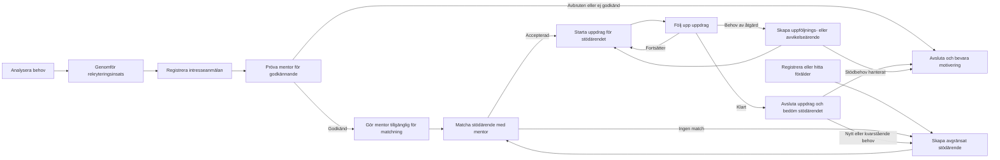
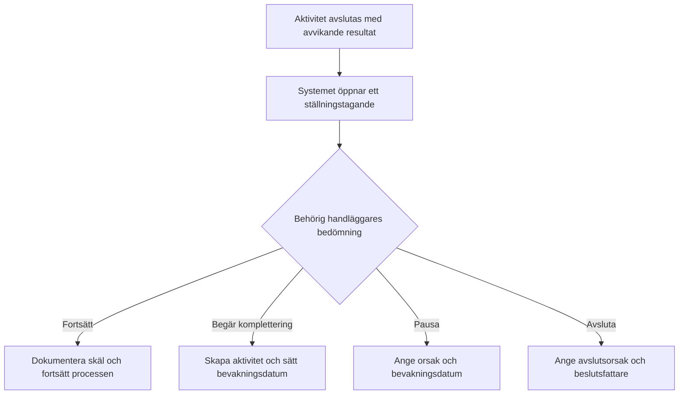

# Verksamhetsflöden och handläggningsrutiner

Status: Verksamhetsförslag 2.0
Produkt: FöräldraMentorer - Kommunportal  
Senast uppdaterad: 2026-08-22

Relaterade dokument:

- [Koncept och systemskiss](foraldramentorer-koncept.md)
- [Teknisk specifikation för progressiv ärendehantering](teknisk-specifikation-progressiv-arendehantering.md)

## 1. Syfte och avgränsning

Detta dokument beskriver hur samordnare och handläggare bör kunna arbeta i systemet från ett identifierat rekryteringsbehov till godkänd mentor, registrerad förälder, matchning, aktivt uppdrag, uppföljning och avslut.

Beskrivningen är en föreslagen normalrutin för prototypen. Den ska prövas med verksamhetsrepresentanter innan den betraktas som en fastställd kommunal process. Kommunen måste särskilt fastställa:

- vilket lagstöd och vilken registertyp som gäller för registerkontroll,
- vilka beslut som är myndighetsutövning och vem som har delegation,
- vad som ska diarieföras, bevaras eller gallras,
- vilka uppgifter som omfattas av sekretess eller särskild informationsklassning,
- hur personuppgifter får sökas, visas och exporteras,
- vilka roller som får godkänna, pausa, avsluta och återöppna ärenden.

Systemet ska stödja rutinen utan att göra varje enkel registrering tung. En användare ska kunna börja med en kort registrering och komplettera samma ärende när mer struktur behövs.

### 1.1 Så används dokumentet som lathund

Vid normal handläggning följer användaren flödena i avsnitt 6-13. När något avviker används situationskatalogen i bilaga A.

Varje situationskort innehåller fyra delar:

1. **Gör nu** - den omedelbara handläggningen.
2. **Registrera** - vilken information som ska in i systemet.
3. **Nästa läge** - hur ärendet eller aktiviteten ska lämnas.
4. **Gör inte** - vanliga fel som skapar otydlighet, integritetsrisk eller bristande spårbarhet.

Snabbingång:

| Det som har hänt | Gå till |
| --- | --- |
| Ny intresseanmälan, möjlig dubblett eller otilldelat ärende | A.1 Registrering och fördelning |
| Identiteten kan inte verifieras | A.2 Kontroller inför godkännande |
| Registerutdrag saknas, är gammalt eller kan inte bekräftas | A.2 Kontroller inför godkännande |
| Referensen svarar inte eller lämnar uppgifter som måste bedömas | A.2 Kontroller inför godkännande |
| Mentorn uteblir, vill vänta eller återkallar sin ansökan | A.3 Kontakt och medverkan |
| Ett kontrollresultat är inte godtagbart | A.4 Avvikelse och beslut |
| En aktivitet är försenad eller saknar ansvarig | A.5 Bevakning och överlämning |
| Någon har registrerat fel uppgift eller fel handling | A.6 Rättelse och datakvalitet |
| En matchning fungerar inte eller ett uppdrag behöver pausas | A.7 Matchning och uppdrag |
| En förälder saknar underlag för matchning eller tackar nej | A.7 Matchning och uppdrag |
| Det finns oro för säkerhet, barn eller olämpligt beteende | A.8 Brådskande och känsliga situationer |

## 2. Grundläggande arbetsmodell

### 2.1 Fyra skilda objekt

| Objekt | Fråga som objektet besvarar | Exempel |
| --- | --- | --- |
| Ärende | Vad handlägger kommunen och varför? | Godkännande av Amina Ekström |
| Aktivitet | Vad behöver någon i kommunen göra eller bevaka? | Kontrollera referenser |
| Handling | Vilket underlag har kommit in eller skapats? | Tjänsteanteckning från referenssamtal |
| Händelse | Vad har redan hänt i systemet? | Aktiviteten avslutades av Sara Lind 14:32 |

Minnesregel:

> Ärendet håller ihop processen. Aktiviteten styr arbetet. Handlingen är underlaget. Händelsen ger spårbarhet.

En aktivitet omvandlas inte till en handling eller händelse. När aktiviteten utförs kan handläggaren registrera en handling, och systemet skapar automatiskt en händelse.

### 2.2 Förälder, mentor och ärende

- **Förälder** och **mentor** är separata registerposter med egna kort och historik.
- En förälderpost beskriver personen och stabila kontaktuppgifter. Stödbehov, bedömningar och uppföljningar hör till ärenden och ska inte skrivas in som löpande profiltext.
- En förälder kan ha flera avgränsade stödärenden, samtidigt eller över tid. Varje stödärende beskriver ett bestämt stödbehov, syfte och tidsmässigt sammanhang.
- Ett matchningsärende tillhör exakt ett stödärende och prövar högst en föreslagen mentor åt gången. Ett stödärende kan ha flera bevarade matchningsförsök.
- Ett mentoruppdrag skapas från en accepterad matchning och kopplar exakt ett stödärende, en förälder och en mentor under en avgränsad period.
- Ett nytt stödbehov med annat syfte ska normalt registreras som ett nytt stödärende. En komplettering eller förändring inom samma syfte hanteras i det befintliga stödärendet med bevarad historik.
- Systemet grupperar inte flera personer i en gemensam registerpost. Om flera föräldrar behöver stöd registreras de som egna personer och hanteras i egna ärenden.
- Barn registreras inte som egna personer i denna del av systemet. Nödvändiga uppgifter hanteras enligt kommunens fastställda rutin och i rätt verksamhetssystem.

| Från | Relation | Till |
| --- | --- | --- |
| Förälder | En till flera | Stödärenden |
| Stödärende | En till flera över tid | Matchningsförsök |
| Matchningsförsök | Noll eller ett | Mentoruppdrag |
| Mentoruppdrag | Exakt ett | Stödärende |
| Mentor | Noll till flera över tid | Mentoruppdrag |

Det finns alltså ingen fristående eller permanent relation `Förälder → Mentor`. Relationen uppstår genom ett uppdrag för ett bestämt stödärende och upphör när uppdraget avslutas.

> Föräldrakortet beskriver personen. Stödärendet avgränsar behovet. Matchningen dokumenterar urvalet för just det stödärendet. Mentoruppdraget beskriver den överenskomna insatsen och behåller kopplingen till sitt ursprungliga stödärende.

### 2.3 Ansvar

- Varje öppet ärende bör normalt ha en ansvarig handläggare.
- Ett ärende kan ha flera medhandläggare.
- En aktivitet ärver ärendets ansvariga om den inte har tilldelats särskilt.
- Den ansvariga handläggaren ansvarar för att ärendet drivs framåt, men behöver inte utföra varje aktivitet.
- En samordnare ansvarar för otilldelade ärenden, belastning mellan handläggare och ställningstaganden som kräver högre behörighet.
- Systemet ska alltid lagra användar-ID, men visa personens fullständiga namn i gränssnittet.

### 2.4 Status och resultat

Status och resultat får inte blandas ihop.

**Status beskriver arbetsläget:**

- Ej påbörjad
- Pågår
- Väntar
- Avslutad
- Ej aktuell

**Resultat beskriver utfallet:**

- Godtagbart utfall, exempelvis `Identitet verifierad` eller `Referenser godtagbara`.
- Avvikande utfall, exempelvis `Äkthet inte bekräftad` eller `Referens kunde inte nås`.

Ett avvikande resultat betyder inte automatiskt avslag. Det öppnar ett ställningstagande där behörig handläggare väljer att fortsätta, begära komplettering, pausa eller avsluta ärendet.

### 2.5 Sammanhållna men valbara övergångar

När ett arbetsmoment normalt följs av att ett nytt objekt skapas ska systemet erbjuda detta i samma vy. Nästa steg är förvalt, men användaren får avmarkera det innan registreringen bekräftas.

| Arbetsmoment | Förvalt nästa steg | Om användaren avmarkerar |
| --- | --- | --- |
| Registrera mentor | Skapa ärende om godkännande | Mentorposten sparas och visar `Godkännandeärende saknas` som rekommenderat nästa steg |
| Registrera förälder | Skapa stödärende | Förälderposten sparas utan aktivt stödärende |
| Stödärende redo för matchning | Skapa matchningsärende | Stödärendet ligger kvar som `Redo för matchning` |
| Accepterad matchning | Skapa mentoruppdrag | Matchningen får läget `Accepterad - uppdrag ej skapat` |
| Avsluta uppdrag | Bedöm stödärendets nästa läge | Uppdraget avslutas och en uppföljningsaktivitet skapas eller ligger kvar som rekommenderad åtgärd |
| Avvikande aktivitetsresultat | Öppna ställningstagande | Resultatet sparas men avvikelsen ligger kvar tydligt i arbetskön |

Gränssnittet ska före bekräftelsen visa vilka poster som kommer att skapas eller ändras. Ett förval får aldrig genomföras dolt. Om användaren väljer bort nästa steg ska det sparade objektet få ett tydligt och sökbart läge så att processen kan fortsätta senare. Obligatoriska verksamhetsbeslut får inte ersättas av ett förval.

Att den sista aktiviteten avslutas är inte i sig en övergång. Systemet sparar aktivitetens resultat och visar vilket verksamhetsbeslut som nu behövs, men avslutar inte ärendet, skapar inte ett följdärende och ändrar inte en förälder- eller mentorpost utan ett uttryckligt kommando. Om ett följdärende redan finns ska det visas i stället för att ett nytt föreslås.

## 3. Ärendetyper

Följande ärendetyper behövs för det sammanhängande verksamhetsflödet:

| Ärendetyp | Föräldrakoppling | Mentorkoppling | Registrera minst | Normal avslutning |
| --- | --- | --- | --- | --- |
| Behovsanalys | Ingen | Ingen | Rubrik, beskrivning och ansvarig enhet | Analys dokumenterad och beslutad |
| Rekryteringsinsats | Ingen | Ingen | Rubrik, ansvarig enhet och önskat utfall | Insats genomförd och utvärderad |
| Godkännande av mentor | Ingen | Exakt en mentor | Mentor, ansvarig enhet och bakgrund | Godkänd, avbruten eller ej godkänd |
| Stödärende för förälder | Exakt en förälder | Ingen | Förälder, ansvarig enhet, avgränsat stödbehov, syfte och kontaktstatus | Redo för matchning eller avslutat utan matchning |
| Matchning | Via exakt ett stödärende | Högst en mentor | Stödärende, grundkriterier, föreslagen mentor och önskat utfall | Matchning accepterad eller avslutad utan match |
| Mentoruppdrag | Via exakt ett stödärende | Exakt en mentor | Stödärende, accepterad matchning, ansvarig enhet och uppdragets ramar | Uppdrag avslutat |
| Uppföljning | Högst en förälder | Högst en mentor | Ansvarig enhet, syfte och förväntat resultat | Uppföljning dokumenterad |
| Övrigt ärende | Högst en förälder | Högst en mentor | Ansvarig enhet, avgränsad fråga och önskat resultat | Frågan hanterad |

En förälder och en mentor kan ha flera ärenden över tid. Matchningar och uppdrag ska alltid kunna härledas till det stödärende som beskriver varför insatsen behövs. Ett ärende om godkännande eller ett stödärende ska inte återanvändas som mentoruppdrag.

### 3.1 Så väljs ärendetyp

- **Behovsanalys:** välj när verksamheten först behöver beskriva omfattning, målgrupp, område, språk och tidshorisont för ett nytt eller förändrat behov.
- **Rekryteringsinsats:** välj när ett bedömt behov ska omsättas i annons, informationsinsats eller annan konkret rekrytering.
- **Godkännande av mentor:** välj när en registrerad mentor ska genomgå kontroller, intervju och beslut om godkännande.
- **Stödärende för förälder:** välj när ett avgränsat stödbehov, kontaktstatus och förutsättningar för matchning ska dokumenteras. Skapa ett nytt stödärende när syftet är ett annat än i tidigare ärenden.
- **Matchning:** välj när ett bestämt stödärende ska prövas tillsammans med en godkänd och tillgänglig mentor.
- **Mentoruppdrag:** välj när en accepterad matchning övergår till ett uppdrag med ramar och planerad uppföljning. Uppdraget ska behålla kopplingen till stödärendet.
- **Uppföljning:** välj för en avgränsad planerad eller behovsstyrd uppföljning. Koppla mentor när uppföljningen gäller en viss person.
- **Övrigt ärende:** välj bara när frågan inte hör hemma i någon av typerna ovan. Ange vad som behöver vara gjort för att ärendet ska kunna avslutas.

Samma hjälp visas kortfattat direkt när handläggaren väljer ärendetyp i registreringsvyn. Det minskar behovet av att lämna arbetsläget för att slå upp grundläggande vägledning.

### 3.2 Hur ärendetyper får skapas

Alla ärendetyper ska inte finnas i den generella funktionen **Ny registrering**. Skapandevägen är en systemregel och kontrolleras även när registreringen sparas.

| Ärendetyp | Skapandeväg |
| --- | --- |
| Behovsanalys, Rekryteringsinsats, Stödärende för förälder, Uppföljning och Övrigt ärende | Kan skapas manuellt från ärenderegistret. |
| Godkännande av mentor | Startas från en mentorpost. Då följer rätt mentor med och dubbelregistrering kan kontrolleras. |
| Matchning | Startas från ett bestämt stödärende. Stödärendet behöver inte avslutas först. |
| Mentoruppdrag | Skapas från en matchning först när både föräldern och mentorn har accepterat. |

En handläggare ska alltså inte kunna skapa ett fristående matchningsärende eller mentoruppdrag och i efterhand försöka återskapa sambanden. Vid behov av ett nytt matchningsförsök startas det från samma stödärende. En systemadministratör kan se skapandevägen för varje ärendetyp men inte ändra dessa integritetsregler i prototypen.

**I systemet:** [Administrera ärendetyper](feature:admin.case-types)

## 4. Övergripande livscykel

Övergången mellan stegen ska ske med ett uttryckligt kommando. Systemet får föreslå nästa ärende eller aktivitet, men får inte fatta verksamhetsbeslut dolt.

### 4.1 Publik intresseanmälan från ny mentor

1. Den intresserade personen öppnar `Bli mentor` utan inloggning och lämnar kontaktuppgifter, område, språk, tillgänglighet, erfarenhetsområden och motivation. Personnummer eller registeruppgifter ska inte efterfrågas här.
2. Ett utkast kan sparas lokalt och fortsättas i samma webbläsare. Vid inskick skapas en intresseanmälan med referens, status och historik samt en registrerad mottagningsbekräftelse via demo-e-post eller demo-SMS.
3. Ansökan visas i mentorregistrets granskningskö. Handläggaren kontrollerar fullständighet och möjliga dubbletter innan någon mentorpost skapas.
4. Om uppgifter saknas används `Begär komplettering`. Ansökan ligger kvar som samma objekt och den sökande kan uppdatera den under `Min ansökan`.
5. Om personen redan finns kopplas ansökan till den befintliga mentorposten. Annars väljer handläggaren `Ta emot och skapa mentor`.
6. Överföringen skapar en ordinarie mentorpost och matchningsprofil samt startar ärendet `Godkännande av mentor`. Självuppgivna erfarenheter är märkta som egna uppgifter tills handläggningen verifierar dem.

Intresseanmälan är inte ett godkännande och inte ett mentorärende. Den är ett insamlings- och mottagningsobjekt före kommunens formella prövning. Identitet, belastningsregister, referenser, utbildning, intervju och beslut hanteras fortsatt i godkännandeärendet.

## 5. Dagligt arbete för handläggare

### 5.1 Börja arbetsdagen

Handläggaren öppnar `Översikt`. Arbetskön ligger först och bygger på samma ärende- och aktivitetsdata som register och ärendekort. Köerna är `Aktiviteter`, `Otilldelade`, `Försenade` och `Ställningstaganden`. För `Aktiviteter`, `Försenade` och `Ställningstaganden` kan handläggaren visa alla ärendeansvariga, sina egna ärenden eller en vald handläggares ärenden. `Otilldelade` saknar ansvarig och påverkas därför inte av ansvarigfiltret. Varje rad visar ärendet och nästa aktivitet och leder direkt till rätt arbetsyta.

Rekommenderad arbetsordning är att först bedöma ställningstaganden och försenade aktiviteter och därefter fortsätta med egna aktiviteter. Samordnaren kontrollerar dessutom kön `Otilldelade` och fördelar arbetet. Om ett bevakningsdatum passeras visas aktiviteten som försenad.

Varje köpost ska visa ärende, relevant personkoppling, nästa aktivitet och varför posten visas i kön. Förfallodatum visas när det finns. Formuleringen `Kräver åtgärd` ska undvikas. Systemet ska i stället ange exempelvis `Ställningstagande krävs av handläggare`, `Förfallodatum passerat` eller `Inväntar komplettering från mentor`.

Ärendeflödena längre ned på Översikt visar antal öppna ärenden per ärendetyp och hur typerna hänger ihop. De centrala flödena visas först. Sekundära samband och mentorflödet kan fällas ut och får inte användas som ersättning för arbetskö eller beslutspunkt.

**I systemet:** [Öppna Översikt och arbetskö](feature:dashboard.work-queue)

Kalendern samlar bokade och genomförda möten samt öppna aktiviteters och ärendens förfallodatum. Den är en planerings- och navigeringsvy; datum ändras alltid i mötet, aktiviteten eller ärendet där uppgiften hör hemma. Handläggaren kan filtrera på innehållstyp och ansvarig och öppna varje kalenderpost direkt i rätt arbetsvy.

**I systemet:** [Öppna Kalender](feature:calendar.view)

### 5.2 Öppna och bedöma ett ärende

När handläggaren öppnar ett ärende ska fliken `Arbete` direkt besvara:

- Vad gäller ärendet?
- Vem är ansvarig?
- Vilket är nästa rekommenderade steg?
- Finns en tidsfrist eller avvikelse?
- Vad inväntar kommunen?
- Vilket underlag finns redan?

Fliken visar därför nästa åtgärd först, därefter ärendebeskrivningen, aktiviteterna och de två eller tre senaste verksamhetshändelserna. Tekniska systemhändelser visas inte i den korta listan. Äldre grunduppgifter och sällan använda ärendeåtgärder ligger kollapsade sist.

Ärendebeskrivningen används för bakgrund, syfte, aktuellt läge och önskat resultat. Handläggaren redigerar den i ett särskilt läge och varje tidigare version kan läsas med användare och tidpunkt. För `Övrigt ärende` är beskrivningen rymlig från början; i styrda ärenden tar den mindre plats tills den behöver läsas eller ändras.

Menyn `Lägg till` ska i första hand styra till rätt verksamhetsobjekt: aktivitet, kontakt, möte eller handling. `Anteckning om ärendet` ligger sist och används bara när informationen inte hör hemma i någon av dessa registreringar.

Handläggaren går därefter till den aktuella aktiviteten, utför arbetet, registrerar relevant resultat och kompletterar med underlag endast när det behövs.

En aktivitet kan vara enkel eller guidad. En enkel aktivitet fungerar som tidigare och visar resultat och anteckning direkt. En guidad aktivitet samlar flera interna arbetssteg i samma aktivitet. Stegen har inte egna ansvariga eller förfallodatum och syns därför inte som separata poster i arbetskön. Om ett moment behöver eget ansvar eller egen bevakning ska handläggaren skapa en vanlig aktivitet.

I en guidad aktivitet visas färdiga steg kompakt och det aktuella steget utvecklat med en tydlig nästa åtgärd. Obligatoriska steg måste bli klara innan handläggaren kan välja aktivitetens slutresultat. Valfria steg kan hoppas över med en registrerad orsak. Ett blockerat steg sätter aktiviteten i vänteläge, men stegets status ersätter aldrig aktivitetens separata verksamhetsresultat.

Den första guidade aktiviteten är `Genomför första mötet` i matchningsflödet: `Förbered`, `Hitta tid`, `Boka och kalla`, `Genomför` och `Dokumentera`. Ett bokat och kopplat möte flyttar aktiviteten till `Genomför`. När samma möte markeras genomfört och har en saklig anteckning blir även `Genomför` och `Dokumentera` klara. Handläggaren väljer därefter aktivitetens slutresultat uttryckligen.

Aktivitetslistan ligger i samma första flik. Den är medvetet kompakt och visar aktivitetens namn, aktuellt läge, registrerat resultat och den kopplade registrering som fortfarande måste färdigställas. Ansvarsundantag, förfallodatum och handlingar visas bara när de är relevanta.

Om aktiviteten hör ihop med en strukturerad registrering visar aktivitetslistan och aktivitetskortet samma block med:

- registreringens namn,
- ett härlett, verksamhetsnära läge, exempelvis `Inte påbörjad`, `Påbörjad` och `Fullständig` eller för intervju `Inte bokad`, `Bokad` och `Genomförd`,
- tidpunkt och användare för senaste ändring,
- ett direkt kommando som öppnar rätt flik och rätt inmatning.

Läget räknas från den faktiska registreringen och anges inte separat på aktiviteten. Exempelvis hämtas identitetsstatus från mentorkortets identitetsuppgifter, intervjuunderlag från det kopplade mötet och matchningsstatus från matchningsärendets strukturerade underlag. När obligatorisk registrering inte är klar är avslutande resultat spärrade. Vyn förklarar vad som saknas och ger ett direkt kommando till rätt formulär.

**I systemet:** [Öppna ärenderegistret](feature:cases.list)

### 5.3 Avsluta arbetsmomentet

När en aktivitet avslutas i aktivitetsvyn ska användaren:

1. välja ett strukturerat resultat,
2. ange notering om resultattypen kräver det,
3. registrera eller länka relevant handling när det behövs,
4. använda den tydliga avslutningsknappen, som anger om nästa aktivitet öppnas eller om användaren återgår till ärendet.

Systemet registrerar automatiskt vem som gjorde ändringen och när den gjordes. Resultat får inte vara förvalt och ett valt resultat ska kunna avmarkeras. Resultaten visas som en lista med alternativ så att möjliga utfall är synliga utan att en meny behöver öppnas.

Om en obligatorisk kopplad registrering inte är klar är resultatvalen inaktiverade. Kommandot `Påbörja registrering` eller `Fortsätt registrering` leder direkt till rätt arbetsyta. Efter att uppgifterna sparats återgår handläggaren till aktiviteten och kan registrera dess verksamhetsresultat.

Vänteläge, `Pågår`, `Ej aktuell` och andra undantag ligger under `Planering och undantag`. De ska inte konkurrera med det normala flödet resultat, eventuell anteckning och avslut.

När alla tillämpliga aktiviteter är avslutade och inga ställningstaganden återstår ska aktivitetsvyn visa:

- att ärendet fortfarande är öppet,
- vilka uppgifter som har sparats i aktiviteten och loggen,
- att inget följdärende eller registerkort har ändrats automatiskt,
- ett primärt förslag anpassat till ärendetypen,
- kommandot `Avsluta ärendet` som ett separat, uttryckligt beslut.

### 5.4 Välj rätt vy

- **Översikt:** prioriterar dagens arbete, ger genvägar för att skapa nytt och visar antal öppna ärenden i verksamhetsflödena.
- **Ärenderegister:** visar den fullständiga, sökbara listan över ärenden. Här väljer användaren vilket ärende som ska öppnas.
- **Ärendekort:** är den primära arbetsytan för beskrivning, aktiviteter, handlingar, kontakter, historik och beslut i ett ärende.
- **Mentorregister och mentorkort:** visar person- och registeruppgifter samt länkar till personens ärenden. Kontroller, möten och beslut ska registreras i rätt ärende och bara sammanfattas på mentorkortet.
- **Demoläge:** finns under Systemadministration och demonstrerar aktuella funktioner i en förberedd ordning. Återkoppling från ett demosteg registreras som ett utvecklingsförslag i supportkön och får inte blandas med verksamhetsärenden, tjänsteanteckningar eller logghändelser.

Samma status ska aldrig registreras separat i flera vyer. Översikt, listor och mentorkort ska härleda sina sammanfattningar från ärenden och aktiviteter.

## 6. Flöde A: behovsanalys och rekrytering

### 6.1 Registrera behov

**Utlösare:** verksamheten identifierar brist på mentorer inom ett område, språk eller en viss tillgänglighet.

**Enkel registrering:**

- ärendetyp `Behovsanalys`,
- rubrik,
- kort beskrivning av det uppmärksammade behovet,
- ansvarig enhet, exempelvis `Familjestöd`.

Fältet `Mentor` visas inte eftersom en behovsanalys gäller verksamhetens samlade behov och inte en viss mentor.

**Strukturerade kompletteringar i samma registrering:** målgrupp, geografiskt område, språkbehov, önskat antal mentorer och datum då behovet senast bör vara mött. Fyll i det som är känt och komplettera samma ärende senare. Analysunderlag läggs till som handling och medhandläggare läggs till när fler behöver arbeta i ärendet.

**Avslut:** ansvarig registrerar slutsats och beslut om fortsatt åtgärd. Om rekrytering ska genomföras föreslår systemet `Skapa rekryteringsärende` och kopplar det nya ärendet till behovsanalysen som relaterat ärende.

**I systemet:** [Skapa ett nytt ärende](feature:case.create)

### 6.2 Genomför rekryteringsinsats

Vanliga aktiviteter:

1. Formulera målgrupp och budskap.
2. Skapa och godkänn platsannons eller informationsmaterial.
3. Välj publiceringskanaler.
4. Publicera.
5. Bevaka svarstid.
6. Sammanställ utfall.

Annons, beslut och sammanställning registreras som handlingar. En publicering registreras som en händelse eller tjänsteanteckning, inte som en uppladdad fil om inget dokument behöver bevaras.

## 7. Flöde B: intresseanmälan och första bedömning

### 7.1 Registrera ny mentor

**Utlösare:** en person skickar en intresseanmälan eller kontaktar kommunen.

**Minsta registrering:**

- namn,
- kontaktväg,
- samtyckes- eller informationsstatus enligt fastställd rutin,
- kort notering om intresset.

Systemet erbjuder att skapa en mentorpost och ett ärende om godkännande i samma sammanhängande operation. `Skapa ärende om godkännande` är förvalt men kan avmarkeras. Om det avmarkeras sparas mentorposten utan ärende och visar godkännandeärendet som rekommenderat nästa steg. Dublettkontroll görs mot befintliga personer, men sammanslagning får aldrig ske automatiskt.

Systemet registrerar automatiskt vilken inloggad användare som skapade mentorposten och tidpunkten för registreringen. Registreraren visas separat från ansvarig handläggare, eftersom det kan vara olika personer. Uppgiften kan inte ändras i mentorpostens redigeringsläge.

**I systemet:** [Registrera ny mentor](feature:mentor.create)

### 7.2 Fördela ärendet

Nya ärenden om godkännande kan vara otilldelade. Samordnaren:

1. kontrollerar arbetsbelastning och eventuell jävssituation,
2. väljer ansvarig handläggare,
3. lägger vid behov till medhandläggare,
4. anger första bevakningsdatum.

### 7.3 Första kontakt

Handläggaren bekräftar intresseanmälan, beskriver processen och säkerställer att personen vill gå vidare. Kontakten registreras som möte eller tjänsteanteckning beroende på omfattning.

Möjliga utfall:

- `Vill gå vidare`: godkännandeaktiviteterna fortsätter.
- `Återkommer senare`: ärendet sätts i vänteläge med bevakningsdatum.
- `Avstår`: ärendet avslutas med neutral avslutsorsak.
- `Felregistrerad/dubblett`: särskild rättelserutin används; posten tas inte bara bort.

## 8. Flöde C: prövning av mentor för godkännande

Ärendet om godkännande skapas från en versionsstyrd mall. Aktiviteterna visas i rekommenderad ordning, men kommunen kan tillåta parallellt arbete där det är lämpligt.

### 8.1 Verifiera identitet

**Syfte:** säkerställa att personuppgifterna hör till rätt person.

**Arbetssätt:**

- Digital verifiering med godkänd e-legitimation, exempelvis BankID, eller
- fysisk kontroll av giltig identitetshandling enligt kommunens rutin.

**Registreras strukturerat:** personnummer eller annan tillåten identitetsbeteckning, verifieringssätt, datum och verifierande handläggare.

**Registreras normalt inte:** kopia av fysisk identitetshandling. Behov, rättslig grund och lagring måste beslutas separat innan en sådan funktion införs.

**Resultat:**

- Identitet verifierad.
- Identitet kunde inte verifieras.
- Komplettering behövs.

Vid avvikande resultat krävs notering och ställningstagande. Inmatad identitetsinformation visas därefter skrivskyddad och ändras endast genom ett uttryckligt redigeringsläge med bekräftelse och loggning.

### 8.2 Kontrollera registerutdrag

Kommunen måste först fastställa att uppdragets innehåll och lagstöd ger rätt att begära det aktuella utdraget. För arbete som innebär direkt och regelbunden kontakt med barn kan utdraget för annan verksamhet med barn vara relevant, men den bedömningen får inte göras av prototypen.

Normal rutin när den registertypen är tillämplig:

1. Mentorn begär själv utdraget.
2. Utdraget visas först när personen erbjudits arbete eller uppdrag enligt den tillämpliga rutinen.
3. Handläggaren kontrollerar att utdraget är rätt typ och inte för gammalt.
4. Ett digitalt utdrags äkthet kontrolleras i Polismyndighetens kontrolltjänst. Pappersutdrag kontrolleras enligt dess säkerhetsdetaljer.
5. Systemet registrerar endast att utdraget har visats och kontrollerats, datum, handläggare och neutralt resultat.

För den registertyp som gäller annan verksamhet med barn får verksamheten enligt Polismyndighetens information anteckna att utdraget visats, men inte behålla en kopia eller anteckna dess innehåll. Systemet ska därför inte erbjuda vanlig filuppladdning på denna aktivitet innan kommunens lagstöd och dokumenthanteringsrutin har fastställts.

**Resultat:**

- Kontrollerat, inget fortsatt ställningstagande behövs.
- Kontrollerat, särskilt ställningstagande krävs.
- Inte visat.
- Fel typ eller för gammalt.
- Äkthet inte bekräftad.

Resultatet `Kontrollerat, särskilt ställningstagande krävs` används när kontrollen har genomförts men fortsatt lämplighet behöver bedömas enligt kommunens fastställda rutin. Systemet registrerar inte brott, påföljd eller andra uppgifter ur utdraget. Aktiviteten avslutas och ärendet sätts i läget `Kräver ställningstagande`.

Ansvarig handläggare måste därefter registrera ett uttryckligt ställningstagande:

- fortsätt prövningen,
- begär komplettering,
- pausa ärendet, eller
- avsluta utan godkännande.

Ställningstagandet kräver en saklig motivering och loggas med handläggare och tidpunkt. Motiveringen får inte återge registerutdragets innehåll. Resultaten `Inte visat`, `Fel typ eller för gammalt` och `Äkthet inte bekräftad` följer samma ställningstagandeflöde; handläggaren kan exempelvis begära ett nytt utdrag med bevakningsdatum.

### 8.3 Kontrollera referenser

1. Handläggaren registrerar referensperson och kontaktuppgifter med minsta nödvändiga uppgifter.
2. Mentorn informeras om hur uppgifterna används enligt kommunens rutin.
3. Handläggaren kontaktar referensen.
4. Samtalet dokumenteras som en strukturerad tjänsteanteckning kopplad till aktiviteten.
5. Aktiviteten avslutas med resultat.

**Resultat:**

- Referenser godtagbara.
- Kompletterande referens behövs.
- Referens kunde inte nås.
- Uppgifter behöver bedömas.

Om ett kontaktförsök inte lyckas står referensaktiviteten i `Väntar` med väntande part, bevakningsdatum och en kort notering. Ett vänteläge har inget slutresultat. När beslutade kontaktförsök är uttömda avslutas aktiviteten med exempelvis `Referens kunde inte nås`, vilket öppnar ett ställningstagande. En separat aktivitet, exempelvis `Kontakta mentorn om ny referens`, skapas bara om detta är ett eget arbetsmoment med eget ansvar eller datum.

### 8.4 Följ upp e-learning

E-learningplattformen eller handläggaren registrerar genomförande, datum och version av utbildningen. Systemet bör inte lagra fler svar än vad verksamheten behöver.

**Resultat:** genomförd, delvis genomförd eller ej genomförd. Vid delvis genomförd utbildning står aktiviteten i vänteläge med tydligt återstående moment.

### 8.5 Genomför kunskapsavstämning

Avstämningen ska visa om de obligatoriska kunskapsområdena har förståtts. Resultatet registreras strukturerat. Vid behov skapas en kompletterande utbildningsaktivitet i stället för att den ursprungliga bedömningen skrivs över.

### 8.6 Kalla till intervju

Aktiviteten omfattar att föreslå tid, bekräfta deltagare och registrera bokningen. Förfallodatum är den tid då kallelsen senast ska vara hanterad, medan själva mötestiden lagras på mötet.

**Resultat:** bokad, ombokning behövs, tackat nej eller ej nådd.

### 8.7 Genomför intervju inför godkännande

Intervjun inför godkännande registreras som ett möte kopplat till aktiviteten. Det ska gå att registrera flera intervjutillfällen utan att tidigare protokoll skrivs över.

Minsta mötesuppgifter:

- mötestyp `Intervju inför godkännande`,
- datum och tid,
- deltagande handläggare,
- sammanfattning,
- bedömningsresultat.

Ett mer omfattande protokoll registreras som handling kopplad till mötet och aktiviteten. Andra kontakter och senare uppföljningar registreras som egna möten med annan mötestyp, så att de inte blandas ihop med intervjun inför godkännande.

### 8.8 Fatta beslut om godkännande

Beslut kan påbörjas när obligatoriska aktiviteter är avslutade och öppna avvikelser är hanterade. Systemet visar ett beslutsunderlag men fattar inte beslutet.

Beslutsfattaren ska se:

- vilka kontroller som genomförts,
- resultat och datum,
- kvarstående avvikelser,
- relevanta handlingar,
- vem som berett ärendet.

**Möjliga utfall:**

- Godkänd.
- Komplettering krävs.
- Inte godkänd.
- Ansökan återkallad.

Beslutet kräver beslutsfattare, datum, strukturerad orsak och motivering enligt fastställd rutin. Vid godkännande uppdateras mentorns tillgänglighet för matchning. Vid övriga slutliga utfall avslutas ärendet om godkännande och återstående aktiviteter markeras `Ej aktuella`.

## 9. Flöde D: avvikelse och ställningstagande

Ställningstagandet ska ligga kvar i arbetskön tills det har hanterats. Det får inte försvinna genom att någon ändrar aktivitetens status. En ändring av ett redan fattat ställningstagande kräver nytt beslut, motivering och behörighet; historiken bevaras.

## 10. Flöde E: förälder, stödärende och matchning

Föräldern registreras som en egen person. Varje avgränsat stödbehov hanteras i ett eget stödärende. Matchningar och uppdrag utgår från stödärendet och ska inte döljas som profilfält eller status på föräldern eller mentorn.

Stödområden används som en gemensam, kontrollerad begreppslista genom hela flödet. Kommunen väljer vilka områden som används internt och vilka som visas i den publika stödansökan. Förälderns val hör till det aktuella stödärendets matchningsunderlag, inte till en permanent beskrivning av personen. Mentorn har en aktiv, versionshanterad matchningsprofil och markerar endast områden där hen vill bli matchad. Självskattad trygghet att ge vardagsnära stöd är primärt underlag; erfarenhetsgrund är sekundärt. Överlappning mellan dessa uppgifter är ett öppet beslutsunderlag, aldrig ett automatiskt beslut.

Geografiska områden, språk och återkommande tillgänglighetsfönster registreras som strukturerade val i både stödärendets och mentorns matchningsprofil. Samordnaren administrerar kommunens geografiska områden under systemadministration. Ett område som inte längre används inaktiveras i stället för att raderas, så att tidigare matchningar fortfarande kan förstås.

### 10.1 Registrera förälder och stödärende

1. Handläggaren söker först efter en befintlig förälder för att undvika dubbletter.
2. Om personen saknas registreras namn, kontaktuppgift, informationsstatus och de få stabila uppgifter som behövs för fortsatt kontakt.
3. Systemet registrerar vem som skapade posten och när.
4. Handläggaren kontrollerar om det finns ett pågående stödärende med samma syfte.
5. Om behovet har ett nytt syfte är `Skapa stödärende för förälder` förvalt. Handläggaren kan avmarkera valet och endast spara förälderposten. Om det är en fortsättning kompletteras det befintliga stödärendet utan att historiken skrivs över.
6. Stödbehovets stödområden, syfte, språk, geografiska område, tillgänglighet och andra matchningsuppgifter registreras i stödärendet, inte som känslig fritext på föräldrakortet. Om föräldern ännu inte kan välja stödområde markeras behovet för bekräftelse i första kontakten.
7. Stödärendet får en egen ansvarig, status, starttidpunkt och plan för nästa kontakt.
8. Handläggaren dokumenterar om föräldern vill gå vidare till matchning och vad nästa kontakt ska vara.

Föräldraregistreringen ska inte skapa någon gemensam personpost. Om en annan förälder också behöver stöd registreras den personen separat. Ett nytt stödärende ska däremot inte skapa en ny förälderpost för en person som redan finns.

På föräldrakortet visas de länkade posterna i den ordning handläggningen normalt följer: `Stödärenden`, `Matchningar` och `Uppdrag`. Varje flik visar status och nästa aktivitet och leder direkt till rätt ärende, så att handläggaren inte behöver söka fram nästa del av flödet i ärenderegistret.

**I systemet:** [Öppna föräldraregistret](feature:parent.list) · [Registrera förälder](feature:parent.create)

### 10.2 Avgränsa stödärendet och förbered matchningen

Innan en mentor föreslås ska handläggaren avgöra om registreringen är ett nytt stödbehov eller en fortsättning inom ett befintligt stödärende:

- **Samma syfte:** komplettera det befintliga stödärendet och bevara tidigare uppgifter och händelser.
- **Annat syfte eller annan avgränsad insats:** skapa ett nytt stödärende, även om samma förälder redan har eller har haft ett uppdrag.

Det valda stödärendet ska därefter innehålla tillräckliga och aktuella uppgifter för urvalet:

- stödets avgränsade syfte,
- önskat resultat,
- minst ett bekräftat stödområde ur kommunens katalog,
- kända grundkriterier valda ur katalogerna för språk, geografiskt område och återkommande tillgänglighet,
- kontaktstatus och om föräldern vill medverka i matchningen,
- ansvarig handläggare och nästa planerade kontakt.

De tre första punkterna är prototypens krav för `Fullständigt underlag`. De markeras som obligatoriska i formuläret och en checklista visar vilka som återstår. Ett ofullständigt utkast får sparas, men en aktivitet som kräver underlaget kan inte avslutas förrän kraven är uppfyllda. Matchningsärendet ska inte startas med påhittade standardvärden. Om föräldern redan har ett aktivt stödärende eller uppdrag ska systemet visa detta som en upplysning, inte blockera en ny registrering. Handläggaren bedömer och dokumenterar eventuell samordning.

### 10.3 Matcha stödärende med mentor

Matchning är ett eget ärende som alltid tillhör ett bestämt stödärende. Den ska inte döljas som en status på föräldern eller mentorn.

När matchningen startas fryser systemet en ögonblicksbild av stödärendets och mentorns aktiva matchningsprofiler. Ändringar som görs senare ska användas i nya matchningar men får inte ändra vad den tidigare matchningen grundades på.

1. Handläggaren startar matchningsärendet från det stödärende som ska få en mentorinsats. Ärendets namn fylls automatiskt från stödärendet.
2. Systemet visar en sök- och filtrerbar lista över godkända och tillgängliga mentorer.
3. På varje mentor visas vilka aktiva kriterier som matchar och vilka uppgifter som saknas eller behöver kontrolleras.
4. Handläggaren kan tillfälligt avaktivera enskilda kriterier för att bredda urvalet. Avaktiveringen ändrar inte det sparade stödunderlaget och ska vara synlig i bedömningen.
5. Handläggaren bedömer strukturerad överlappning i språk, geografi och tillgänglighet tillsammans med erfarenhetsnivå, parternas önskemål och andra relevanta kriterier samt dokumenterar kort varför en match föreslås. Avsaknad av registrerad överlappning är en upplysning, inte ett automatiskt avslag.
6. Föräldern och mentorn kontaktas var för sig enligt kommunens rutin.
7. Första mötet bokas och registreras.
8. Båda parters återkoppling dokumenteras utan onödiga samtalsdetaljer.
9. Matchningen accepteras eller avslutas utan match. Stödärendet ligger kvar och kan få ett nytt matchningsförsök.

Matchningsärendets aktiviteter har var sin avgränsade uppgift och egna resultat. `Genomförd` ska inte användas som ett generellt matchningsutfall.

| Aktivitet | Handläggaren gör | Exempel på registrerat utfall |
| --- | --- | --- |
| Kontrollera tillgänglighet och grundkriterier | Kontrollerar godkännande, aktiv status, tillgänglighet, stödområden, språk, geografi och praktiska förutsättningar. | Grundkriterier uppfyllda; mentorn är inte tillgänglig; grundkriterier inte uppfyllda; mer underlag behövs. |
| Dokumentera matchningsförslag | Motiverar kort varför mentorn passar det aktuella stödärendet och anger begränsningar eller sådant som behöver bekräftas. | Matchningsförslag dokumenterat; ingen lämplig matchning kunde föreslås; mer underlag behövs. |
| Kontakta mentorn | Informerar om uppdragets syfte och ramar med minsta nödvändiga personuppgifter och registrerar svaret. | Mentorn vill gå vidare; mentorn tackar nej; mentorn kunde inte nås. |
| Boka första mötet | Kommer överens om datum, kontaktform och praktiska förutsättningar. Vid utebliven bekräftelse används vänteläge. | Första mötet bokat; mötet kunde inte bokas; ombokning behövs. |
| Registrera parternas återkoppling | Registrerar förälderns och mentorns svar var för sig i den strukturerade återkopplingen på ärendets översikt. | Båda vill gå vidare; föräldern tackar nej; mentorn tackar nej; nytt förslag behövs. |
| Fatta beslut om matchning | Kontrollerar underlaget och parternas svar och sparar det samlade utfallet på ärendets översikt. | Matchningen godkänd; matchningen avslutas utan uppdrag; nytt matchningsförslag behövs. |

Aktivitetslistan visar den aktuella arbetsinstruktionen. När en aktivitet är avslutad visar den registrerat utfall, eventuell tjänsteanteckning, tidpunkt och registrerande användare. Parternas svar och beslut registreras i den strukturerade återkopplingen på översikten; systemet uppdaterar motsvarande aktiviteter så att samma uppgift inte behöver registreras parallellt på två ställen.

Återkopplingen registreras separat för respektive part:

| Part | Tillåtna utfall |
| --- | --- |
| Förälder | Accepterar, tackar nej, vill avvakta |
| Mentor | Accepterar, tackar nej, vill avvakta |
| Matchningsärende | Accepterad matchning, väntar på svar, avslutad utan match |

Ett mentoruppdrag får erbjudas först när både föräldern och mentorn har accepterat samma förslag. `Skapa mentoruppdrag` är då förvalt men kan avmarkeras. Om det avmarkeras sparas matchningen som `Accepterad - uppdrag ej skapat`. När uppdraget skapas får det en oföränderlig referens till stödärendet och den accepterade matchningen. Systemet får inte tolka uteblivet svar som ett godkännande.

En misslyckad matchning ändrar inte automatiskt mentorns godkännandestatus. Om något framkommer som påverkar lämpligheten skapas ett separat uppföljningsärende och mentorns tillgänglighet kan pausas genom ett uttryckligt beslut.

**I systemet:** [Öppna matchningsärenden](feature:matching.list)

### 10.4 Förvalta stödområden

Systemadministratören utgår från den centrala katalogen och väljer för varje område:

1. om området ska kunna användas av kommunen,
2. om området även ska visas för föräldrar i den publika stödansökan.

Ett publikt område måste samtidigt vara aktiverat internt. När ett område inaktiveras döljs det i nya registreringar, men uppgiften ligger kvar i redan sparade stödärenden, mentorprofiler och uppdrag. Ett område får därför inte återanvända ett gammalt tekniskt ID för en ny betydelse. Ändrad benämning eller större betydelseförändring ska versionshanteras.

Katalogen ska beskriva sådant en föräldermentor faktiskt kan stödja i vardagen, exempelvis skolfrånvaro, vardagsrutiner, kommunikation eller föräldraskap. Akut fara, våld, allvarlig psykisk ohälsa, missbruk eller behov av myndighetsutövning ska inte omvandlas till vanliga matchningsområden. Sådana uppgifter följer kommunens eskalerings- och skyddsrutiner.

**I systemet:** [Administrera stödområden](feature:admin.support-areas)

För varje område som en mentor kan ge stöd inom registreras en eller flera erfarenhetsgrunder: **egen eller närståendes erfarenhet**, **erfarenhet av att stödja andra** och **utbildning eller yrkeserfarenhet**. Alternativen kan kombineras. Handläggaren ska inte tolka ett valt område som en formell behörighet; verifiering och lämplighetsbedömning görs separat.

## 11. Flöde F: mentoruppdrag och uppföljning

När en matchning accepterats erbjuder systemet att skapa ett uppdragsärende kopplat till exakt ett stödärende, en förälder och en mentor, med startdatum, ansvarig samordnare, planerade uppföljningar och förväntat slutdatum. Uppdragets syfte hämtas från stödärendet men kan preciseras i uppdragets ramar.

En förälder kan ha flera uppdrag över tid och, när verksamheten uttryckligen bedömt att det behövs, flera samtidiga uppdrag för olika stödärenden. Systemet ska då varna för överlappning och kräva att ansvar, syfte och samordning framgår. Uppdragen får inte slås ihop enbart för att de gäller samma förälder.

Uppföljningen består av fyra skilda men sammanhängande delar. De ska inte ersättas av en gemensam fritextanteckning:

1. **Uppdragsplan** - vad som ska göras, under vilken period och hur ofta kontakterna ska ske.
2. **Mentorrapport** - mentorns redovisning av genomförda eller uteblivna kontakter.
3. **Föräldraavstämning** - handläggarens oberoende kontroll med föräldern.
4. **Ersättningsperiod** - det underlag som handläggaren granskar, godkänner och senare markerar som utbetalt.

### 11.1 Fastställ uppdragsplan

Handläggaren fastställer startdatum, planerat slutdatum, normal kontaktfrekvens, kontaktform, datum för första föräldraavstämning, fortsatt uppföljningsfrekvens och inom hur många dagar mentorn ska rapportera. Systemet ska inte ha ett generellt krav på ett visst antal möten; omfattningen bestäms för varje uppdrag utifrån stödärendets syfte och lokal rutin.

Planen ska vara sparad innan återkommande kontakter börjar. Första föräldraavstämningen ska ligga inom uppdragstiden. Ändringar i planen ska visa vem som ändrat och när.

### 11.2 Registrera mentorrapport

Efter varje planerad kontakt rapporterar mentorn datum, kontaktform, tidsåtgång, utfall, kort saklig sammanfattning och eventuellt nästa kontaktdatum. Utebliven eller inställd kontakt registreras också. Mentorn kan markera att kontakt eller stöd från handläggaren behövs.

I prototypen registrerar handläggaren rapporten i systemet och det framgår både vilken mentor som rapporterat och vem som registrerat uppgiften. I ett senare externt mentorgränssnitt kan mentorn registrera samma informationsobjekt direkt utan att datamodellen ändras.

### 11.3 Genomför föräldraavstämning

Handläggaren kontaktar föräldern vid den första planerade avstämningen och därefter enligt uppdragsplanen. Avstämningen ska hållas skild från mentorrapporten och besvara:

- om kontakt med mentorn har skett,
- om samarbetet fungerar,
- om stödet upplevs relevant,
- om kontakten känns trygg,
- om uppdraget bör fortsätta, ändras, pausas eller avslutas.

Normal avstämning kan registreras snabbt med strukturerade svar. Vid ett avvikande svar krävs en kort tjänsteanteckning om vad som avviker och nästa steg. Oro eller uppgift om att kontakt inte skett ska hanteras innan ersättning godkänns. Föräldern ska inte behöva attestera varje enskild timme; avstämningen är en rimlig oberoende kontroll av genomförande och kvalitet.

### 11.4 Granska ersättningsperiod

En ersättningsperiod har start- och slutdatum och sammanställer slutförda mentorrapporter samt den senaste föräldraavstämningen inom perioden. Överlappande perioder för samma uppdrag får inte skapas.

Systemet visar något av följande lägen:

- `Väntar på rapporter`
- `Väntar på föräldraavstämning`
- `Redo för granskning`
- `Kräver komplettering`
- `Godkänd`
- `Utbetald`

Handläggaren får godkänna perioden först när det finns minst en genomförd mentorrapport och en föräldraavstämning som bekräftar kontakt utan trygghetsoro. Vid godkännande fryses rapporternas id:n, godkänd tidsåtgång och den avstämning som låg till grund för beslutet. Senare registreringar får därför inte ändra ett redan godkänt underlag. Utbetalning markeras separat efter att ekonomirutinen genomförts.

### 11.5 Följ upp kvalitet och avsluta

De strukturerade uppgifterna kan användas för kvalitetsredovisning, exempelvis andel genomförda kontakter, avvikelser, trygghetsoro, ändrade uppdrag och tid till första avstämning. Fritext ska inte användas som primär statistik och ska begränsas till vad som behövs för handläggningen.

När uppdraget avslutas registrerar handläggaren slutdatum, avslutsorsak på lämplig nivå, slutlig föräldraavstämning och återstående ersättningsperiod. Därefter bedöms stödärendet separat: avsluta, fortsätt utan uppdrag eller påbörja ny matchning.

Vid oro, konflikt, gränsöverskridande eller annan betydande avvikelse ska användaren kunna:

- registrera kontakten,
- pausa matchningen eller uppdraget om rollen medger det,
- skapa en särskild utrednings- eller uppföljningsaktivitet,
- eskalera till samordnare,
- registrera beslut och åtgärd utan onödiga känsliga detaljer.

Akuta skydds- eller orosfrågor ska följa kommunens särskilda rutin och får inte reduceras till ett vanligt arbetsflöde i systemet.

**I systemet:** [Öppna uppdragsärenden](feature:assignment.list)

## 12. Flöde G: kontaktmottagning och enkel registrering

`Registrera kontakt` finns som en tydlig underåtgärd till `Kontaktmottagning` i navigationen och kan även nås från Översikt. Den används för inkommande telefonsamtal och e-post och förutsätter inte att den som kontaktar kommunen är en förälder.

Under kontakten registrerar handläggaren endast det som behövs för att arbetet ska kunna fortsätta:

1. kontaktväg och kontaktuppgift,
2. vem som kontaktar kommunen, om det är relevant,
3. en kort saklig anteckning,
4. vad nästa steg ska vara, beskrivet med egna ord.

Registreringen skapar ett mottagningsärende. Personkoppling är inte obligatorisk och en förälder- eller mentorpost ska inte skapas bara för att ett samtal tas emot. I vyn `Kontaktmottagning` finns tidigare mottagningsärenden med anteckningar och historik.

- Om kontakten hör till ett öppet ärende kan mottagningsärendet länkas dit senare.
- Om fortsatt stöd blir aktuellt skapas eller länkas ett stödärende när behov och person är tillräckligt kända.
- Om fortsatt arbete behövs används den angivna nästa-steg-texten som grund för aktivitet, ansvar och eventuell tidsfrist.
- Om inget mer behövs avslutas mottagningsärendet med orsak.

Det finns inget separat avancerat ärende. Samma ärende kompletteras stegvis och behåller alltid ID, nummer och historik.

## 13. Paus, vänteläge, avslut och återöppning

### Vänteläge

Används när nästa steg beror på mentor eller extern part. Aktiviteten ska ange vem eller vad som inväntas och normalt ha ett bevakningsdatum. Ärendet förblir aktivt.

### Paus

Används efter ett uttryckligt ställningstagande när handläggningen tillfälligt inte ska fortsätta. Paus kräver orsak, beslutsfattare och normalt bevakningsdatum.

### Avslut

Avslut kräver strukturerad avslutsorsak, motivering och beslutsfattare. Återstående aktiviteter blir `Ej aktuella`. Ärendet och dess historik tas inte bort.

Avslutskommandot registrerar datum och tid för avslutet och uppdaterar samtidigt ärendets `Senast ändrad`. I en mentor- eller föräldrapost visas denna tid på det länkade ärendet; personpostens egen ändringstid ändras bara om personuppgifter eller personens verksamhetsstatus också ändras.

### När alla aktiviteter är klara

Ett ärende är inte avslutat bara för att alla aktiviteter är avslutade. Ärendet ligger kvar som pågående tills handläggaren väljer nästa verksamhetssteg. Systemet visar ett beslutsläge med de alternativ som är relevanta för ärendetypen:

- öppna ett redan länkat följdärende,
- registrera ett föreslaget följdärende,
- granska och komplettera ärendet,
- avsluta ärendet med strukturerad orsak.

För ett stödärende är normalförslaget `Starta matchning` när föräldern vill gå vidare. För ett matchningsärende ska parternas svar registreras innan ett mentoruppdrag kan skapas. För ett mentoruppdrag ska rapporter, föräldraavstämningar och ersättningsunderlag granskas före avslut.

Ett särskilt verksamhetskommando kan ha en definierad sammansatt effekt. Exempelvis kan `Fatta beslut om godkännande` både registrera beslutet, avsluta godkännandeärendet och göra den godkända mentorn tillgänglig för matchning. En sådan effekt ska alltid beskrivas före bekräftelsen och loggas som ett uttryckligt beslut; den får inte utlösas enbart av att en godtycklig sista aktivitet blir klar.

### Återöppning

Återöppning är ett särskilt behörighetsstyrt kommando. Användaren anger motivering. Systemet skapar en händelse och återaktiverar inte automatiskt tidigare aktiviteter; användaren väljer vilka nya eller tidigare aktiviteter som ska gälla.

## 14. Handlingar, tjänsteanteckningar och kontakter

### När en fri ärendeanteckning används

Använd en fri ärendeanteckning endast för saklig arbetsinformation som inte har en bättre strukturerad plats. Ange om den gäller hela ärendet, en aktivitet eller ett kontakttillfälle. Resultat från aktiviteter, mötesutfall, kontaktuppgifter, beslut och dokument ska inte skrivas om i anteckningen eftersom de redan visas i den gemensamma historiken.

En rättelse skapar en ny version och markerar den tidigare som ersatt. Originaltext, författare och tidpunkt ligger kvar. En fri ärendeanteckning är inte en formell tjänsteanteckning.

### När en tjänsteanteckning används

En uppgift som kommer in muntligt eller på annat sätt än genom en handling och som kan ha betydelse för ett beslut ska dokumenteras med datum och uppgiftslämnare enligt den rutin som gäller. Systemet registrerar dessutom skapad av och skapad tidpunkt.

### När en handling används

En handling används för inkommet eller upprättat underlag som behöver hållas samman med ärendet. Handlingen kopplas till ärendet och, när relevant, till aktiviteten eller mötet där den användes.

### Gemensamt kontakttillfälle

Planerade möten, spontana telefonsamtal, e-post och besök använder samma grundläggande kontaktpost. Där lagras tid, kontaktform, deltagare, eventuell ärende- och aktivitetskoppling, sammanfattning och nästa steg. `Inkommande kontakt` är däremot arbetsflödet för mottagning och uppföljning; samtalet eller mejlet är kontakttillfället som initierade flödet.

Använd `Boka möte` för en framtida kontakt och `Registrera genomförd kontakt` när kontakten redan har skett. Ett kontakttillfälle får vara fristående när det endast gäller planering. Koppla det till ett ärende innan det används som handläggningsdokumentation eller aktivitetsunderlag.

### När ett möte används

Mötet beskriver ett planerat eller genomfört intervjutillfälle, en uppföljning eller annan avstämning. När ett ärende väljs föreslår systemet förälder, mentor och ansvarig handläggare som deltagare. Förslaget kan justeras och handläggaren kan vara administrativt ansvarig utan att delta.

Vid bokning registreras start- och sluttid, mötesform, plats eller möteslänk, deltagare och valfri kallelsetext. Nya möten föreslår en automatisk påminnelse en dag före mötet. Handläggaren kan stänga av den eller välja två dagar, två timmar eller en timme före. E-post används i första hand för varje deltagare och annars SMS. Deltagaren måste därför ha minst en av dessa kontaktuppgifter. Om portalen inte var aktiv vid den planerade tiden behandlas det missade utskicket när portalen öppnas eller åter blir aktiv. Det sker bara om mötet fortfarande har läget `Bokat`, och kommunikationshistoriken visar både planerad och faktisk behandlingstid.

Från ett sparat möte kan handläggaren även begära ett eget utskick via systemets gemensamma kommunikationslager. Prototypens e-post- och SMS-system registrerar automatiska och manuella begäranden, mottagare, innehåll, leverantörs-id och demostatus men skickar inget externt. Posten visas både vid mötet och i det globala kommunikationsregistret. Efter mötestiden väljs utfallet `Genomfört`, `Inställt` eller `Uteblev`. Faktisk närvaro registreras bara för ett genomfört möte och hålls skild från kallelsesvaren. En saklig anteckning och nästa steg gör det tydligt vad som ska hända vidare.

### Global kommunikationshistorik

`Kommunikation`, längst ned i navigeringen, visar all tekniskt hanterad kommunikation för kommunen, oavsett om den skapades från ett möte, en automatisk påminnelseregel, ett ärende eller den centrala meddelandefunktionen. Översikten visar det viktigaste för att hitta rätt post. Detaljvyn visar hela meddelandet, parter, verksamhetssamband, leveranshistorik och tekniska uppgifter. Kommunikationsregistret ersätter inte möten, kontakter eller tjänsteanteckningar; det visar vad som faktiskt passerat kommunikationslagret och länkar tillbaka till rätt verksamhetsobjekt.

I första etappen kan handläggaren skapa utgående e-post och SMS. Båda kanalerna går genom demoleverantörer och får därför läget `Registrerad i demo`, aldrig `Skickad` eller `Levererad`. Modellen stödjer även inkommande meddelanden och framtida kanaler. När riktiga leverantörer införs ska samma register visa köad, accepterad, levererad, mottagen eller misslyckad kommunikation baserat på leverantörernas svar.

Ett inställt eller uteblivet möte ligger kvar i historiken. `Boka ny tid` skapar en ny bokning med en hänvisning till den tidigare posten. Ärende-, förälder- och mentorvyerna visar samma kontaktlista med nästa framtida bokning först och därefter övriga kontakter i omvänd kronologisk ordning.

Aktiviteten `Boka första mötet` kan avslutas när en bokning med tid och deltagare finns. Aktiviteten `Genomför intervju` kräver däremot passerad mötestid och en saklig sammanfattning. Flera möten registreras som separata poster och tidigare versioner skrivs inte över.

### Rättelse

En felaktig handling skrivs inte över utan rättas genom en ny version eller kompletterande anteckning. En felaktig verksamhetsuppgift korrigeras genom ett särskilt kommando som lämnar revisionsspår.

## 15. Handläggarbyten och frånvaro

När ansvarig handläggare byts ska samordnaren:

1. välja ny ansvarig,
2. ange från vilket datum bytet gäller,
3. valfritt ange orsak,
4. kontrollera särskilt tilldelade aktiviteter,
5. bekräfta överlämningen.

Aktiviteter som ärver ärendeansvaret följer automatiskt med. Särskilt tilldelade aktiviteter ligger kvar på sin handläggare och visas i överlämningsdialogen. Händelsen loggas med tidigare och ny ansvarig.

**I systemet:** [Administrera handläggare](feature:admin.handlers)

## 16. Systemstöd och automatiska regler

Systemet bör automatiskt:

- skapa ärendenummer, tidsstämplar och revisionshändelser,
- föreslå standardaktiviteter från versionsstyrda mallar,
- visa nästa rekommenderade steg,
- varna för möjliga dubbletter av både föräldrar och mentorer innan registrering,
- visa en förälders pågående och tidigare stödärenden innan ett nytt stödärende skapas,
- säkerställa att ett matchningsärende tillhör exakt ett stödärende och har högst en föreslagen mentor åt gången,
- kräva separat registrerad återkoppling från föräldern och mentorn innan ett mentoruppdrag skapas,
- säkerställa att ett mentoruppdrag refererar till exakt ett stödärende och den accepterade matchningen,
- varna vid samtidiga eller tidsmässigt överlappande uppdrag för samma förälder utan att automatiskt blockera dem,
- påminna om förfallodatum och passerade bevakningsdatum,
- kräva resultat när en aktivitet avslutas,
- kräva notering vid avvikande resultat,
- öppna ställningstagande vid avvikelse,
- förhindra slutligt godkännande när obligatoriska steg eller avvikelser återstår,
- markera återstående aktiviteter som ej aktuella när ett ärende avslutas,
- logga ansvar, status, resultat, beslut och handlingar,
- visa ett uttryckligt beslutsläge när alla tillämpliga aktiviteter är klara,
- beräkna Översiktens antal och arbetsköer från samma ärenden och aktiviteter som visas i register och kort.

Systemet bör inte automatiskt:

- slå ihop personposter,
- bedöma registerutdragets rättsliga tillämplighet,
- fatta beslut om godkännande eller avslag,
- tolka fritext som ett verksamhetsbeslut,
- tolka uteblivet svar från föräldern eller mentorn som att en matchning har accepterats,
- kopiera stödbehov eller matchningsbedömningar till förälderns eller mentorns registerkort,
- skriva över ett tidigare stödärende eller uppdrag när föräldern söker stöd för ett annat behov,
- flytta en matchning eller ett uppdrag mellan stödärenden efter att de har skapats; en felkoppling ska rättas spårbart enligt beslutad rutin,
- avsluta ett ärende enbart för att alla aktiviteter är avslutade,
- skapa ett följdärende enbart för att alla aktiviteter är avslutade,
- ändra en förälder- eller mentorpost när en vanlig aktivitet avslutas,
- avsluta ett ärende enbart på grund av ett avvikande aktivitetsresultat,
- återöppna eller radera avslutade ärenden,
- lagra kopior av identitetshandlingar eller registerutdrag utan fastställd rutin,
- skapa en separat statusuppsättning för Översikt, mentorflöde eller presentation.

### 16.1 Administration av ärende- och aktivitetsmallar

Samordnaren ska kunna se hur ärendetyper och aktivitetsmallar styr handläggningen. För en ärendetyp visas hjälptext, registreringsanvisning, skapandeväg, kompletterande fält, aktivitetsflöde och föreslagen nästa ärendetyp. Aktivitetsmallarna kan öppnas från aktivitetsflödet eller från det samlade mallregistret. En mall är ett gemensamt versionshanterat objekt och kan återanvändas av flera egna ärendetyper. Processkartan skiljer mellan manuellt skapbara ärenden och ärenden som måste startas från en mentorpost, ett stödärende eller en accepterad matchning. För en aktivitetsmall visas aktivitetsläge, handläggningsanvisning, tillåtna statuslägen, avslutsregel, kopplad strukturerad registrering, resultatval och vilka ärendetyper som använder mallen. För en guidad aktivitet kan systemadministratören lägga till, ordna, redigera och inaktivera steg.

Samordnaren kan skapa egna manuella ärendetyper och egna generella aktivitetsmallar. För en egen ärendetyp går det att välja kompletterande fält, mentorkoppling, aktivitetsmallarnas ordning och föreslagen nästa ärendetyp. Cirkulära flöden blockeras. En egen definition kan inaktiveras när inga aktiva definitioner är beroende av den. Inaktivering döljer definitionen för nya registreringar men raderar aldrig historik.

Kommunen får ändra handledande texter och valbara verksamhetsinställningar. Tekniska ID:n, inbyggda skapandevägar, grundläggande statusregler, resultatkoder, registreringskrav och lagringsnycklar är systemstyrda. Inbyggda kärnflödens struktur är skyddad eftersom särskilda verksamhetsregler använder deras tekniska ID:n. En publicerad ändring skapar en ny version för nya ärenden och aktiviteter; pågående och avslutade poster behåller den version och den stegsnapshot som användes när de skapades. Administrationsvyn visar berörda poster och beroenden före publicering eller inaktivering.

En föreslagen nästa ärendetyp betyder att handläggaren får ett nästa kommando. Den innebär inte att följdärendet skapas automatiskt.

**I systemet:** [Administrera ärendetyper och deras aktivitetsmallar](feature:admin.case-types)

## 17. Roller och beslutspunkter

| Moment | Handläggare | Samordnare | Administratör |
| --- | --- | --- | --- |
| Registrera mentor och ärende | Ja | Ja | Nej som standard |
| Registrera förälder och stödärende | Ja | Ja | Nej som standard |
| Föreslå matchning | Ja | Ja | Nej |
| Bekräfta accepterad matchning och skapa uppdrag | Om delegerad | Ja | Nej |
| Utföra och avsluta tilldelad aktivitet | Ja | Ja | Nej |
| Registrera möte eller handling | Ja | Ja | Nej som standard |
| Fördela otilldelat ärende | Begränsat | Ja | Nej |
| Hantera avvikelse | Om delegerad | Ja | Nej |
| Fatta beslut om godkännande | Om delegerad | Ja | Nej |
| Pausa eller avsluta ärende | Om delegerad | Ja | Nej |
| Återöppna ärende | Nej | Ja | Nej som standard |
| Administrera användare och mallar | Nej | Begränsat | Ja |
| Välja kommunens utbildningsmaterial | Nej | Begränsat | Ja |
| Genomföra tilldelad kurs eller kunskapstest | Nej | Nej | Nej; mentorn gör detta i mentorportalen |

Rollmatrisen är ett förslag. Den slutliga behörigheten ska följa kommunens delegationsordning och organisation, inte hårdkodas utifrån titlar.

## 18. Centrala användningsscenarier för prototyptest

### Scenario 1: okomplicerad prövning för godkännande

En ny mentor registreras, tilldelas en handläggare, genomför alla kontroller med godtagbara resultat, intervjuas och godkänns. Testet ska visa att nästa steg är tydligt och att inga onödiga formulär visas.

### Scenario 2: referens går inte att nå

Referensaktiviteten sätts först i vänteläge med väntande part och bevakningsdatum medan kontaktförsök pågår. Om försöken uttöms avslutas den med `Referens kunde inte nås`. Handläggaren väljer därefter `Begär komplettering`; systemet föreslår aktiviteten `Kontakta mentorn om ny referens`, ansvarig och förfallodatum. När ny referens erhållits fortsätter handläggningen utan att historiken skrivs över.

### Scenario 3: registerutdrag kan inte verifieras

Aktiviteten avslutas med avvikande resultat och notering. Systemet visar `Ställningstagande krävs av handläggare`. Handläggaren begär nytt utdrag, systemet skapar nästa aktivitet och ärendet väntar på mentorn med bevakningsdatum.

### Scenario 4: avvikelsen leder till avslut

Behörig beslutsfattare öppnar ställningstagandet, väljer att avsluta, anger orsak och motivering och bekräftar. Ärendet avslutas och återstående aktiviteter blir ej aktuella. Beslut, aktör och tidpunkt visas i loggen.

### Scenario 5: inkommande kontakt får ett tydligt nästa steg

En handläggare väljer `Registrera kontakt` och registrerar ett telefonsamtal utan att skapa en personpost. Handläggaren skriver med egna ord vad nästa steg ska vara. Kontakten visas därefter i `Kontaktmottagning` som ett mottagningsärende med full historik och kan senare länkas till eller leda till ett stödärende.

### Scenario 6: byte av handläggare

Samordnaren byter ansvarig på ett pågående ärende. Ärvt ansvar uppdateras på aktiviteterna, särskilt tilldelade aktiviteter ligger kvar och överlämningen loggas.

### Scenario 7: flera intervjuer

Två intervjuer inför godkännande registreras som separata möten med var sin sammanfattning och deltagarlista. Båda visas kronologiskt och kan ha egna handlingar.

### Scenario 8: 250 mentorer

Handläggaren växlar mellan `Mina aktiviteter`, `Otilldelade`, `Försenade` och `Ställningstaganden` på Översikt. Listor är paginerade, sökbara och sorterade utan att varje ärende behöver öppnas. Antal, status, nästa aktivitet och ansvarig ska vara konsekventa på Översikt, i ärenderegistret och på ärendekortet. Mentorflödet kontrolleras separat som en sekundär registeröversikt.

### Scenario 9: förälder registreras och matchas

Handläggaren söker efter föräldern, registrerar en ny förälderpost och skapar ett stödärende. När stödbehovet är tillräckligt beskrivet startas en matchning. Systemet visar bara godkända och tillgängliga mentorer som uppfyller grundkriterierna. Förälderns och mentorns svar registreras separat. Först när båda har accepterat skapas mentoruppdraget.

### Scenario 10: föräldern tackar nej men vill fortsätta

Föräldern tackar nej till den föreslagna mentorn men vill få ett nytt förslag. Handläggaren registrerar utfallet utan personliga omdömen. Samma stödärende behålls, det första matchningsförsöket bevaras och ett nytt förslag hanteras utan att föräldern eller mentorn får en negativ registerstatus.

### Scenario 11: föräldern återkommer med ett annat stödbehov

Föräldern har tidigare fått stöd kring skolfrånvaro och återkommer senare med önskemål om stöd kring konflikter hemma. Handläggaren använder den befintliga förälderposten men skapar ett nytt stödärende med eget syfte, ansvar och historik. En ny matchning görs utifrån det nya stödbehovet och kan leda till ett uppdrag med en annan mentor. Det tidigare stödärendet, matchningen och uppdraget ändras inte.

### Scenario 12: två samtidiga stödärenden kräver olika mentorer

Föräldern har två tydligt avgränsade stödärenden där olika kompetens och tillgänglighet behövs. Systemet visar att ett annat uppdrag redan pågår och varnar för överlappning. Behörig handläggare dokumenterar varför två uppdrag behövs, vem som samordnar kontakterna och hur uppdragens syften hålls isär. Varje matchning, uppdrag, aktivitet, möte och handling registreras under rätt stödärende.

### Scenario 13: sista aktiviteten i ett stödärende avslutas

Handläggaren avslutar aktiviteten `Bekräfta att föräldern vill gå vidare`. Systemet sparar resultat, registrerande användare och tidpunkt i ärendet och loggen. Stödärendet ligger kvar som öppet och visar att inget matchningsärende eller registerkort har ändrats automatiskt. Handläggaren väljer därefter `Starta matchning`, `Avsluta ärendet` eller kompletterar handläggningen. Om en matchning redan finns visas en länk till den i stället för att en dubblett föreslås.

### Scenario 14: avslut kräver mer information

Handläggaren öppnar en aktivitet och ser alla möjliga resultat som en lista utan förvalt värde. Om den kopplade registreringen inte är klar är de avslutande resultaten spärrade och vyn visar vad som saknas. När underlaget är klart kan handläggaren välja resultat, komplettera med anteckning och använda knappen som tydligt anger om nästa aktivitet öppnas eller om användaren återgår till ärendet.

### Scenario 15: första mötet genomförs i en guidad aktivitet

Handläggaren öppnar `Genomför första mötet`. Aktiviteten visar vilket av fem steg som är aktuellt och nästa konkreta åtgärd. När ett kopplat möte bokas blir förberedelse, tidssökning och bokning klara utan nya aktiviteter i arbetskön. När mötet senare markeras genomfört med en saklig anteckning blir stegen `Genomför` och `Dokumentera` klara. Systemet visar vem som ändrade varje steg och när, men handläggaren väljer fortfarande aktivitetens slutresultat separat. Om ett obligatoriskt steg blockeras sätts aktiviteten i vänteläge tills hindret har hanterats.

## 18A. Utbildningsmaterial och rollstyrda ingångar

Systemet skiljer mellan material, utbildningar och kunskapstester:

- **Material** är läsbart innehåll som kan visas för mentorer och, om kommunen väljer det, publikt för föräldrar.
- **Utbildning** består av ordnade delar och kan innehålla enklare interaktiva moment samt länkar till material och test.
- **Kunskapstest** innehåller strukturerade frågor, svarsalternativ, rättning och godkändgräns.

Kommunens administratör väljer vilka publicerade innehållspaket som ingår i kommunens urval. Ett separat val avgör vilka referensmaterial som exponeras publikt. Kurser och kunskapstest är inte publika för oinloggade föräldrar. Om en kurs väljs ska systemet visa och bevara dess beroenden till material och test så att kommunen inte kan publicera en ofullständig kurs av misstag.

Mentorn använder mentorportalen för att:

1. se sina uppdrag och kontaktperson,
2. öppna kommunens valda material och kurser,
3. fortsätta ett påbörjat genomförande,
4. genomföra kunskapstest och få resultat,
5. återrapportera planerade kontakter i ett mentoruppdrag.

Utbildningsvyn visar nästa del och genomförandet först. Hela utbildningar följer därefter, medan fristående material och kunskapstest ligger i en utfällbar stödsektion. Delarna visar `Klar`, `Nästa` eller `Kommande`; ordningen är vägledande och hindrar inte användaren från att öppna en senare del.

Administrera utbildning ligger under den tydligt markerade kontexten **Systemadministration**. Samma textmärkning och visuella ram används för övriga administrativa vyer. Markeringen hjälper användaren att orientera sig men är inte en ersättning för behörighetskontroll.

Genomförande, innehållsversion, testförsök och resultat lagras separat från själva innehållet. Handläggaren ska använda denna registrering som underlag i rätt aktivitet och inte skapa en parallell manuell utbildningsstatus. Ett testresultat fattar inte automatiskt beslut om att godkänna eller underkänna en mentor.

En oinloggad förälder kan läsa det referensmaterial som kommunen uttryckligen har markerat som publikt och skicka en förfrågan om stöd. En förfrågan är inte ett beslut och startar inte ett mentoruppdrag. Kommunen kontaktar föräldern och tar ställning till fortsatt registrering och stödärende enligt avsnitt 10.

Valet av testanvändartyp i prototypen simulerar olika behörigheter. Det är inte en produktionsmässig inloggnings- eller behörighetslösning.

**I systemet:** [Öppna utbildningsbiblioteket](feature:learning.library) · [Administrera kommunens urval](feature:admin.learning) · [Öppna den publika sidan](feature:public.home)

## 19. Frågor som måste beslutas före pilot

1. Vilken organisatorisk enhet är personuppgiftsansvarig och ärendeägare?
2. Är beslutet om godkännande ett formellt förvaltningsbeslut och vilka regler om kommunicering, motivering och underrättelse gäller?
3. Vilket registerutdrag får begäras för den faktiska mentorrollen och vid vilken tidpunkt?
4. Vilken information får dokumenteras från registerkontrollen?
5. Vilka handlingar ska diarieföras eller överföras till e-arkiv?
6. Vilka bevarande- och gallringsfrister gäller per uppgiftstyp?
7. Hur hanteras skyddade personuppgifter och personer utan personnummer?
8. Vem får fatta beslut om godkännande, paus, avslag och återöppning?
9. När krävs tvåpersonskontroll eller chefsattest?
10. Hur hanteras jäv, felaktiga personkopplingar och rättelsebegäranden?
11. Vilka händelser ska skapa e-post, SMS eller interna notifieringar?
12. Vilka uppgifter får ingå i statistik och export?
13. Vilka identifierings- och kontaktuppgifter behöver lagras om föräldrar i denna tjänst, och vilka ska ligga i kommunens ordinarie verksamhetssystem?
14. Vilken återkoppling från förälder och mentor krävs innan en matchning får övergå till mentoruppdrag?
15. När ska ett förändrat stödbehov hanteras som en komplettering och när ska kommunen kräva ett nytt stödärende?
16. Vem får godkänna samtidiga uppdrag för samma förälder och vilka samordningsuppgifter ska vara obligatoriska?

## 20. Källor och rättsliga hållpunkter

Följande källor har använts som hållpunkter. De ersätter inte kommunens juridiska bedömning:

- [Förvaltningslag (2017:900), särskilt 25-32 §§](https://www.riksdagen.se/sv/dokument-och-lagar/dokument/svensk-forfattningssamling/forvaltningslag-2017900_sfs-2017-900/): kommunicering, dokumentation av muntliga uppgifter samt krav kring beslut.
- [Polismyndigheten: arbete med barn i annan verksamhet](https://polisen.se/tjanster-tillstand/belastningsregistret/barn-annan-verksamhet/): när utdrag kan visas, giltighet och att den enskilde behåller originalet.
- [Polismyndigheten: information till arbetsgivare](https://polisen.se/tjanster-tillstand/belastningsregistret/information-till-arbetsgivare-om-registerutdrag/): kontrollera rätt utdrag och vilket lagstöd verksamheten har; för utdrag avseende annan verksamhet med barn får endast notering om uppvisande göras.
- [Polismyndigheten: kontrolltjänst för digitala registerutdrag](https://polisen.se/tjanster-tillstand/belastningsregistret/kontrolltjanst-for-digitala-registerutdrag/): möjliga kontrollresultat och begränsningar för att spara kontrollunderlag.
- [Digg: godkända e-legitimationer och intygsfunktioner](https://www.digg.se/digitala-tjanster/e-legitimering/om-e-legitimering/godkanda-e-legitimationer-och-intygsfunktioner): tillit till granskade och godkända e-legitimationer.

## Bilaga A: situationskatalog - vad gör vi när detta händer?

Situationskatalogen beskriver föreslaget systemstöd och normal handläggning. Vid konflikt gäller alltid kommunens beslutade rutin, delegation och säkerhetsinstruktion.

### A.1 Registrering och fördelning

#### En ny intresseanmälan kommer in

**Gör nu:** sök efter personen innan en ny mentorpost skapas. Kontrollera möjliga träffar med tillräcklig information för att skilja personer åt. Skapa en mentorpost och ett ärende om godkännande om ingen säker dubblett finns.

**Registrera:** kontaktuppgifter, kontaktväg, kort beskrivning, informationsstatus och hur anmälan kom in. Systemet registrerar skapare och tidpunkt.

**Nästa läge:** `Nytt` och normalt `Ej tilldelat`, eller tilldelat enligt en beslutad fördelningsregel. Första aktivitet är `Ta första kontakt`.

**Gör inte:** slå ihop personer automatiskt eller använda namn som unik identitet.

#### Systemet visar en möjlig dubblett

**Gör nu:** jämför endast de uppgifter som rollen får se. Välj befintlig person om det säkert är samma individ. Om identiteten är osäker skapas ingen sammanslagning; lämna ärendet för särskild kontroll.

**Registrera:** vald åtgärd och, vid manuell sammanslagning, motivering och ansvarig.

**Nästa läge:** registreringen kopplas till ett kompatibelt öppet ärende eller skapar ett nytt ärende efter ett uttryckligt val.

**Gör inte:** skriva över den äldre posten eller flytta handlingar mellan personer utan en behörighetsstyrd rättelserutin.

#### Ett nytt ärende saknar ansvarig

**Gör nu:** samordnaren bedömer organisatorisk tillhörighet, arbetsbelastning, kompetens och eventuell jävssituation och tilldelar ärendet.

**Registrera:** ansvarig, tilldelad av och tidpunkt. Orsak behövs bara när den avviker från normal fördelning.

**Nästa läge:** ärendet visas i den ansvarigas arbetskö. Aktiviteter utan särskild tilldelning ärver ärendeansvaret.

**Gör inte:** använda en namnanteckning i fritext som ersättning för en riktig ansvarskoppling.

#### En enkel kontakt verkar höra till ett befintligt ärende

**Gör nu:** läs systemets förslag och välj målärende innan registreringen sparas. Välj nytt ärende om kontakten har ett eget syfte eller kräver separat avslut.

**Registrera:** kontakten som möte eller tjänsteanteckning samt eventuell ny aktivitet.

**Nästa läge:** befintligt ärende kompletteras utan att dess ursprungliga beskrivning skrivs över.

**Gör inte:** låta systemet koppla registreringen dolt eller skapa ett nytt ärende för varje kort kontakt.

### A.2 Kontroller inför godkännande

#### Identiteten kan inte verifieras

**Gör nu:** avsluta inte hela ärendet direkt. Välj resultat `Identitet kunde inte verifieras`, ange en saklig notering och öppna ett ställningstagande. Kontrollera om ett annat godkänt verifieringssätt kan användas.

**Registrera:** försökt verifieringssätt, datum, handläggare och neutral orsak. Registrera inte kopior av identitetshandlingar om det saknas fastställd rutin.

**Nästa läge:** `Ställningstagande krävs`. Utfallet blir normalt komplettering, paus eller avslut efter behörig bedömning.

**Gör inte:** gissa personnummer, ändra personuppgifter för att få kontrollen att passera eller skriva känsliga dokumentuppgifter i loggen.

#### Personen saknar personnummer eller har skyddade personuppgifter

**Gör nu:** avbryt det vanliga formulärflödet och följ kommunens särskilda rutin. Kontakta utsedd funktion om handläggaren saknar behörighet eller instruktion.

**Registrera:** endast tillåtna uppgifter och en markering som styr åtkomst och fortsatt handläggning. En eventuell alternativ identitetsbeteckning ska vara beslutad av kommunen.

**Nästa läge:** pausat eller väntande ärende med begränsad åtkomst tills korrekt hantering är fastställd.

**Gör inte:** använda påhittat personnummer, lägga skyddade uppgifter i fritext eller skicka dem i oskyddade meddelanden.

#### Registerutdraget har inte visats

**Gör nu:** kontrollera först att kommunen har fastställt vilket utdrag som får begäras och när. Begär därefter att mentorn visar rätt utdrag enligt rutinen.

**Registrera:** resultat `Inte visat`, ansvarig för uppföljningen och bevakningsdatum. Skapa aktiviteten `Begär registerutdrag` om den inte redan finns.

**Nästa läge:** aktiviteten står i `Väntar` med `Inväntar mentor`.

**Gör inte:** markera kontrollen som avslutad med godtagbart resultat eller begära ett allmänt utdrag för kontroll av egna uppgifter som ersättning utan stöd i rutinen.

#### Registerutdraget är av fel typ eller för gammalt

**Gör nu:** informera sakligt om vad som behöver kompletteras. Välj det strukturerade resultatet `Fel typ eller för gammalt`.

**Registrera:** kontrolltidpunkt, resultat och nästa bevakningsdatum. Dokumentera inte vad som står i utdraget.

**Nästa läge:** ställningstagande och normalt en ny kompletteringsaktivitet som inväntar mentorn.

**Gör inte:** ladda upp en kopia för att bevisa felet eller ändra utdragets datum manuellt.

#### Ett digitalt registerutdrags äkthet kan inte bekräftas

**Gör nu:** välj resultat `Äkthet inte bekräftad`, ange en kort neutral notering och låt behörig handläggare ta ställning till nytt utdrag, paus eller avslut.

**Registrera:** datum, kontrollsätt och kontrollresultat. Följ den fastställda regeln för om kontrollunderlag får sparas för just denna registertyp.

**Nästa läge:** `Ställningstagande krävs av handläggare`.

**Gör inte:** beskriva registerinnehållet i noteringen eller använda `Kräver åtgärd` utan att ange vem som ska göra vad.

#### Registerutdraget innehåller uppgifter som måste bedömas

**Gör nu:** följ kommunens särskilda bedömnings- och delegationsrutin. Begränsa åtkomsten och eskalera till rätt roll. Ett registerfynd innebär inte automatiskt att systemet får fatta beslut.

**Registrera:** endast den neutrala resultatkod och beslutsinformation som den fastställda rutinen tillåter. Själva registerinnehållet ska inte kopieras till vanlig fritext.

**Nästa läge:** öppet ställningstagande tills behörig beslutsfattare har valt fortsättning, paus eller avslut.

**Gör inte:** lagra kopia eller detaljer om innehållet om lagstöd och dokumenthanteringsrutin inte uttryckligen kräver det.

#### Referensen svarar inte

**Gör nu:** dokumentera kontaktförsöket. Lägg till eller använd aktiviteten `Kontakta mentorn om ny referens` och ange när den ska följas upp.

**Registrera:** datum och kontaktväg för försöket, utan onödiga personuppgifter. Resultatet är `Referens kunde inte nås`.

**Nästa läge:** referensaktiviteten står i `Väntar`; den nya aktiviteten är tilldelad handläggaren och inväntar mentorn efter kontakt.

**Gör inte:** markera referensen som underkänd bara för att personen inte svarar.

#### Referensen lämnar uppgifter som behöver bedömas

**Gör nu:** skriv en saklig tjänsteanteckning med uppgifter som är relevanta för bedömningen. Välj resultat `Uppgifter behöver bedömas` och öppna ett ställningstagande.

**Registrera:** när samtalet ägde rum, vem som dokumenterat, relevant sammanfattning och hur uppgiften ska följas upp.

**Nästa läge:** `Ställningstagande krävs`; vid behov skapas kompletterande intervju eller referenskontroll.

**Gör inte:** lägga värdeomdömen, rykten eller irrelevanta privata detaljer i anteckningen.

#### E-learning eller kunskapsavstämning blir inte klar

**Gör nu:** kontrollera om hindret är tekniskt, pedagogiskt eller beror på att mentorn inte vill fortsätta. Erbjud beslutat stöd och sätt rimligt bevakningsdatum.

**Registrera:** återstående moment, överenskommen åtgärd och vem som inväntas.

**Nästa läge:** `Väntar` om mentorn eller extern plattform behöver agera, annars `Pågår` med en tilldelad stödaktivitet.

**Gör inte:** ändra resultatet till godkänt manuellt eller registrera detaljerade felsvar som inte behövs.

### A.3 Kontakt och medverkan

#### Mentorn går inte att nå

**Gör nu:** följ kommunens beslutade antal kontaktförsök och kontaktvägar. Sätt ett tydligt bevakningsdatum efter varje relevant försök.

**Registrera:** datum, kontaktväg och utfall för försöket. Undvik meddelandetext om den saknar betydelse för ärendet.

**Nästa läge:** `Väntar - inväntar mentor`. Efter passerad tidsgräns gör ansvarig ett ställningstagande om fortsatt försök eller avslut.

**Gör inte:** lämna aktiviteten i `Pågår` utan bevakningsdatum eller skapa identiska aktiviteter för varje försök.

#### Mentorn vill skjuta upp processen

**Gör nu:** ta reda på om personen vill återkomma vid ett bestämt datum eller avsluta ansökan tills vidare.

**Registrera:** önskemål, pausorsak och bevakningsdatum om processen ska återupptas.

**Nästa läge:** ärendet pausas om inget arbete ska göras under tiden; annars väntar relevant aktivitet på mentorn.

**Gör inte:** använda paus och vänteläge som synonymer eller lämna en paus utan ägare för bevakningen.

#### Mentorn återkallar sin ansökan

**Gör nu:** bekräfta att återkallelsen har uppfattats korrekt och avsluta enligt kommunens rutin.

**Registrera:** avslutsorsak `Ansökan återkallad`, datum, beslutsfattare och kort neutral notering.

**Nästa läge:** ärendet avslutas och öppna aktiviteter blir `Ej aktuella`.

**Gör inte:** radera mentorposten eller tidigare dokumentation som en del av det vanliga avslutet.

#### Mentorn uteblir från intervju

**Gör nu:** registrera mötets utfall och kontakta mentorn för att avgöra om ombokning ska erbjudas.

**Registrera:** mötet som `Uteblev`, kontaktförsök och eventuell ny bokning. Det gamla mötet ligger kvar.

**Nästa läge:** kallelseaktiviteten återöppnas inte genom att historiken skrivs om; skapa ny bokning eller kompletterande aktivitet.

**Gör inte:** radera det uteblivna mötet eller ersätta dess datum med den nya tiden.

### A.4 Avvikelse och beslut

#### En aktivitet får avvikande resultat

**Gör nu:** välj korrekt resultatkod, skriv den obligatoriska sakliga noteringen och bekräfta avslutningen.

**Registrera:** resultat, klassificering, notering, handläggare och tidpunkt. Systemet skapar avvikelsen och logghändelsen.

**Nästa läge:** ärendet får `Ställningstagande krävs` om det inte redan är pausat eller avslutat.

**Gör inte:** ändra aktiviteten tillbaka till `Ej påbörjad` för att få varningen att försvinna.

#### Handläggningen kan fortsätta trots avvikelsen

**Gör nu:** behörig handläggare väljer `Fortsätt handläggningen` och motiverar varför avvikelsen inte hindrar fortsatt process.

**Registrera:** beslutsutfall, orsakskod, notering och beslutsfattare.

**Nästa läge:** avvikelsen markeras hanterad och nästa relevanta aktivitet blir tillgänglig.

**Gör inte:** ändra det ursprungliga aktivitetsresultatet till ett godtagbart resultat.

#### Komplettering behövs

**Gör nu:** välj `Begär komplettering` och beskriv exakt vad handläggaren ska begära och när det ska följas upp.

**Registrera:** ställningstagande, ny aktivitet, ansvarig, väntande part och förfallo- eller bevakningsdatum.

**Nästa läge:** ärendet står normalt i `Väntar` när begäran är skickad.

**Gör inte:** lägga nästa steg enbart i beslutsmotiveringen; det ska finnas en faktisk aktivitet.

#### Avvikelsen innebär att ärendet bör pausas

**Gör nu:** behörig roll väljer `Pausa ärendet`, anger orsak och bestämmer när eller under vilka villkor ärendet ska tas upp igen.

**Registrera:** pausorsak, notering, beslutsfattare och bevakningsdatum när sådant kan anges.

**Nästa läge:** `Pausat`. Öppna aktiviteter ligger kvar men ska inte visas som fritt utförbara utan tydlig markering.

**Gör inte:** pausa utan motivering eller använda paus för att dölja ett försenat ärende.

#### Avvikelsen innebär att ärendet bör avslutas

**Gör nu:** behörig beslutsfattare granskar underlaget, följer eventuell kommuniceringsrutin och väljer `Avsluta ärendet`.

**Registrera:** avslutsorsak, motivering, beslutsfattare och datum samt eventuell underrättelse enligt lokal rutin.

**Nästa läge:** `Avslutat`; återstående aktiviteter blir `Ej aktuella` i samma operation.

**Gör inte:** låta ett aktivitetsresultat ensamt avsluta ärendet eller radera det underlag som beslutet byggde på.

#### Ett tidigare ställningstagande var fel

**Gör nu:** använd den särskilda funktionen för rättelse eller nytt ställningstagande. Kontrollera att användaren har behörighet.

**Registrera:** ny bedömning, motivering och vilket tidigare beslut den ersätter.

**Nästa läge:** den nya bedömningen blir aktiv; den tidigare ligger kvar som historik.

**Gör inte:** redigera den gamla beslutsposten på plats.

### A.5 Bevakning och överlämning

#### En aktivitet är försenad

**Gör nu:** ansvarig bedömer om aktiviteten kan utföras direkt, behöver ett nytt överenskommet datum eller ska eskaleras.

**Registrera:** utförd åtgärd och, om datum ändras, skäl och nytt datum.

**Nästa läge:** aktiviteten ligger kvar i förseningskön tills den är utförd eller har ett giltigt nytt läge.

**Gör inte:** flytta datum upprepade gånger utan kommentar eller avsluta aktiviteten utan resultat.

#### En aktivitet saknar ansvarig

**Gör nu:** kontrollera först om den ska ärva ärendets ansvariga. Om ärendet också saknar ansvarig går posten till samordnarens kö.

**Registrera:** ärendeansvar eller särskild aktivitetstilldelning.

**Nästa läge:** aktiviteten visas i rätt handläggares arbetskö.

**Gör inte:** tilldela varje mallaktivitet separat när ärvt ansvar är tillräckligt.

#### Ansvarig handläggare är frånvarande eller slutar

**Gör nu:** samordnaren öppnar överlämningsvyn, väljer ny ansvarig och granskar särskilt tilldelade och snart förfallna aktiviteter.

**Registrera:** nytt ansvar, ikraftträdandedatum och valfri överlämningsnotering.

**Nästa läge:** ärvt ansvar följer med; särskilda aktivitetstilldelningar hanteras uttryckligen.

**Gör inte:** byta namn i fritext eller låta avslutade användarkonton stå som enda aktiva ansvariga.

#### Ärendet väntar men bevakningsdatumet har passerat

**Gör nu:** systemet återför posten till arbetskön. Handläggaren kontrollerar om det inväntade underlaget kommit in eller om en påminnelse, ny tidsfrist eller ett ställningstagande behövs.

**Registrera:** utförd uppföljning och nytt läge.

**Nästa läge:** `Pågår`, fortsatt `Väntar` med nytt motiverat datum eller ställningstagande om paus/avslut.

**Gör inte:** låta väntande ärenden försvinna från alla arbetsköer.

### A.6 Rättelse och datakvalitet

#### En grunduppgift om mentorn är fel

**Gör nu:** öppna redigeringsläget, kontrollera korrekt uppgift och spara med bekräftelse. Känsliga identitetsuppgifter kan kräva särskild behörighet.

**Registrera:** nytt värde, aktör och tidpunkt. För skyddsvärda fält ska händelseloggen inte innehålla själva gamla eller nya värdet.

**Nästa läge:** samma mentorpost och samma ärenden behålls.

**Gör inte:** skapa en ny mentor för att rätta stavfel eller personuppgift.

#### En handling har kopplats till fel aktivitet men rätt ärende

**Gör nu:** använd funktionen `Ändra koppling` om behörigheten medger det. Behåll handlingens ärendekoppling och logga ändringen.

**Registrera:** tidigare och ny aktivitetskoppling i revisionshändelsen, utan att duplicera filen.

**Nästa läge:** handlingen visas under korrekt aktivitet och fortsatt i ärendets handlingslista.

**Gör inte:** ladda upp samma fil igen och lämna två aktiva kopior.

#### En handling har kopplats till fel person eller ärende

**Gör nu:** stoppa normal åtkomst till handlingen och eskalera till behörig rättelsefunktion. Bedöm om händelsen är en personuppgiftsincident enligt kommunens rutin.

**Registrera:** rättelseåtgärd och incidentreferens där sådan finns. Exponera inte handlingens innehåll i loggen.

**Nästa läge:** korrekt koppling eller spärrad handling med fullständigt revisionsspår.

**Gör inte:** bara ta bort raden eller flytta filen genom en vanlig redigering utan spårbarhet.

#### En tjänsteanteckning innehåller ett sakfel

**Gör nu:** skapa en rättelse eller kompletterande anteckning som tydligt hänvisar till den tidigare. Följ särskild rutin om felet påverkat ett beslut.

**Registrera:** vad som rättas, varför och av vem. Den ursprungliga anteckningen bevaras enligt beslutad regel.

**Nästa läge:** den rättade versionen visas som aktuell med tillgång till historiken för behöriga roller.

**Gör inte:** tyst skriva över den ursprungliga anteckningen.

### A.7 Matchning och uppdrag

#### En ny förälder vill ha stöd

**Gör nu:** sök efter en befintlig förälderpost. Registrera personen om den saknas, kontrollera tidigare stödärenden och skapa ett avgränsat stödärende för det aktuella behovet.

**Registrera:** namn, nödvändig kontaktuppgift, informationsstatus, skapad av samt en kort beskrivning av stödbehovet i ärendet.

**Nästa läge:** stödärendet kompletteras tills det är redo för matchning eller avslutas om föräldern inte vill gå vidare.

**Gör inte:** registrera samma person flera gånger, gruppera flera personer i samma post, återanvända ett tidigare stödärende med annat syfte eller lägga hela stödbehovet som ostrukturerad text på föräldrakortet.

#### Föräldern söker senare stöd för ett annat behov

**Gör nu:** använd den befintliga förälderposten, jämför det nya behovets syfte med tidigare stödärenden och skapa ett nytt stödärende när insatsen är tydligt avgränsad från den tidigare.

**Registrera:** nytt syfte, startdatum, ansvarig, nödvändiga matchningskriterier och eventuell samordning med pågående stödärenden eller uppdrag.

**Nästa läge:** det nya stödärendet förbereds för en egen matchning. Tidigare stödärenden, matchningar och uppdrag ligger kvar oförändrade i historiken.

**Gör inte:** byta rubrik eller behovsbeskrivning på ett avslutat eller pågående stödärende så att dess tidigare sammanhang går förlorat.

#### Föräldern behöver två samtidiga uppdrag

**Gör nu:** kontrollera att stödbehoven verkligen har olika syften och att två uppdrag är motiverade. Utse vem som ansvarar för samordningen innan det andra uppdraget startas.

**Registrera:** två separata stödärenden, respektive matchning och uppdrag samt en kort motivering till överlappningen och hur kontakterna ska samordnas.

**Nästa läge:** båda uppdragen kan vara aktiva med egna aktiviteter, möten och uppföljningar. Systemet visar överlappningen för berörda handläggare.

**Gör inte:** slå ihop olika stödbehov i ett enda uppdrag för att undvika varningen eller låta samma anteckning automatiskt visas i båda ärendena.

#### Underlaget räcker inte för att föreslå en mentor

**Gör nu:** kontakta föräldern och komplettera bara de uppgifter som behövs för matchningen.

**Registrera:** aktivitet för komplettering, ansvarig, förfallodatum och vilka kriterier som saknas.

**Nästa läge:** stödärendet är `Väntar` med bevakningsdatum. Matchningsärende skapas först när underlaget är användbart.

**Gör inte:** fylla luckor med antaganden eller starta flera matchningsärenden för att prova sig fram.

#### Föräldern tackar nej till en föreslagen mentor

**Gör nu:** registrera svaret neutralt och fråga om föräldern vill att en annan mentor ska övervägas.

**Registrera:** `Tackat nej`, datum, om fortsatt matchning önskas och endast en övergripande orsakskategori när den behövs.

**Nästa läge:** matchningsärendet fortsätter med ett nytt förslag eller avslutas utan match. Förälderns stödärende och mentorns godkännande påverkas inte automatiskt.

**Gör inte:** skriva personliga omdömen om föräldern eller mentorn i deras registerkort.

#### Mentorn tackar nej till en föreslagen matchning

**Gör nu:** registrera det neutrala utfallet och bedöm om mentorn fortfarande är tillgänglig för andra matchningar.

**Registrera:** `Tackat nej`, datum och övergripande orsakskategori om den behövs för fortsatt matchning.

**Nästa läge:** matchningsärendet avslutas utan match eller fortsätter med ett annat förslag. Godkännandet påverkas inte automatiskt.

**Gör inte:** markera mentorn som olämplig enbart på grund av ett nej.

#### Första mötet visar att matchningen inte fungerar

**Gör nu:** dokumentera återkopplingen sparsamt, avsluta matchningen respektfullt och bedöm om en ny matchning ska sökas.

**Registrera:** möte, utfall `Matchning avböjd/avbruten` och nästa steg för respektive part.

**Nästa läge:** matchningsärendet avslutas eller fortsätter med nytt förslag. Uppdragsärende skapas inte om matchningen aldrig accepterades.

**Gör inte:** lägga detaljerade personliga omdömen i mentorprofilen.

#### Ett pågående uppdrag behöver tillfälligt pausas

**Gör nu:** samordnaren bedömer om kontakt, ersättning, uppföljning eller säkerhetsåtgärd behöver hanteras innan paus.

**Registrera:** pausorsak, beslutsfattare, startdatum och bevakningsdatum. Berörda parter informeras enligt rutinen.

**Nästa läge:** uppdragsärendet är `Pausat`; mentorns matchningstillgänglighet bedöms separat.

**Gör inte:** ändra mentorns godkännandestatus utan ett separat underlag och beslut.

#### Föräldern eller mentorn vill avsluta uppdraget

**Gör nu:** bekräfta önskemålet, hantera praktiska avslutsfrågor och erbjud beslutad avslutande uppföljning.

**Registrera:** avslutsorsak på lämplig abstraktionsnivå, slutdatum, avslutande möte och eventuellt ersättningsunderlag.

**Nästa läge:** uppdraget avslutas. Mentorns fortsatta tillgänglighet bedöms uttryckligen och oberoende.

**Gör inte:** låta uppdragets avslut automatiskt inaktivera mentorn eller radera matchningshistoriken.

#### Mentorn har rapporterat men föräldern uppger att kontakten inte skett

**Gör nu:** godkänn inte ersättningsperioden. Kontrollera först om uppgifterna avser samma datum och kontakt och kontakta vid behov båda parter var för sig.

**Registrera:** föräldraavstämning med `Kontakt ej bekräftad`, en kort tjänsteanteckning och ersättningsperiodens status `Kräver komplettering`.

**Nästa läge:** handläggaren dokumenterar klarläggandet, korrigerar felaktiga uppgifter spårbart och tar därefter ställning till ersättning, paus eller annan åtgärd.

**Gör inte:** ändra mentorrapporten tyst eller godkänna ersättningen enbart på grund av den rapporterade tiden.

#### Föräldern uttrycker oro eller upplever kontakten som otrygg

**Gör nu:** prioritera trygghetsfrågan, följ lokal avvikelse- eller akutrutin och bedöm om uppdraget omedelbart behöver pausas.

**Registrera:** strukturerat svar `Oro finns`, en kort nödvändig anteckning, beslutad åtgärd och ansvarig för fortsatt hantering. Ersättningsperioden får inte godkännas innan frågan hanterats.

**Nästa läge:** uppdraget fortsätter, ändras, pausas eller avslutas genom ett uttryckligt beslut. Mentorns generella godkännande prövas separat om uppgiften påverkar lämpligheten.

**Gör inte:** lägga detaljerade känsliga uppgifter i kvalitetsfält eller låta en ersättningsfråga styra skyddsbedömningen.

#### Mentorrapport saknas när perioden ska granskas

**Gör nu:** begär rapport eller rättelse från mentorn och sätt en tydlig tidsfrist.

**Registrera:** perioden ligger kvar som `Väntar på rapporter`; vid behov skapas en aktivitet med ansvarig och förfallodatum.

**Nästa läge:** när rapporten registrerats och föräldraavstämningen finns går perioden automatiskt vidare till `Redo för granskning`.

**Gör inte:** uppskatta tid åt mentorn eller skapa en fristående ersättningspost utan koppling till uppdraget.

#### Ersättningsperioden är godkänd men behöver rättas

**Gör nu:** stoppa utbetalningen om möjligt och följ kommunens rättelserutin. Ett godkänt underlag ska inte skrivas över.

**Registrera:** rättelsehändelse med orsak, beslutsfattare och hänvisning till det frysta underlaget. Om utbetalning redan skett hanteras korrigeringen i ekonomirutinen.

**Nästa läge:** ett korrigerat underlag eller en separat justeringspost beslutas enligt behörighet. Prototypen visar det frysta originalunderlaget men har ännu inte ett fullständigt ekonomiskt rättelseflöde.

**Gör inte:** återöppna och ändra historiska rapporter så att det inte längre går att se vad som godkändes.

### A.8 Brådskande och känsliga situationer

#### Det framkommer oro för ett barn eller en akut skyddsfråga

**Gör nu:** följ kommunens särskilda akutrutin och kontakta utsedd funktion omedelbart. Systemets vanliga ärendeflöde får inte fördröja en nödvändig åtgärd.

**Registrera:** endast enligt den särskilda rutinen och i rätt system eller ärendetyp. Länka vid behov en neutral referens från mentorärendet.

**Nästa läge:** ansvar och fortsatt hantering styrs av akutrutinen; mentoruppdraget kan behöva pausas genom behörigt beslut.

**Gör inte:** utreda en akut skyddsfråga enbart i ett vanligt mentorärende eller skriva mer känslig fritext än rutinen kräver.

#### Olämpligt beteende eller gränsöverskridande rapporteras

**Gör nu:** säkra berörda personers trygghet, separera omedelbara skyddsåtgärder från den senare utredningen och eskalera till samordnare.

**Registrera:** mottagen rapport, tidpunkt, omedelbar åtgärd och ansvarig utredare enligt informationsklassningen.

**Nästa läge:** uppdrag eller tillgänglighet kan pausas; ett separat uppföljnings- eller utredningsärende skapas om rutinen kräver det.

**Gör inte:** fatta ett slutligt lämplighetsbeslut enbart utifrån en ostrukturerad notering eller exponera rapporten för fler användare än nödvändigt.

#### Uppgifter har skickats till fel mottagare eller visats för obehörig

**Gör nu:** följ kommunens incidentrutin omedelbart, begränsa fortsatt åtkomst och kontakta informationssäkerhets- eller dataskyddsfunktion enligt instruktion.

**Registrera:** incidenten i avsett system och endast en neutral referens i ärendet om det behövs.

**Nästa läge:** ärendets verksamhetsflöde fortsätter eller pausas enligt incidentansvarigs besked.

**Gör inte:** försöka dölja händelsen genom att radera loggar eller skicka känsliga detaljer i vanlig intern kommentar.

#### Användaren är osäker på rätt rutin eller behörighet

**Gör nu:** spara ett utkast om funktionen stödjer det, avstå från det oåterkalleliga beslutet och eskalera till samordnare eller utsedd specialist.

**Registrera:** vid behov en aktivitet `Begär ställningstagande` med ansvarig och tidsfrist. Skriv inte en juridisk gissning som verksamhetsbeslut.

**Nästa läge:** ärendet står kvar i ett tydligt arbetsläge och syns i ansvarig kö.

**Gör inte:** välja ett slumpmässigt resultat för att komma vidare eller använda administratörsbehörighet som genväg.
